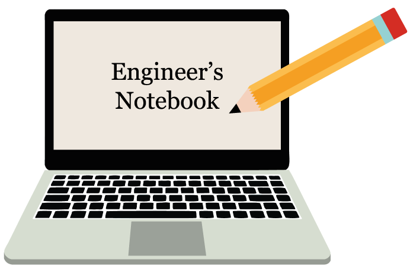

Notebook

# Engineer's Notebook

###### One-stop knowledge management system - by Kyungjae Lee (kjxlee@gmail.com)

### Contents: 

* **<a href="./embedded-systems/">Embedded Systems</a>**
* **<a href="./operating-systems/">Operating Systems</a>**
* **<a href="./computer-architecture/">Computer Architecture</a>**
* **<a href="./c-programming/">C Programming</a>**
* **<a href="./cpp-programming/">C++ Programming</a>**
* **<a href="./problem-solving/">Problem Solving</a>**

