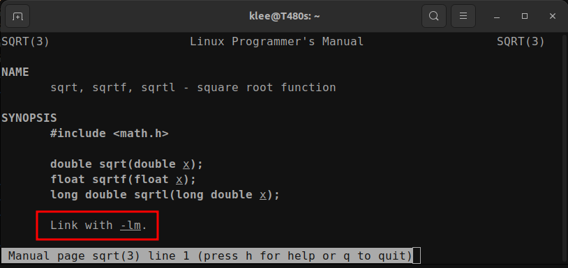

<a href="../">Notebook</a> > <a href="./">Makefile & Build System</a> > Improve Makefile

# Improve Makefile

Exercise in this section requires the project directory structure setup. See **<a href="./project-directory-structure">Project Directory Structure</a>**.


## Create a Makefile

* The following is a primitive makefile we will improve step-by-step.

  ```c
  # project/src/mod1/makefile
  default:
  	gcc mod1.c -o ../../bin/mod1
  ```

  ```c
  /* project/src/mod1/mod1.c */
  #include <stdio.h>
  #include <math.h>
  
  int main(int argc, char *argv[])
  {
      printf("Square root of 15 = %lf\n", sqrt(15.0)); 
      return 0;
  }
  ```

  

## Improvement 1 - Incremental Build

* Incremental build feature speeds things up by skipping projects or files that are already up-to-date.

* An incremental build is much faster than a full build.

* The following makefile does not support an incremental build. That is, when `make` command is run, `mod1.c` will get compiled over and over again even though the file hasn't been modified at all.

  ```makefile
  # project/src/mod1/makefile
  default:
  	gcc mod1.c -o ../../bin/mod1
  ```

  ```shell
  $ make
  gcc mod1.c -o ../../bin/mod1
  $ make
  gcc mod1.c -o ../../bin/mod1
  ```

  To apply an incremental build, modify the target and add the prerequisite:

  ```makefile
  # project/src/mod1/makefile
  ../../bin/mod1: mod1.c
  	gcc mod1.c -o ../../bin/mod1
  ```

  ```shell
  $ make
  gcc mod1.c -o ../../bin/mod1
  $ make
  make: '../../bin/mod1' is up to date.
  ```


## Improvement 2 - Variables

* Macros/variables help improve maintainability of makefiles.

* If we wanted to modify the target path in the following makefile, we need to make the modification in two places. 

  ```makefile
  # project/src/mod1/makefile
  ../../bin/mod1: mod1.c
  	gcc mod1.c -o ../../bin/mod1
  ```

  Use a macro/variable to improve this:

  ```makefile
  # project/src/mod1/makefile
  OUTPUT = ../../bin/mod1
  INPUT = mod1.c
  
  $(OUTPUT): $(INPUT)			# $(VAR): dereference VAR
  	gcc $(INPUT) -o $(OUTPUT)
  ```


## Improvement 3 - Automatic Variables

* Automatic variables can have a different value for each rule in a makefile and are designed to make writing rules simpler.

  | Variable | Description                                                  |
  | -------- | ------------------------------------------------------------ |
  | $@       | Name of the rule's target                                    |
  | $%       | The target member's name, if the rule's target is an archive |
  | $<       | Name of the first prerequisite                               |
  | $^       | List of all prerequisites                                    |
  | $?       | List of all prerequisites that are newer than the target     |
  | $*       | The "stem" of an implicit or pattern rule                    |

* Automatic variables can only be used in the **recipe** portion of a rule. They cannot be used anywhere within the target list of a rule; they have no value there and will expand to the empty string.

* Using the automatic variables our makefile can be simplified as:

  ```makefile
  # project/src/mod1/makefile
  OUTPUT = ../../bin/mod1
  INPUT = mod1.c
  
  $(OUTPUT): $(INPUT)			
  	gcc $(<) -o $(@)	# $(<) = $<, $(@) = $@
  ```

* Now, to direct the binary files to `bin` directory, and the object files to `obj` directory:

  ```makefile
  # project/src/mod1/makefile
  OUTPUT = ../../bin/mod1
  INPUT = mod1.c
  OBJ1 = ../../obj/mod1.o
  
  $(OUTPUT): $(OBJ1)			
  	gcc $< -o $@
  	
  $(OBJ1): $(INPUT)
  	gcc -c $< -o $@
  ```


## Improvement 4 - Linker Flags

* It is a good idea to add the linker flags to make your makefile platform independent. For example, the source file `mod1.c` includes two header files:

  ```c
  /* project/src/mod1/mod1.c */
  #include <stdio.h>
  #include <math.h>
  
  int main(int argc, char *argv[])
  {
      printf("Square root of 15 = %lf\n", sqrt(15.0)); 
      return 0;
  }
  ```

* Using the linker flags our makefile can be updated as:

  ```makefile
  # project/src/mod1/makefile
  OUTPUT = ../../bin/mod1
  INPUT = mod1.c
  OBJ1 = ../../obj/mod1.o
  
  $(OUTPUT): $(OBJ1)			
  	gcc $< -o $@ -lm -lc	# -lm: libm.a for math.h, -lc: libc.a for stdio.h
  							
  $(OBJ1): $(INPUT)
  	gcc -c $< -o $@
  ```

  > Linker flags are added to the recipe line 7 because it is where all the necessary libraries should get linked to the object file generated from the previous step.

  Further improving our makefile using variables:

  ```makefile
  # project/src/mod1/makefile
  OUTPUT = ../../bin/mod1
  INPUT = mod1.c
  OBJ1 = ../../obj/mod1.o
  LDFLAGS = -lm -lc		# -lm: libm.a for math.h, -lc: libc.a for stdio.h
  
  $(OUTPUT): $(OBJ1)			
  	gcc $< -o $@ $(LDFLAGS)	
  							
  $(OBJ1): $(INPUT)
  	gcc -c $< -o $@
  ```

* If `make` command ran successfully without these linker flags, it is because your current compiler does that for you behind the scenes.

* How to find out what linker flags to use? 

  For example,

  ```shell
  $ man sqrt
  ```

  


## Improvement 5 - Compiler Flags

* Warnings are diagnostic messages that report constructions that are not inherently erroneous but that are risky or suggest there may have been an error.

* The following language-independent options do not enable specific warnings but control the kinds of diagnostics produced by GCC.

  | Flag           | Description                                                  |
  | -------------- | ------------------------------------------------------------ |
  | -w             | Inhibit all warning messages.                                |
  | -Wall          | Enable all the warnings.                                     |
  | -Werror        | Make all warnings into errors.                               |
  | -Werror=       | Make the specified warning into an error (e.g., -Werror=switch) |
  | -Wfatal-errors | Abort compilation on the first error occurred rather than trying to keep going and printing further error messages. |
  | ...            | ...                                                          |

* Let's add `-Wall` and `-Werror` flags to our makefile to make the compiler show and treat all warnings as errors:

  ```makefile
  # project/src/mod1/makefile
  OUTPUT = ../../bin/mod1
  INPUT = mod1.c
  OBJ1 = ../../obj/mod1.o
  CFLAGS = -Wall -Werror
  LDFLAGS = -lm -lc		# -lm: libm.a for math.h, -lc: libc.a for stdio.h
  
  $(OUTPUT): $(OBJ1)
  	gcc $< -o $@ $(LDFLAGS)	
  							
  $(OBJ1): $(INPUT)
  	gcc $(CFLAGS) -c $< -o $@
  ```

  Use the following source file `mod1.c` that's been modified to have an unused variable declared:

  ```c
  /* project/src/mod1/mod1.c */
  #include <stdio.h>
  #include <math.h>
  
  int main(int argc, char *argv[])
  {
      int a = 10;		/* intentionally added to generate a warning */
      printf("Square root of 15 = %lf\n", sqrt(15.0)); 
      return 0;
  }
  ```

  Now, you'll see all the warnings treated as errors that wouldn't have appeared without the compiler flags:

  ```shell
  $ make
  gcc -Wall -Werror -c mod1.c -o ../../obj/mod1.o
  mod1.c: In function ‘main’:
  mod1.c:6:13: error: unused variable ‘a’ [-Werror=unused-variable]
      6 |         int a = 10;
        |             ^
  cc1: all warnings being treated as errors
  make: *** [makefile:12: ../../obj/mod1.o] Error 1
  ```

  


## References

Subrata, S. (2022). *GNU Make & Makefile To Build C/C++ Projects - (LINUX,MAC)* [Video file]. Retrieved from  https://www.udemy.com/course/gnu-make-makefile-to-build-cc-projects-linuxmac/

