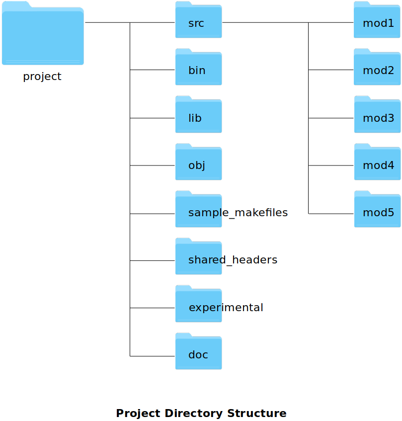

<a href="../">Notebook</a> > <a href="./">Makefile & Build System</a> > Project Folder Structure

# Project Directory Structure

The following is the project directory structure that will be used in the following sections.

## References

Subrata, S. (2022). *GNU Make & Makefile To Build C/C++ Projects - (LINUX,MAC)* [Video file]. Retrieved from  https://www.udemy.com/course/gnu-make-makefile-to-build-cc-projects-linuxmac/

