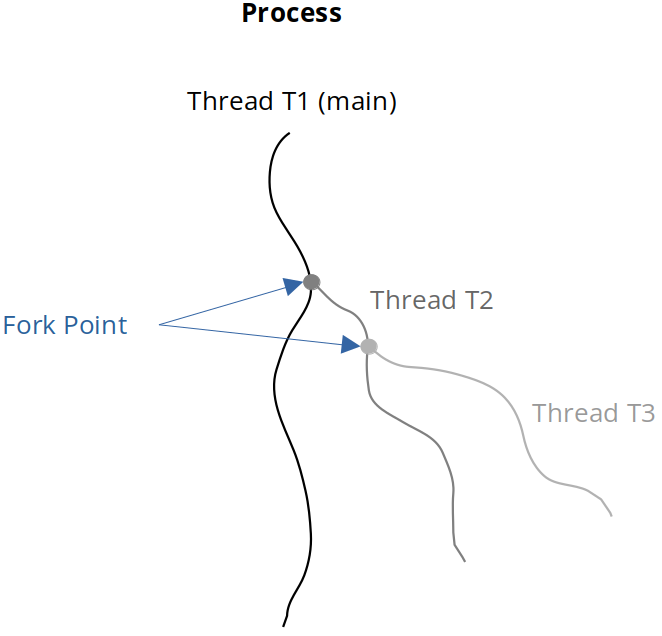

<a href="../">Notebook</a> > <a href="./">Multi-Threading (POSIX Threads)</a> > Introduction to Threads

# Introduction to Threads


## What are Threads?





* A thread is **a basic unit of execution flow** (i.e., an independent set of instructions which execute).
* A process has at least one thread (i.e., main thread)
  * The main function of the program runs as a main thread.
* A thread runs in the context of a process.
* A thread can create other threads, other threads can create more threads and so on.
* The point where a new thread is created is called **fork point**.
* A thread which creates a new thread is called **parent thread**, whereas a thread which is created is called **child thread**.


## Example - Hello World

Following program will create one thread, which is called the **main thread**, and that main thread will execute the function `main`.

```c
/*
 * File Name    : hello_world.c
 * Description  : C program to demonstrate the use of POSIX threads
 * Author       : Modified by Kyungjae Lee (Original: Abhishek Sagar)
 * Date Created : 12/25/2022
 */

 /*  
  * Compile using:
  * gcc -g -c hello_world.c -o hello_world.o
  * gcc -g hello_world.o -o hello_world -lpthread
  * Or simply using:
  * gcc -g hello_world.c -o hello_world -lpthread
  *
  * Run using:
  * ./hello_world
  */

#include <stdio.h>
#include <stdlib.h>
#include <pthread.h>    /* POSIX threads */
#include <unistd.h>     /* pause(), sleep() */

/* A thread callback function must have the following prototype
 * void* (*thread_fn)(void *) */
static void* thread_fn_callback(void *arg)
{
    char *input = (char*)arg;
    
    while (1) 
    {   
        printf("input string = %s\n", input);
        sleep(1);
    }   

    return input;
}

void thread1_create()
{
    /* opaque data structure (as a programmer don't need to know its internal structure) */
    pthread_t pthread1; /* a.k.a. thread handle */
    
    /* Take some argument to be passed to the thread function.
     * Make sure that you always pass the persistent memory as an argument to the thread.
     * (e.g., static variable or dynamically allocated variables on the heap)
     * Do not pass caller's local variables or stack memory because these variables will
     * go away when the caller terminates. */
    static char *thread_input1 = "I am thread no 1";

    /* pthread_create() - Inbuilt API provided by POSIX thread library
     * Returns 0 on success, error code otherwise
     * 1st arg: address of the thread handle
     * 2nd arg: NULL
     * 3rd arg: thread function that the new thread will execute
     * 4th arg: memory address that contains the data to be bassed to the thread
     * All pthread functions return negative error code on failure and do not set global
     * 'errno' variable. */
    int rc = pthread_create(&pthread1, NULL, thread_fn_callback, (void*)thread_input1);

    if (rc != 0)
    {
        printf("Error: Thread could not be created. (errno = %d\n)", rc);
        exit(0);
    }
}

int main(int argc, char *argv[])
{
    thread1_create();
    printf("main function paused\n");

    /* pause the main function, otherwise it will straight up terminate and all of its
     * child threads will get terminated as well */
    pause();

    return 0;
}
```


## References

Sagar, A. (2022). *Part A - Multithreading & Thread Synchronization - Pthreads* [Video file]. Retrieved from  https://www.udemy.com/course/multithreading_parta/
