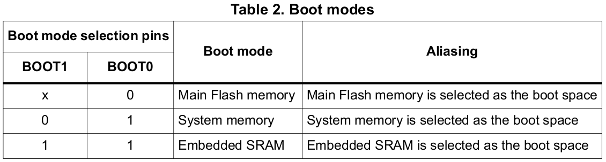

<a href="../../">Home</a> > <a href="../notebook">Notebook</a> > <a href="./">Bootloader</a> > Boot Configuration

# Boot Configuration

## Boot Configuration of STM32F407xx

* Depending on the configuration of the "boot mode selection pins," the memory region from which the boot will take place, which is to be mapped to the memory address 0x0000 0000, will be chosen differently.
