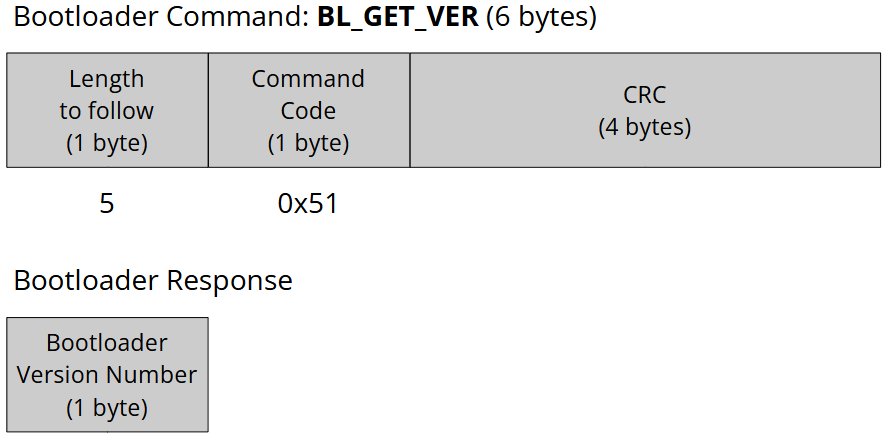
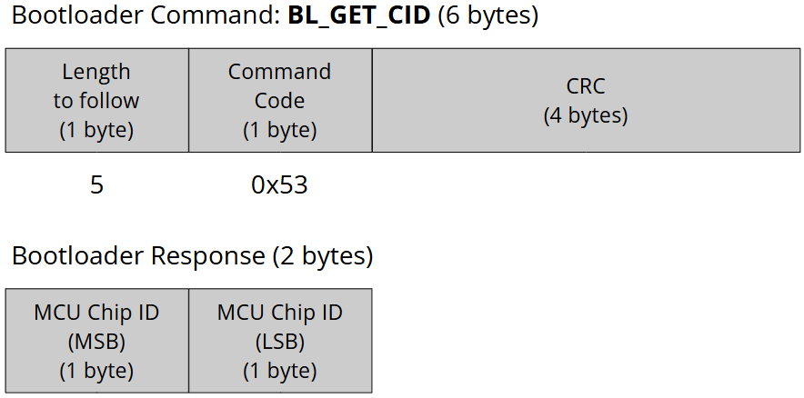
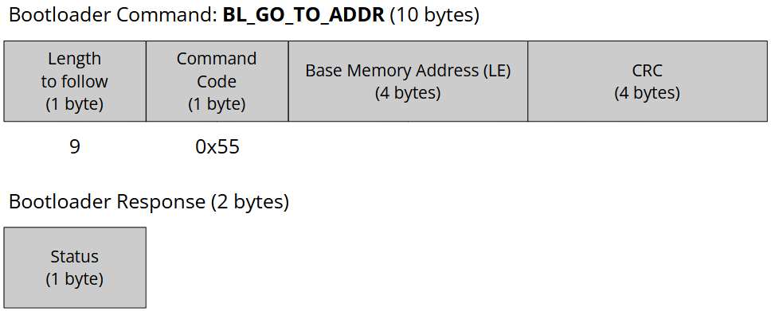
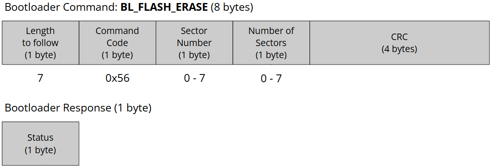
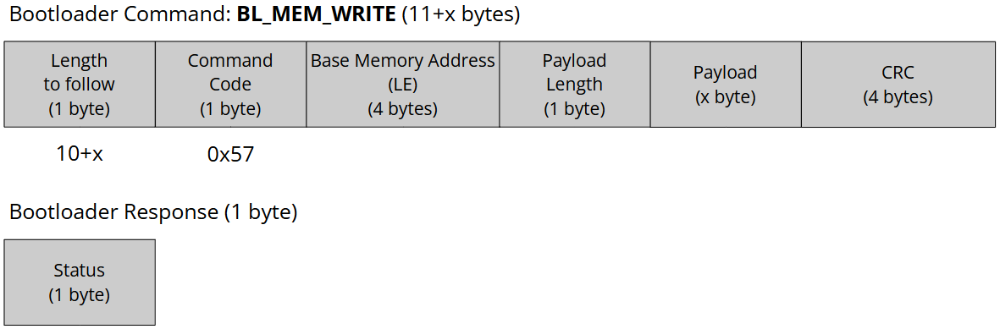
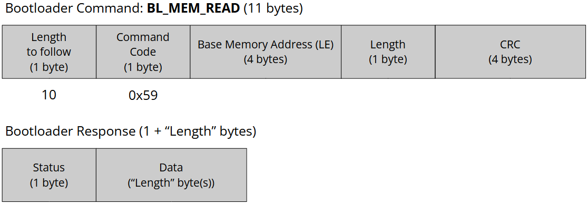
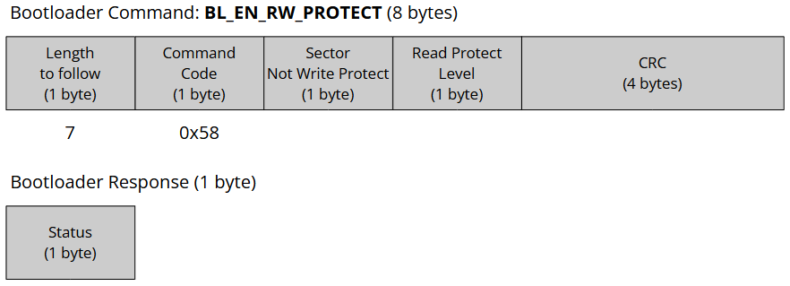
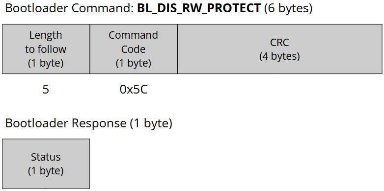
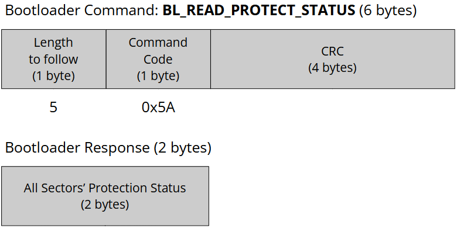

<a href="../../">Home</a> > <a href="../notebook">Notebook</a> > <a href="./">Bootloader</a> > Bootloader Commands Formats

# Bootloader Commands Formats

## Supported Bootloader Commands

| Host Sends             | Command Code | Bootloader Responds                         | Notes                                                        |
| ---------------------- | ------------ | ------------------------------------------- | ------------------------------------------------------------ |
| BL_GET_VER             | 0x51         | Bootloader version number (1 byte)          | Used to read the bootloader version from the MCU             |
| BL_GET_HELP            | 0x52         | All supported command codes (10 bytes)      | Used to retrieve all the commands that are supported by the bootloader |
| BL_GET_CID             | 0x53         | Chip identification number (2 bytes)        | Used to read the MCU chip identification number              |
| BL_GET_RDP_STATUS      | 0x54         | Flash Read Protection (RDP) Level (1 byte)  | Used to read the Flash Protection (RDP) Level                |
| BL_GO_TO_ADDR          | 0x55         | Success or error code (1 byte)              | Used to jump bootloader to specified address                 |
| BL_FLASH_ERASE         | 0x56         | Success or error code (1 byte)              | Used to mass erase or sector erase the user Flash            |
| BL_MEM_WRITE           | 0x57         | Success or error code (1 byte)              | Used to write data into different memories of the MCU        |
| BL_EN_RW_PROTECT       | 0x58         | Success or error code (1 byte)              | Used to enable read/write protection on different sectors of the user Flash |
| BL_DIS_RW_PROTECT      | 0x5C         | Success or error code (1 byte)              | Used to disable read/write protection on all the sectors of the user Flash (i.e., Restores the default state) |
| BL_MEM_READ            | 0x59         | Memory contents of length asked by the host | Used to read data from different memories of the MCU         |
| BL_READ_PROTECT_STATUS | 0x5A         | All sectors' protection status              | Used to read the protection status of all the sectors of the user Flash memory |

## Bootloader Commands Formats

* For every bootloader command
  * First byte - **Length to follow**
  * The second byte - **Command code** sent by the host to the bootloader
  * The last four bytes - **CRC** to check the integrity of the bytes received from the host.

### BL_GET_VER

* Used to read the bootloader version from the MCU

* Total length (in bytes) of the packet: 6
* Length to follow: 5
* Command code: 0x51

### BL_GET_HELP

* Used to retrieve all the commands that are supported by the bootloader

* Total length (in bytes) of the packet: 6
* Length to follow: 5
* Command code: 0x52

### GL_GET_CID

* Used to read the MCU chip identification number

* Total length (in bytes) of the packet: 6
* Length to follow: 5
* Command code: 0x53

### BL_GO_TO_ADDR

* Used to jump the bootloader to a specified address
* Total length (in bytes) of the packet: 10
* Length to follow: 9
* Command code: 0x55
* Base memory address: 4-byte base memory address to jump to (LE: Little Endian)

### BL_FLASH_ERASE

* Used to mass erase or sector erase the user Flash
* Total length (in bytes) of the packet: 8
* Length to follow: 7
* Command code: 0x56

### BL_MEM_WRITE

* Used to write data into different memories (e.g., Flash, SRAM, etc.) of the MCU 
  * e.g., Programming binary into the Flash memory
* Total length (in bytes) of the packet: 11+x
* Length to follow: 10+x
* Command code: 0x57
* Base memory address: 4-byte base memory address from which the writing will take place (LE: Little Endian)
* Payload length: The number of bytes to write (Max: 255 bytes)
* Payload: Data to write

### BL_MEM_READ

* Used to read data from different memories (e.g., Flash, SRAM, etc.) of the MCU
* Total length (in bytes) of the packet: 11
* Length to follow: 10
* Command code: 0x59
* Base memory address: 4-byte base memory address from which the reading will take place (LE: Little Endian)
* Length: The number of bytes to read (Max: 255 bytes)

### BL_EN_RW_PROTECT

* Used to enable read/write protect on different sectors of the user Flash
* Total length (in bytes) of the packet: 8
* Length to follow: 7
* Command code: 0x58
* Sector details (Each bit represents the sector number; e.g., 0^th^ bit is sector 0)
  * 1: Protection
  * 2: No protection
* Protection mode:
  * 1: Write protection
  * 2: R/W protection

### BL_DIS_RW_PROTECT

* Used to disable read/write protection on all the sectors of the user Flash (i.e., Restores the default state)
* Total length (in bytes) of the packet: 6
* Length to follow: 5
* Command code: 0x5C

### BL_READ_SECTOR_STATUS

* Used to read the protection status of all the sectors of the user Flash memory
* Total length (in bytes) of the packet: 6
* Length to follow: 5
* Command code: 0x5A

