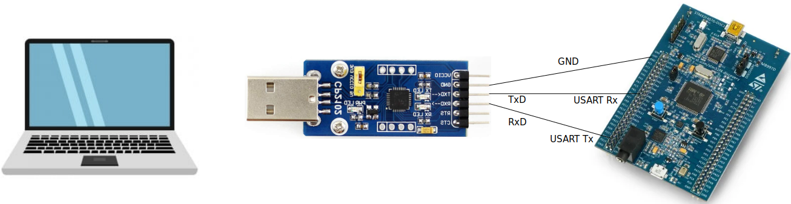

<a href="../../">Home</a> > <a href="../notebook">Notebook</a> > <a href="./">Bootloader</a> > Bootloader-Host Communication

# Bootloader-Host Communication

## Introduction

* According to the Application Note (AN2606), the bootloader of the STM32F40xxx MCU can communicate with the host over various peripheral interfaces such as USART, CAN, etc.

## Bootloader-Host Communication over USART Peripheral Interface

* Select one USART peripheral (i.e., USART1 or USART3)
* Connect the board to the host PC using the USB-to-UART adapter as shown in the image below.

* Download STM32 Flash loader demonstrator (UM0462) (replaced by STM32CubeProgrammer) 
