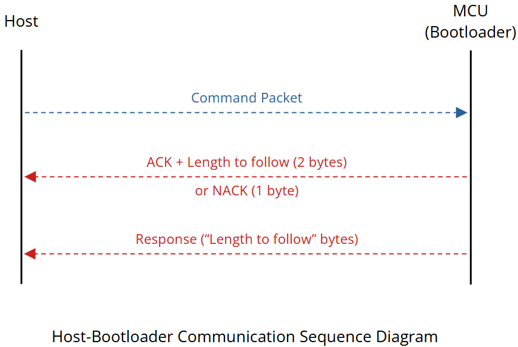
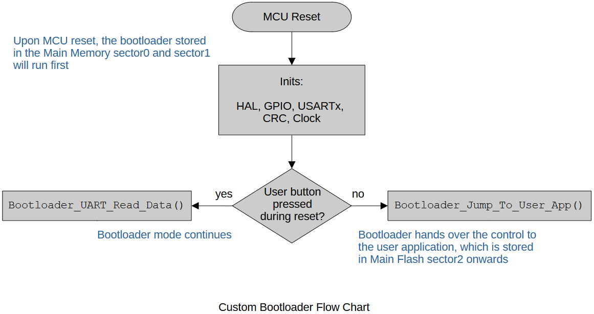

<a href="../../">Home</a> > <a href="../notebook">Notebook</a> > <a href="./">Bootloader</a> > Custom Bootloader Design

# Custom Bootloader Design

## Bootloader Code Placement in Flash (Main) Memory

## Supported Bootloader Commands

| Host Sends             | Command Code | Bootloader Responds                         | Notes                                                        |
| ---------------------- | ------------ | ------------------------------------------- | ------------------------------------------------------------ |
| BL_GET_VER             | 0x51         | Bootloader version number (1 byte)          | Used to read the bootloader version from the MCU             |
| BL_GET_HELP            | 0x52         | All supported command codes (10 bytes)      | Used to retrieve all the commands that are supported by the bootloader |
| BL_GET_CID             | 0x53         | Chip identification number (2 bytes)        | Used to read the MCU chip identification number              |
| BL_GET_RDP_STATUS      | 0x54         | Flash Read Protection (RDP) Level (1 byte)  | Used to read the Flash Protection (RDP) Level                |
| BL_GO_TO_ADDR          | 0x55         | Success or error code (1 byte)              | Used to jump bootloader to specified address                 |
| BL_ERASE_FLASH         | 0x56         | Success or error code (1 byte)              | Used to mass erase or sector erase the user Flash            |
| BL_WRITE_MEM           | 0x57         | Success or error code (1 byte)              | Used to write data into different memories of the MCU        |
| BL_EN_RW_PROTECT       | 0x58         | Success or error code (1 byte)              | Used to enable read/write protection on different sectors of the user Flash |
| BL_READ_MEM            | 0x59         | Memory contents of length asked by the host | Used to read data from different memories of the MCU         |
| BL_READ_PROTECT_STATUS | 0x5A         | All sectors' protection status              | Used to read the protection status of all the sectors of the user Flash memory |
| BL_READ_OTP            | 0x5B         | OTP contents                                | Used to read the OTP contents                                |
| BL_DIS_RW_PROTECT      | 0x5C         | Success or error code (1 byte)              | Used to disable read/write protection on all the sectors of the user Flash (i.e., Restores the default protection state) |

## Host-Bootloader Communication Sequence

* Upon reset, the MCU will go through the initialization process and then will hang at some point (e.g., USART receive function) ready to receive commands from the host.
* Upon receiving a command from the host, the bootloader performs CRC check. It ACKs if the CRC check has succeeded,  NACKs otherwise.
* After ACKing, the bootloader sends its response to the host.

## Custom Bootloader Flow Chart

## Bootloader Command Handling Flow Chart

