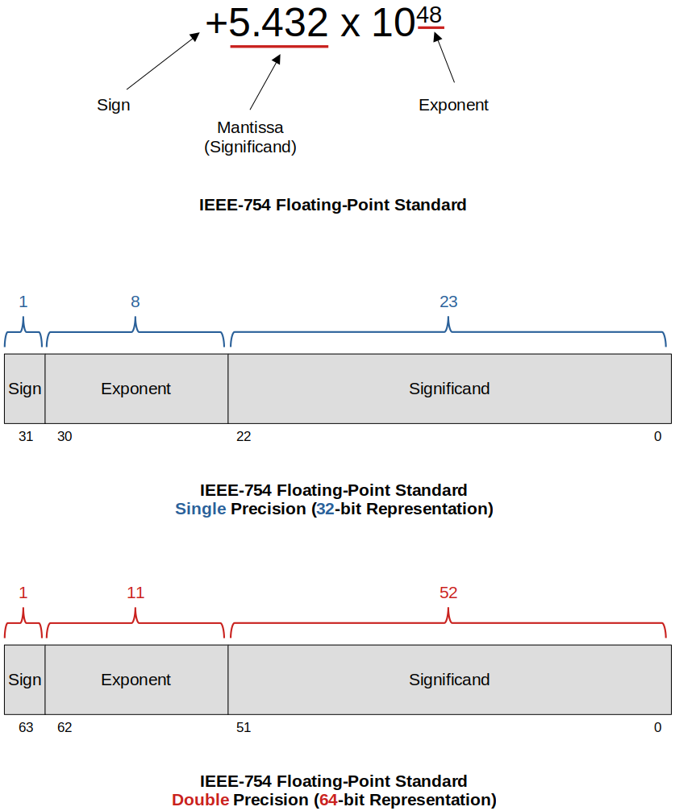
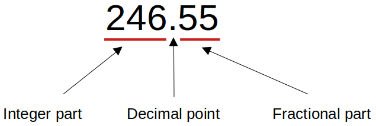

<a href="../">Notebook</a> > <a href="./">C Programming</a> > Representation of Decimal Numbers

# Representation of Decimal Numbers

## Decimal Numbers

* A **decimal number** contains a **decimal point**. (e.g., 125.55 is a decimal number or a real number.)

* In computer memory, real numbers are stored according to the **IEEE Standard 754 floating-point representation**.

* IEEE754 floating-point representation is an approximate representation of real numbers.

* All computer systems and microcontrollers nowadays use this standard to store real numbers in memory.

* If you are working with numbers that have a fractional part or in case you are using integers that don't fit into a long data type, then you can use the floating-point representation.

* In C, too small or too big numbers or numbers having a fractional part are represented using floating-point representation data types such as float and double.

  * Too small real number

    e.g., Charge of an electron = -1.60217662 x 19^-19^ coulombs

  * Too big real number

    e.g., Distance between the earth and the Andromeda galaxy = 2.3651826 x 10^19^ Km

* In summary, floating-point representation is needed:

  * To store too-small numbers in memory
  * To store too-big numbers in memory
  * To store decimal numbers

## IEEE-754 Floating-Point Standard

* The IEEE-754 is a standard for representing and manipulating floating-point quantities that are followed by all modern computer systems and microcontrollers.
* Let's say you are to store +5.432 x 10^48^ in memory. You can't just store it as is in binary format because it will take up too much space. The IEEE-754 suggests, approximate the number and store only the necessary information in memory.

* You cannot represent decimal numbers like 246.55 in a program using integer data types such as `int`, `char`, or `long`. When these data types are used, the fractional part will be lost. Following two data types are used to represent decimal numbers. 
  * Float (32-bit floating-point representation, single precision)
  * Double (64-bit floating-point representation, double precision)

## Format Specifiers for `float` and `double` Data Types

* Use `%lf` format specifier to read or write `double` type variable.
* Use `%f` format specifier to read or write `float` type variable.
* Use `%e`, `%le` format specifier to read or write real numbers in scientific notation.
* All constants with a decimal point are considered as `double` by default.

## References

Nayak, K. (2022). *Microcontroller Embedded C Programming: Absolute Beginners* [Video file]. Retrieved from  https://www.udemy.com/course/microcontroller-embedded-c-programming/
