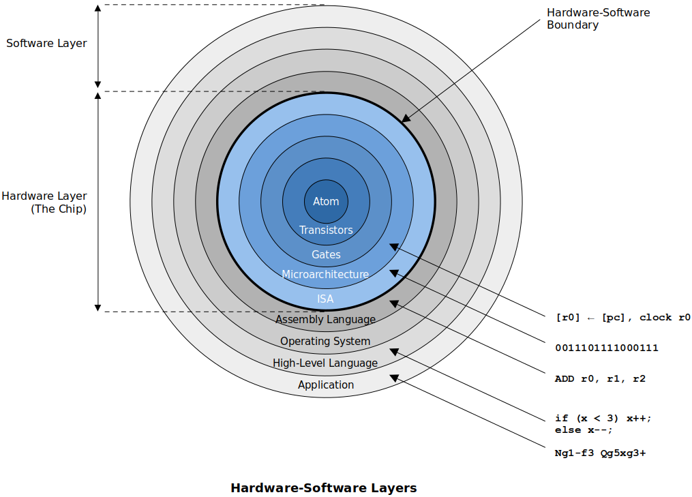

<a href="../">Notebook</a> > <a href="./">Computer Architecture & Organization</a> > Microarchitecture

# Microarchitecture

## Hardware & Software Layers

* **Application Level**

  At this level, the computer appears to be a device that performs a function. (e.g., a computer running a GPS mapping package appears just like a satnav device.)

* **High-Level Language Level**

  At this level, the computer appears to be *machine independent* and executes a high-level language. All computers executing the same language are identical (in principal) and differ only in terms of performance.

* **Low-Level Language Level**

  At this level, the computer is *architecture dependent* and the machine code executed will run only on one particular class of computer. (e.g., Intel IA32 code on Core i7)

* **Microarchitecture Level** 

  This level represents the physical organization of the computer in terms of registers, functional units, and buses. The microarchitecture may be unique to a particular instance of a microprocessor (i.e., two microprocessors share the same low-level language but different microarchitectures). Normally, this level is not accessible by the end user. Hoiwever, modern programmable logic does allow users to modify the microarchitecture of processors constructed from programmable logic.

* **Gate Level**

  Below the microarchitecture lie the individual gates that determine the ultimate speed of the processor. (e.g., AND gates, OR gates, flip-flops, etc.)

* **Device Physics Level**

  The lowest level and is determined by the electronic properties of the material used to fabricate the gates. (e.g., Transistors, atoms, etc.)