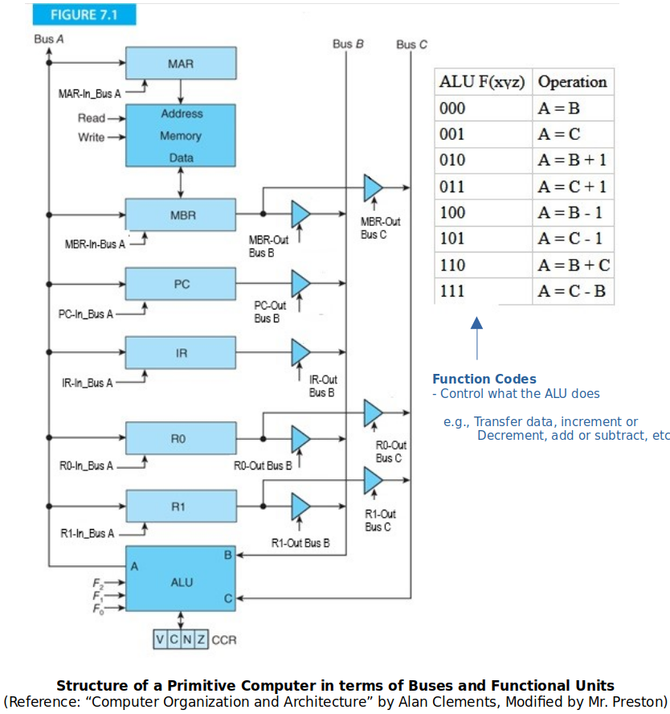

<a href="../">Notebook</a> > <a href="./">Computer Architecture & Organization</a> > Microarchitecture

# Microarchitecture


## Hardware & Software Layers


* **Application Level**

  At this level, the computer appears to be a device that performs a function. (e.g., a computer running a GPS mapping package appears just like a satnav device.)

* **High-Level Language Level**

  At this level, the computer appears to be *machine independent* and executes a high-level language. All computers executing the same language are identical (in principal) and differ only in terms of performance.

* **Low-Level Language Level**

  At this level, the computer is *architecture dependent* and the machine code executed will run only on one particular class of computer. (e.g., Intel IA32 code on Core i7)

* **Microarchitecture Level** 

  This level represents the physical organization of the computer in terms of registers, functional units, and buses. The microarchitecture may be unique to a particular instance of a microprocessor (i.e., two microprocessors share the same low-level language but different microarchitectures). Normally, this level is not accessible by the end user. Hoiwever, modern programmable logic does allow users to modify the microarchitecture of processors constructed from programmable logic.

* **Gate Level**

  Below the microarchitecture lie the individual gates that determine the ultimate speed of the processor. (e.g., AND gates, OR gates, flip-flops, etc.)

* **Device Physics Level**

  The lowest level and is determined by the electronic properties of the material used to fabricate the gates. (e.g., Transistors, atoms, etc.)


## The Microprogram

#### The Generic Digital Processor

Not used any more, antequated but good to understand how control signals work.

Generally, CPUs are made of registers, buses, ALUs and Control Units. (Technically speaking, a CPU could work without registers in it but then it will have to continuously access memory which will dramatically degrade its speed.)





* **FETCH** (Takes 3 minor clock cycles)

  * T0:

    ```plain
    PC-Out Bus B, ALU F(000), MAR-in Bus A, Read
    ```

    Get ready to fetch the next instruction from memory. Note that the **Read** happens at the same time! At this minor clock cycles, all these control signals are turned one at the same time.

  * T1:

    ```plain
    PC-Out Bus B, ALU F(010), PC-in Bus A
    ```

    Update the PC so it points to the next instruction (in this particular architecture, update PC by 1). The reason why this is a good time for PC update is that beccause the memory read operations of T0  takes time. By default, the next instruction to be executed is assumed to be the one that’s stored in the next sequential memory. When this minor clock cycle begins, all the control signals that were turned on during T0 are turned off.

    By the time T1 is done, the instruction read from the memory will have been stored in MBR.

  * T2:

    ```plain
    MBR-Out Bus B (or MBR-Out Bus C), ALU F(000) (or ALU F(000)), IR-in Bus A {Decode}
    ```

    Transfer the instruction to the IR and start decode process. 

    By the time T2 is done, CPU will be ready to execute.

  Fetch is called a **major clock cycle**, and T0~T2 are called **minor clock cycles**.

  Control signals such as `PC-Out Bus B`, `ALU F(010)`, or `Read` come from the **Control Unit**.

* **ADD** (Takes 1 minor clock cycle)

  Since there are only two general purpose registers (i.e., `r0` and `r1`), one has to be overwritten at the end of the operation. 
   (Whichever register that is listed first in the `ADD` instruction will be overwritten.)	

  ```assembly
  add r1, r0
  ```

  ```plain
  R0-Out Bus B, R1-Out Bus C, ALU A=B+C, R1-In Bus A
  ```

  In the case of addition, it doesn’t matter whether which bus (between Bus B and Bus C as long as they are different) `r0` and `r1` get sent out to because addition is commutative. However, be careful when you do `SUB`.

* **BEQ** (Takes 1 minor clock cycle) 

  The memory address to branch to is in the IR. (In terms of assembly code, the `label` is the address, and it is part of the instruction.)

  ```assembly
  beq T
  ```

  ```plain
  (if Z bit in CCR is set) IR(address part)-Out Bus B, ALU A=B, PC-In Bus A
  ```

* **STR** (Takes 2 minior clock cycles)

  The memory address `r0`’s data is to be stored into is in the IR.

  ```assembly
  str m, r0
  ```

  * T0:

    ```plain
    IR(address part)-Out Bus B, ALU A=B, MAR-In Bus A 
    ```

    Done with the address

  * T1:

    ```plain
    R0-Out Bus B, ALU A=B, MBR-In Bus A, Write
    ```

    Done with the data

  Not all, but a lot of RISC machines’ instructions take 1 clock cycle.

