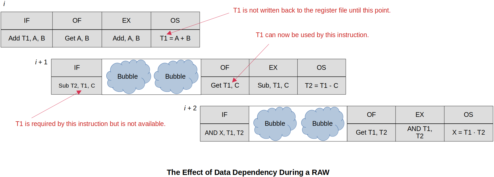
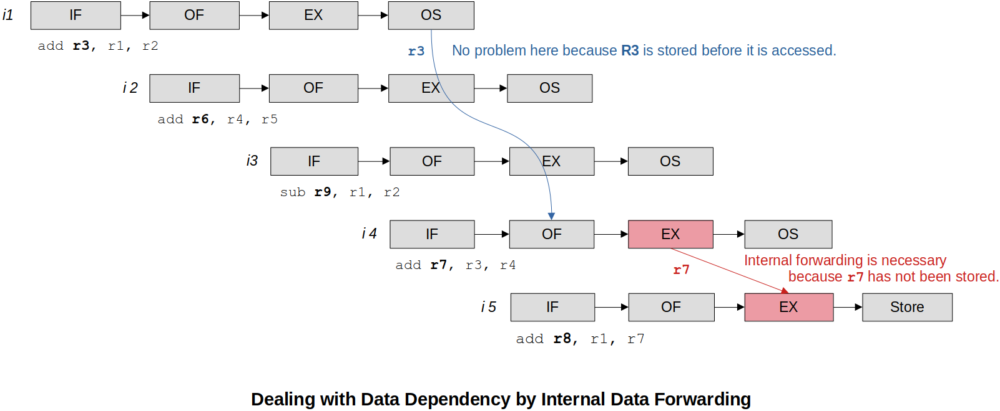

<a href="../">Notebook</a> > <a href="./">Computer Architecture & Organization</a> > Pipelining

# Pipelining


## 1. Introduction to Pipelining

### 1.1. What is Pipelining?

The basic concept of pipelining is to execute independent instructions in a continuous, orderly, and somewhat overlapped manner to improve the overall CPU performance.

One of many techniques to improve the Instruction-Level Parallelism (ILP) in a processor.

#### 1.1.1. Analogy - Computer Assembly Line

A simple example is the factory assembly line for a computer which takes 1 person 100  minutes to build one computer. Let’s divide the assembly process into 5 subtasks (A to E) which take exactly the same amount of time; 20 minutes. Once the pipeline is full, a computer is finished every cycle; 20 minutes. It still takes same amount of time to build; 100 minutes each. 

```plain
  20m  20m  20m  20m  20m  20m  20m  20m  20m
- ---- ---- ---- ---- ---- ---- ---- ---- ----
1 A    B    C    D    E
2      A    B    C    D    E
3           A    B    C    D    E
4                A    B    C    D    E
```

> Pros: Faster, specialized steps
>
> Cons: More resources are needed (people, workstations, tools)

The same principles apply to CPUs as well (with some additional complexity). By overlapping the stages and executing the instructions in parallel, it will look like one instruction completes execution once every clock-cycle. Of course the pipeline has to fill-up first.

Pipelining came from RISC efforts but is now used by almost every modern processor; CISC adopted it. Yet another example of the blurring of the lines between RISC and CISC.

### 1.2. Five-Stage Pipeline

A simplified ARM11 pipeline, standard pipeline or what we as computer science students are expected to know if asked about a pipeline.

1. **IF (Instruction Fetch)**

   Read the instruction `add r0, r1, r2` from the system memory and increment the program counter.

2. **ID (Instruction Decode)** 

   Decode the instruction read from memory during the previous phase. The nature of the instruction decode phase is dependent on the complexity of the instruction set.

3. **OF (Operand Fetch)**

   The operands specified by the instruction are read from resisters `r1` and `r2` in the register file and latched into flip-flops.

4. **EX (Execute)**

   The operations specified by the instruction is carried out.

5. **OS (Operand Store)**

   The result of the execution phase is written into the operand destination in main memory. This may be an on-chip register or a location in external memory. In this case the result is stored in register `r0`.

Typically each of these stages take one clock-cycle to execute.

Not all instructions require all 5 stages. (e.g., a `CMP` does not have the OS stage.)


##### What is the effect on the hardware?    

Redundant hardware will be necessary so it can be used by the different stages at  the same time. (e.g., The PC increment during the Instruction Fetch cannot use the ALU that is  used for the Execution stage. However it can be done by adding an **extra**  adder to the PC so it can increment itself without the help of ALU.)

##### What is the effect on the software?    

There are cases where an operand read can happen prior to or at the same time as the operand write. (Can get old data.) The assembler has to know about this and reorganize the code to make sure this does not happen.

### 1.3. Variations of Pipeline

#### 1.3.1. Another Five-Stage Pipeline

In this case, Instruction Fetch (IF) also decodes the instruction.

1. Instruction Fetch
2. Operand Read
3. Execute
4. Memory
5. Write Operand

There may be separate pipelines for different instructions in a single system. (e.g., Floating point instructions may have their own pipeline which tends to be much longer.)

#### 1.3.2. Four-Stage Pipeline

1. Instruction Fetch
2. Operand Read
3. Execute
4. Write Operand

Shorter pipelines are easier to demonstrate the issues with pipelines. The issues get worst with longer (more) pipeline stages.


## 2. Speedup Ratio

The performance of a pipeline is expressed in terms of its **speedup ratio**.
$$
\begin{align}
\text{Speedup Ratio} 
&= \frac{\text{Time to execute instruction in non-pipeline method}}
{\text{Time to execute instruction in pipeline method}} \\
&= \frac{n\times i}{n+(i-1)}, \text{where $n$ is the number of pipeline stages, $i$ is  
the number of instructions} \\
&= \frac{n\times i}{i+(n-1)} \\
&= \frac{n}{1+\frac{n-1}{i}}
\text{ cycles}
\end{align}
$$
With the pipeline, the first instruction (out of $i$ instructions to be executed) will take $n$ clock cycles, and the rest ($i−1$ instructions) will be executed every clock cycle.

When $i=1$ (only one instruction to execute) − No speedup! 
When $i=∞$ − Speedup is $n$.

##### Examples:

20 instruction with 5 stages:
$S=\frac{5×20}{20+4}=4.1667$ times faster than the system without the pipeline.

100 instruction with 5 stages:
$S=\frac{5×100}{100+4}=4.8077$ times faster than the system without the pipeline.

10000 instruction with 5 stages: 
 $S=\frac{5×10000}{10000+4}=4.998$ times faster than the system without the pipeline.

Basically what these examples are trying to show is that once you get to the point of executing an infinite number of executions, your speedup is equal to the number of the stages in the pipeline.

In theory, once the pipeline is full, a new operation is completed every clock cycle. But this cannot be achieved all the time due to:

- Branches
- Data dependencies


## 3. Pipeline Hazards

A **pipeline hazard** occurs when the pipeline, or some portion of the pipeline, must stall because conditions do not permit continued execution. Such a **pipeline stall** is also referred to as **pipeline bubble**. 

Three types of hazards: 

* Structural hazard (or resource hazard)
* Data hazard (or pipeline data hazard)
* Control hazard (or branch hazard)

### 3.1.1. Structural Hazard (a.k.a. Resource Hazard)

A structural hazard occurs when two (or more) instructions that are already in the pipeline need the same resource simultaneously. The result is that the instructions must be executed in serial rather than parallel for a portion of the pipeline.

For example, memory can be a structural hazard if two instructions attempt to access it at the same time and it cannot grant simultaneous access.

Another example is when multiple instructions are ready to enter the execute instruction phase and there is a single ALU. One solution to such structural hazards is to increase available resources, such as having multiple ports into main memory and multiple ALU units.

Structural hazards have to be taken care of in the **design time**.

### 3.1.2. Data Hazard (a.k.a. Pipeline Data Hazard)

A data hazard occurs when the processing of one instruction depends on the data created by a previous instruction that is still in the pipeline. To maintain correct operation, the pipeline must stall for one or more clocks cycles which results in inefficient pipeline usage.

To prevent data hazards, **special hardware** is used to forward or bypass the stages to provide the results sooner.

Three types of data hazards:

* **Read after write (RAW), or true data dependency**

  An instruction modifies a register or memory location and a succeeding instruction reads the data in that memory or register location. A hazard occurs if the read takes place before the write operation is complete.

  For example:

  ```assembly
  add r0, r1, r2
  sub r4, r0, r5    @ r0 will not be ready in time for this calculation.
  ```

* **Write after read (WAR), or anti data dependency**

  An instruction reads a register or memory location and a succeeding instruction writes to the location. A hazard occurs if the write operation completes before the read operation takes place. 

  For example:

  ```assembly
  add r1, r2, r3
  sub r2, r4, r5
  ```

  WAR hazard cannot occur in most systems. If the instructions are reordered (e.g., to delay branches) then this presents a problem!

* **Write after write (WAW), or output dependency**

  Two instructions both write to the same location. A hazard occurs if the write operations take place in the reverse order of the intended sequence. 
  
  For example:
  
  ```assembly
  add r1, r2, r3
  sub r1, r4, r5
  ```
  
  WAW hazard is very unlikely to happen in a single core processor. It is more of a multi-core processor issue. Can happen with superscalar processors that perform out-of-order execution. In “Operating Systems” this is also called a **race condition**. When the value of a variable is dependent on the order of execution of the instructions and the last instruction to execute wins by having its value stored.

### 3.1.3. Control Hazard (a.k.a. Branch Hazard)

A control hazard occurs when a branch is taken and all the partially executed instructions in the pipeline have to be thrown away (or **flushed**, **squashed**). This happens because when a branch instruction (to be taken) is fetched, its target address is not known until it is in the execute stage in the pipeline. During that time (i.e., IF ~ EX), the subsequent instructions are pushed into the pipeline only to be wasted.


## 4. Mitigating Pipeline Hazards

### 4.1. Mitigating Data Hazards (Pipeline Data Hazard)

Data dependency arises when the outcome of the current operation is dependent on the result of a previous instruction that has not yet been executed to completion.

The most important form of data hazard is **RAW**, where a read operation takes place after a write. 

Two solutions to mitigate the aspect of data hazard:

* **Bubbles** (primitive)
* **Internal data forwarding** (advanced)

#### 4.1.1. Introducing Bubbles

Consider,

```assembly
@ X = (A + B) AND (A + B - C)
@ assume A, B, C, X and two temporary values, T1 and T2, are in registers

add T1, A, B      @ [T1] ← [A] + [B]  ; T1 will not be available immediately
sub T2, T1, C     @ [T2] ← [T1] - [C] ; uses T1 before the instruction 1 has committed it to memory
and X, T1, T2     @ [X]  ← [T1] · [T2]; uses T2 before the instruction 1 has committed it to memory
```

How to fix this?

Bubbles can be introduced into the pipeline while the instructions $i+1$ and $i+2$ wait for their data as shown in the following diagram.





However, this is not what pipelines are for! This can be improved in the hardware by using **internal data forwarding**.

#### 4.1.2. Internal Data Forwarding

Internal data forwarding is a mechanism to reduces the stalls due to data dependency, it uses **hardware technique** to forward the result of interstage buffer register (IBR) to next instruction’s buffer register.

Consider,

```assembly
add r3, r1, r2    @ [r3] ← [r1] + [r2]
add r6, r4, r5    @ [r6] ← [r4] + [r5]
add r9, r1, r2    @ [r9] ← [r1] + [r2]
add r7, r3, r4    @ [r7] ← [r3] + [r4] ; RAW harzard because r7 is reuqired by the next instruction
add r8, r1, r7    @ [r8] ← [r1] + [r7]
```

Instruction 4 generates a destination operand `r7` that is required as a source operand by the next instruction. If the processor were to read the source operand requested by instruction 5 from the register file, it would see the old value of `r7`.

How to fix this?

By means of **internal data forwarding** the processor transfers `R7` from instruction 4’s execution unit directly to the execution unit of instruction 5. (When the issue is detected the internal forwarding hardware provides the right data to the instruction.)





### 4.2. Mitigating Control Hazard (Branch Hazard)

It is known that branches take up 5 ~ 30% of the instructions in any program. (e.g., Unconditional branches, conditional branches, indirect branches, procedure calls, procedure returns). So, it is very important that they are correct and efficient.

 The following are some of the solutions that have been proposed for mitigating aspects of control hazards:

* Pipeline stall
* Delayed branch
* Branch prediction

#### 4.2.1. Pipeline Stall

Freeze the pipeline until the branch outcome and target are known, then proceed with fetch.  Thus, every branch instruction incurs a penalty equal to the number of stall cycles.  This solution is unsatisfactory if the instruction mix contains many branch instructions, and/or the pipeline is very deep.

#### 4.2.2. Delayed Branch

Delayed branch is reordering of the instructions in such a way that the instruction immediately following a branch is always executed. This avoids stalling the pipeline while the branch condition is evaluated, thus keeping the pipeline full and minimizing the effect of conditional branches on processor performance.

```assembly
@ original code
add r3, r2, r1
add r5, r4, r6	@ not dependent on the following branch, will be executed 100% anyways
b   N
add r7, r8, r9
```

```assembly
@ reordered code
add r3, r2, r1
b   N 
add r5, r4, r6	@ gets executed in the "branch delay slot"
add r7, r4, r6
```

Sections in the code to look for the instructions to fill the branch delay slot:

* Before the branch instruction (Best choice, always improves performance)
* Target address (Only meaningful when branch taken)
* Fall through (Only meaningful when not taken)

Unfortunately, it's not always possible to reorder the code in such a way that the instruction immediately following a branch is always executed. If the compiler fails to find such an instruction, it must introduce a **no operation** (`NOP`) instruction after the branch and accept the inevitability of a stall (or bubble). 

```assembly
add r3, r2, r1
add r5, r4, r6
b   N
NOP       		@ no operation ("branch delay slot")
add r7, r8, r9
```

This really slows down the pipeline. The more stages the pipeline has the more `NOP`s that have to be added and the bigger the the slow-down in the pipeline.

#### 4.2.3. Branch Prediction

Branch prediction is an approach to computer architecture that attempts to mitigate the costs of branching. The processor looks ahead in the instruction code fetched from memory and takes an educated guess if the branch will or will not be taken.

Two types of branch prediction:

* **Static branch prediction**
* **Dynamic branch prediction** (Branch guess are determined at runtime and will change over time)

Prediction mechanisms works well with unconditional branches like:

```assembly
  B Loop      @ unconditional branch; this branch will be taken 100%
   
Loop:
```

Conditional branches pose a problem:

```assembly
bne Loop      @ conditional branch; CCR flags setting affects the subsequent instructions 
...

Loop:
```


## 5. Branches and the Branch Penalty


Since the pipeline doesn't know what's going to happen, it can either:

1. **Pause Fetch and wait**

   Nice thing about this is that no bad decision has been made! It just waits till the decision is made. But, at the same time, there will always be the **lost cycles**.

2. **Take a guess**

   If guessed right there will be no performance degrade (Good!). But, if guessed worng **bubble** (or **hole**) will be introduced in pipeline. 

   Prediction methods:

   * Assume the branch is never taken.                

     e.g., Execute `then` part rather than `else` part in `if then ... else` statement

     This is said to be working approximately 80% of the time. If the branch is not taken, whatever that’s stored in PC will end up being the next instruction to be executed, life is good.

   * Branch prediction using hardware called the **Branch Prediction Table**

     Studies have shown that this works >90%  of the time.

Either way there are some potential issues. It’s the designers’ choice!