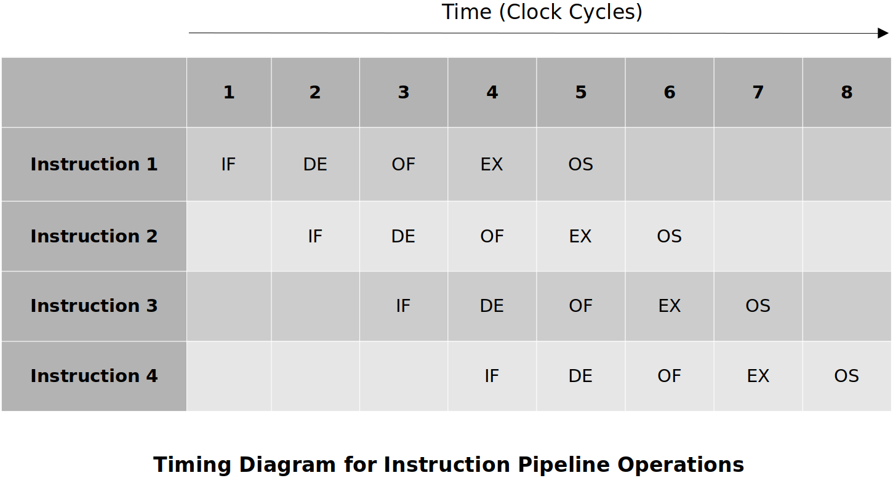

<a href="../">Notebook</a> > <a href="./">Computer Architecture & Organization</a> > Pipelining

# Pipelining


## Introduction to Pipelining

### What is Pipelining?

The basic concept of pipelining is to execute independent instructions in a continuous, orderly, and somewhat overlapped manner to improve the overall CPU performance.

One of many techniques to improve the Instruction-Level Parallelism (ILP) in a processor.

#### Analogy - Computer Assembly Line

A simple example is the factory assembly line for a computer which takes 1 person 100  minutes to build one computer. Let’s divide the assembly process into 5 subtasks (A to E) which take exactly the same amount of time; 20 minutes. Once the pipeline is full, a computer is finished every cycle; 20 minutes. It still takes same amount of time to build; 100 minutes each. 

```plain
  20m  20m  20m  20m  20m  20m  20m  20m  20m
- ---- ---- ---- ---- ---- ---- ---- ---- ----
1 A    B    C    D    E
2      A    B    C    D    E
3           A    B    C    D    E
4                A    B    C    D    E
```

> Pros: Faster, specialized steps
>
> Cons: More resources are needed (people, workstations, tools)

The same principles apply to CPUs as well (with some additional complexity). By overlapping the stages and executing the instructions in parallel, it will look like one instruction completes execution once every clock-cycle. Of course the pipeline has to fill-up first.

Pipelining came from RISC efforts but is now used by almost every modern processor; CISC adopted it. Yet another example of the blurring of the lines between RISC and CISC.


### Five-Stage Pipeline

A simplified ARM11 pipeline, standard pipeline or what we as computer science students are expected to know if asked about a pipeline.

1. **IF (Instruction Fetch)**

   Read the instruction `add r0, r1, r2` from the system memory and increment the program counter.

2. **ID (Instruction Decode)** 

   Decode the instruction read from memory during the previous phase. The nature of the instruction decode phase is dependent on the complexity of the instruction set.

3. **OF (Operand Fetch)**

   The operands specified by the instruction are read from resisters `r1` and `r2` in the register file and latched into flip-flops.

4. **EX (Execute)**

   The operations specified by the instruction is carried out.

5. **OS (Operand Store)**

   The result of the execution phase is written into the operand destination in main memory. This may be an on-chip register or a location in external memory. In this case the result is stored in register `r0`.

Typically each of these stages take one clock-cycle to execute.

Not all instructions require all 5 stages. (e.g., a `CMP` does not have the OS stage.)





#### What is the effect on the hardware?    

Redundant hardware will be necessary so it can be used by the different stages at  the same time. (e.g., The PC increment during the Instruction Fetch cannot use the ALU that is  used for the Execution stage. However it can be done by adding an **extra**  adder to the PC so it can increment itself without the help of ALU.)

#### What is the effect on the software?    

There are cases where an operand read can happen prior to or at the same time as the operand write. (Can get old data.) The assembler has to know about this and reorganize the code to make sure this does not happen.


### Variations of Pipeline

#### Another Five-Stage Pipeline

In this case, Instruction Fetch (IF) also decodes the instruction.

1. Instruction Fetch
2. Operand Read
3. Execute
4. Memory
5. Write Operand

There may be separate pipelines for different instructions in a single system. (e.g., Floating point instructions may have their own pipeline which tends to be much longer.)

#### Four-Stage Pipeline

1. Instruction Fetch
2. Operand Read
3. Execute
4. Write Operand

Shorter pipelines are easier to demonstrate the issues with pipelines. The issues get worst with longer (more) pipeline stages.


## Speedup Ratio

The performance of a pipeline is expressed in terms of its **speedup ratio**.
$$
\begin{align}
\text{Speedup Ratio} 
&= \frac{\text{Time to execute instruction in non-pipeline method}}
{\text{Time to execute instruction in pipeline method}} \\
&= \frac{n\times i}{n+(i-1)}, \text{where $n$ is the number of pipeline stages, $i$ is  
the number of instructions} \\
&= \frac{n\times i}{i+(n-1)} \\
&= \frac{n}{1+\frac{n-1}{i}}
\text{ cycles}
\end{align}
$$
With the pipeline, the first instruction (out of $i$ instructions to be executed) will take $n$ clock cycles, and the rest ($i−1$ instructions) will be executed every clock cycle.

When $i=1$ (only one instruction to execute) − No speedup! 
When $i=∞$ − Speedup is $n$.

### Examples

20 instruction with 5 stages:
$S=\frac{5×20}{20+4}=4.1667$ times faster than the system without the pipeline.

100 instruction with 5 stages:
$S=\frac{5×100}{100+4}=4.8077$ times faster than the system without the pipeline.

10000 instruction with 5 stages: 
 $S=\frac{5×10000}{10000+4}=4.998$ times faster than the system without the pipeline.

Basically what these examples are trying to show is that once you get to the point of executing an infinite number of executions, your speedup is equal to the number of the stages in the pipeline.

In theory, once the pipeline is full, a new operation is completed every clock cycle. But this cannot be achieved all the time due to:

- Branches
- Data dependencies


## Pipeline Hazards

A **pipeline hazard** occurs when the pipeline, or some portion of the pipeline, must stall because conditions do not permit continued execution. Such a pipeline stall is also referred to as **pipeline bubble**. 

Three types of hazards: 

* Structural hazard (or resource hazard)
* Data hazard (or pipeline data hazard)
* Control hazard (or branch hazard)

### Structural Hazard (a.k.a. Resource Hazard)

A **structural hazard** occurs when two (or more) instructions that are already in the pipeline need the same resource. The result is that the instructions must be executed in serial rather than parallel for a portion of the pipeline.

For example, when multiple instructions are ready to enter the execute instruction phase and there is a single ALU. One solution to such structural hazards is to increase available resources, such as having multiple ports into main memory and multiple ALU units.

Structural hazards have to be taken care of in the **design time**.

### Data Hazard (a.k.a. Pipeline Data Hazard)

A **data hazard** occurs when the processing of one instruction depends on the data created by a previous instruction that is still in the pipeline. To maintain correct operation, the pipeline must stall for one or more clocks cycles which results in inefficient pipeline usage.

For example, in the following scenario, the `add` will not write/update `r0` until “stage 5” so the `sub` would have to stall at “stage 2” until “stage 5” is complete. 

```assembly
add r0, r1, r2
sub r4, r0, r5    @ r0 will not be ready in time for this calculation.
```

To prevent data hazards, **special hardware** is used to forward or bypass the stages to provide the results sooner.

Three types of data hazards:

* **Read after write (RAW), or true dependency**

  An instruction modifies a register or memory location and a succeeding instruction reads the data in that memory or register location. A hazard occurs if the read takes place before the write operation is complete.

* **Write after read (WAR), or antidependency**

  An instruction reads a register or memory location and a succeeding instruction writes to the location. A hazard occurs if the write operation completes before the read operation takes place.

* **Write after write (WAW), or output dependency**

  Two instructions both write to the same location. A hazard occurs if the write operations take place in the reverse order of the intended sequence.

### Control Hazard (a.k.a. Branch Hazard)

A **control hazard** occurs when the pipeline makes the wrong decision on a branch prediction and therefore all the partially executed instructions in the pipeline have to be discarded (or **flushed**).

Unconditional branches are NOT problematic:

```assembly
  B Loop      @ unconditional branch; this is detected in the Fetch phase
              @ (overwrite PC)
Loop:
```

Conditional branches are problematic:

```assembly
bne Loop      @ CCR flags setting affects the subsequent instructions 
...

Loop:
```

Since the pipeline doesn't know what's going to happen, it can either:

1. **Pause Fetch and wait**

   Nice thing about this is that no bad decision has been made! It just waits till the decision is made. But, at the same time, there will always be the **lost cycles**.

2. **Take a guess**

   If guessed right there will be no performance degrade (Good!). But, if guessed worng **bubble** (or **hole**) will be introduced in pipeline. 

   Prediction methods:

   * Assume the branch is never taken.                

     e.g., Execute `then` part rather than `else` part in `if then ... else` statement

     This is said to be working aproximately 80% of the time. If the branch is not taken, whatever that’s stored in PC will end up being the next instruction to be executed, life is good.

   * Branch prediction using hardware called the **Branch Prediction Table**

     Studies have shown that this works >90%  of the time.

Either way there are some potential issues. It’s the designers’ choice!


## Mitigating Pipeline Hazards

