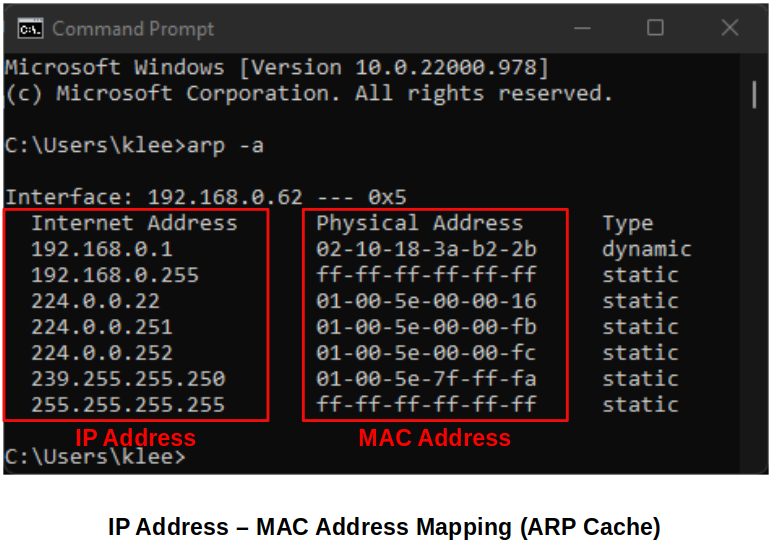
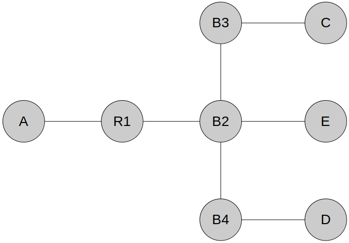

<a href="../">Notebook</a> > <a href="./">Computer Networks & Network Security</a> > Data Link Layer - ARP

# Data Link Layer - ARP

## ARP (Address Resolution Protocol)

* ARP is used for finding the MAC address that corresponds to an IP address. (ARP is located between the *Internet Layer* and the *Network Access  Layer* in the TCP/IP model.)

* Why is ARP necessary?

  For any communication to happen, we need **port number**, **IP address**, and **MAC address**. If a computer is contacted with an IP address, it has to put the  corresponding MAC address in the frame. How does the source computer know the destination computer’s MAC address? There is no way a user can provide the MAC address of the destination computer. All user can provide is the IP address or the name of the destination computer. So, the user expects the source computer (or system) to map the IP address to the destination MAC address.

  

## Two Basic Functions of ARP

1. **Mapping IPv4 addresses to MAC addresses**        

   Note that this is NOT a logical conversion! There is no logical relationship between an IP address and a MAC address. IP address is something that is manually given by the network administrator or dynamically assigned by the DHCP server whereas the MAC address is given by the Network Interface Card manufacturer at its birth.

2. **Maintaining a table of mappings**        

   Every device can be assigned an IP address and also has its own MAC addresss, so mapping can be made.

   Every device in the local area network is going to maintain the ARP cache.

   In the ARP cache of the local host, IP address to MAC address mappings are available.

## Address Resolution Process    

1. Upon receiving the IP address, the source machine **broadcasts** the request using the broadcast MAC address (FF:FF:FF:FF:FF:FF) if the IP address is NOT found in its ARP cache table.        

   Notice that the broadcast address used here is  the **MAC Address** not the IP Address because ARP is the Data Link Layer (Layer 2) protocol.

2. Target machine responds (**unicast**) with its physical (MAC) address.        

   Other hosts in the network will first accept the request because it is a broadcasted message, then check the network layer header only to find that the destination IP address does not match their own. As a result, they discard the message.

* When a device in a LAN boots up the first ARP it sends out will be to obtain the MAC address of the default gateway. This is because most of the cases the device will try to send out or receive things to or from the Internet.

## ARP Example

* **Problem:**

  Given all devices have just powered on. Describe how two-way communication between host C and host D is established. Assume using IP address (No DNS) and host C is initiating the communication. Make sure to describe all the protocols and techniques that host, bridge and routers will use.

  Hosts: A, C, D, E

  Bridges: B2, B3, B4

  Routers: R1

  

  **Solution:**

  1. C - ARP Request D (Broadcast)

     C - [ DA_D | SA_C | DAIP_D | SAIP_C ]

     B3 Flood B2

     B2 Flood R1, E, B4

     B4 Flood D

     $\therefore$ B3, B2, B4 learn location of C

  2. D - ARP Response C (Unicast)

     D - [ DA_C | SA_D | DAIP_C | SAIP_D ]

     B4 $\to$ B2

     B2 $\to$ B3

     B2 $\to$ C

     $\therefore$ B4, B2, B3 learn location of D

  Now, we have the bidirectional communication.
