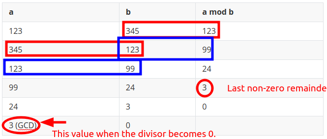

<a href="../">Notebook</a> > <a href="./">Computer/Software Security</a> > Cryptography Math

# Cryptography Math

## Modular Inverse

* The modular inverse of $A\pmod C$ can be represented as $A^{-1}$.
* $(A * A^{-1}) \equiv 1 \pmod C$ or equivalently $(A * A^{-1}) \bmod C \equiv 1 $.
* For a modular inverse to exist, $A$ and $C$ must be **coprime** (mutually relatively prime), that is, the $\gcd(A, C) = 1$.
* If you end up with a negative modular inverse, you can make it positive by adding it to (a multiple of) the modulo value.
  * Positive modulo inverse = Negative modulo inverse + (Multiple of) modulo value
  * This works because the positive modulo inverse is congruent to the negative modulo inverse (they are in the same equivalence class)
  * Note that you would start adding <u>1 * modulo</u> value, but if the sum of negative modulo inverse plus <u>1 * modulo</u> value is less than 0, you have to go to <u>2 * modulo</u> value, etc.
  * See lease non-negative residue (LNR)

### Example

* **What is $27^{-1} \pmod {392}$ ?**

  Solution:

  $392 = 27(14) + 14$

  $27 = 14(1) + 13$

  $14 = 13(1) + 1$

  --

  $14 + 13(-1) = 1$

  $27 + 14(-1) = 13$

  $392 + 27(-14) = 14$

  --

  Substitute $13$:

  $14 + [27 + 14(-1)](-1) = 1$

  $\to$ $14 + (14 - 27) = 1$

  $\to$ $2(14) + 27(-1) = 1$

  Substitute $14$:

  $2([392 + 27(-14)]) + 27(-1) = 1$

  $\to$ $2(392) + 27(-28) + 27(-1) = 1$

  $\to$ $2(392) + 27(-29) \equiv 1 \pmod {392}$

  $\to$ $2(392) + 27(392-29) \equiv 1 \pmod {392}$, since $-29 \equiv 392 -  29 \pmod {392}$

  $27(363) \equiv 1 \pmod {392}$, since $2(392) \equiv 0 \pmod {392}$

  $\therefore 27^{-1} \pmod {392} \equiv 363$

  

## Euclidean Algorithm

* The **Euclidean algorithm** is a method to compute the greatest common divisor of two numbers.
* First described by Euclid in 300BC.
* Repeatedly divide the divisor by the remainder until the remainder is 0.

### Example

* Find the greatest common divisor of $123$ and $345$ using Euclidean algorithm.

  Solution:

  

  
  
  
  
  $\therefore \gcd(123, 345) = 3$

## Extended Euclidean Algorithm

* The **Extended Euclidean algorithm** is an algorithm to compute integers $x$ and $y$ such that:

  $ax + by = \gcd(a, b)$

  Start with the `gcd` and do **back substitution** (work backwards recursively).

### Example

* Compute $x$ and $y$ such that $1239x + 168y = \gcd(1239, 168)$

  | a    | b    | r    | q    | Equation           | Equation # |
  | ---- | ---- | ---- | ---- | ------------------ | ---------- |
  | 1239 | 168  | 63   | 7    | 63 = 1239 - 7(168) | 1          |
  | 168  | 63   | 42   | 2    | 42 = 168 - 2(63)   | 2          |
  | 63   | 42   | 21   | 1    | 21 = 63 - 1(42)    | 3          |
  | 42   | 21   | 0    | 2    | 0 = 42 - 21(2)     | 4          |
  | 21   | 0    |      |      |                    |            |

  Solution: Do back substitution

  Start with next to last equation (equation 3):

  $21 = 63 - 1(42)$

  Substitute equation 2 in for the $42$ in equation 3:

  $21 = 63 - 1([168 - 2(63)]) = 1(63) + -1(168) + 2(63)$

  Get: $21 = -1(168) + 3(63)$

  Substitute equation 1 in for the $63$ in this equation:

  $21 = -1(168) + 3([1239 - 7(168)]) = -1(168) + 3(1239) - 21(168)$

  Get: $21= -22(168) + 3(1239)$ 

  $\therefore$ $x=3$, $y=-22$