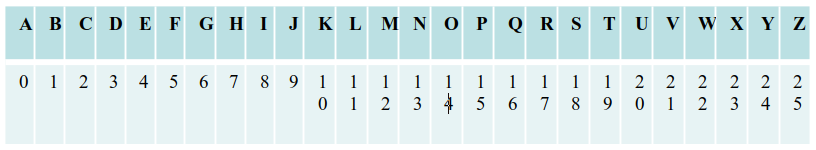
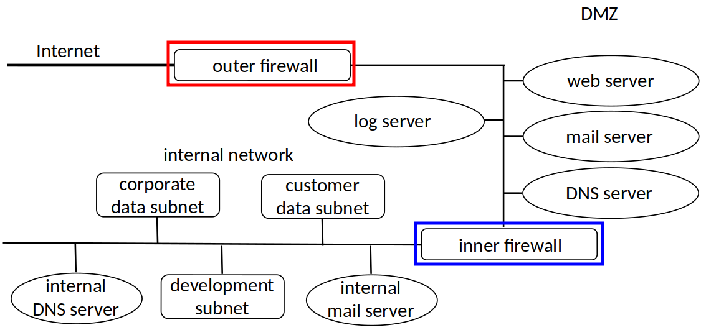

<a href="../">Notebook</a> > <a href="./">Computer/Software Security</a> > Review Questions

# Review Questions

## Security Definitions

* **Define “Confidentiality” within the area of cybersecurity.**
  * Keeping data and resources hidden
  * Access control mechanisms support confidentiality. e.g., Cryptography.

* **Define “Integrity” within the area of cybersecurity.**
  * Integrity refers to the trustworthiness of data or resources.
  * Data integrity (integrity)

  * Origin integrity (authentication)

* **Define “Availability” within the area of cybersecurity.**
  * Allowing access to data and resources

## Cryptography Math

* **Use the Extended Euclidean Algorithm to computer integers x and y such that:**

  **ax+by = gcd(a,b) = gcd(14,50)**

* **Use the Extended Euclidean Algorithm to computer integers x and y such that:**

  **ax+by = gcd(a,b) = gcd(14,52)**

  [Extended Euclidean Algorithm Calculator](https://www.extendedeuclideanalgorithm.com/calculator.php)

* **Given a=26, m=3, calculate the modular inverse.**
* **Given a=23, m=18, calculate the modular inverse.**
* **Given a=23, m=14, calculate the modular inverse.**
* **Given a=27, m=5, calculate the modular inverse.**
* **Given a=30, m=13, calculate the modular inverse.**
* **Given a=30, m=13, calculate the modular inverse.**
* **Given a=20, m=7, calculate the modular inverse.**

## Basic Cipher

* **Given the above table, and a key “FAB”, encode the plaintext “WHY” using a Vigenere cipher.  **

* **Given the above table, and a key “BED”, encode the plaintext “NOT” using a Vigenere cipher.  **

* **Use the cipher key “HEY” and the plaintext “RUN”.**

## Hashing

* **What is the (primary) problem nowadays with the MD5 hash function?  WHY is this a problem?** 

  **Which hash function is preferred, MD5 or SHA256, and Why?**

  **What is the (primary) problem nowadays with the MD5 hash function?  WHY is this a problem?**

  * SHA256 is better because MD5 is a broken algorithm. (Since 2004)
  * MD5 has collision issues; different plaintext can produce the same hash value. (MD5 is susceptible to collision attacks and so far no collisions have been found for SHA256)
  * Collision means that we could change information only in one of the messages and affect both of them.

* **What is a Collision in regard to a cryptographic hash function (I’m not talking about the hash data structure here, but the cryptographic hash)?  As part of your answer, list one hash function that has had a collision.**

  * Collision happens when two different plaintext results in the same hash value.
  * MD5 had collision issues.

## Bloom Filters

* **How does a Bloom filter work?**
  * A password is hashed (may be multiple hashes) and the corresponding bits in the hash table
    are set to 1. A password is "bad" if there is already a 1 in that location in the hash table.

* A Bloom filter is a data structure designed to tell you, rapidly and memory-efficiently, whether an element is present in a set. Typically used to add elements to a set and test if an element is in a set. A set value cannot be removed. Think why! Bloom filters are useful in cases where:
  * the data to be searched is large
  * the memory available on the system is limited/low

## Passwords

* **What is the primary purpose of a salt value?**
  * A user's new password is combined with a salt value before hashing, this increases the
    difficulty of offline dictionary attacks.

* **How is a Salt value used in a UNIX password file, and what benefit does this provide?**
  * Password salting is a technique to protect passwords stored in databases by adding a string  of 32 or more characters and then hashing them. Salting <u>prevents hackers who breach an enterprise environment from reverse-engineering passwords and stealing them from the database</u>.
  * Having a salt means that the same password can encrypt in 4,096 different ways. This makes it much harder for an attacker to build a reverse dictionary for translated encrypted passwords back into her unencrypted form: to  build a reverse dictionary of 100,000 words, an attacker would need to  have 409,600,000 entries.
* **When discussing password cracking, what is a Rainbow table?**
  * Pre-compute tables of hash values for all salt.

  * A mammoth table of hash values.
  * Can be countered by using a sufficiently large salt value and a sufficiently large hash length.

## Basic Principles of Computer Security

* **Principle of least privilege**
  * A subject should be given only those privileges that it needs in order to complete its task.
* **Principle of complete mediation**
  * All accesses to objects be checked to ensure that they are allowed. (Everything should be looked at.)
  * Inner firewall mediates every access to DMZ
* **Principle of separation of privilege**
  * A system should not grant permission based on a single condition. (More than one entity has to make the decision)
  * Going to Internet must pass through inner, outer firewalls and DMZ servers.
* **Principle of least common mechanism**
  * Mechanisms used to access resources should not be shared.
  * Inner, outer firewalls are distinct; DMZ servers separate from inner servers.
  * DMZ DNS violates this principle
    * If it fails, multiple systems affected
    * Inner, outer firewall addresses fixed, so they do not depend on DMZ DNS

## Firewall

* No internal system directly communicates with the Internet. None of the internal network directly communicate with the section between the **inner firewall** and the **outer firewall** even.

* **What is a Demilitarized Zone (DMZ) and what is its purpose?**
  * In computer security, a DMZ network (sometimes referred to as a “demilitarized zone”) functions as a subnetwork containing an organization's exposed, outward-facing services. It acts as the exposed point to an untrusted network, commonly the Internet.
  * In DMZ, external customers can access it without going onto internal network.

* **What is a firewall and how does it work?**
  * A firewall is a host that mediates access to a network. It allows/disallows accesses based on configuration and type of access.
  * **Outer firewall**
    * Goals - restrict public access to corporate network; restrict corporate access to Internet
    * Required - public needs to send, receive email; access web services
      * So outer firewall allows SMTP, HTTP, HTTPS
      * Outer firewall uses its address for those of mail, web servers
    * To do it safe, make DNS server, mail server, web server run on different systems from each other and from the firewall.

  * **Inner firewall**
    * Goals - restrict access to corporate internal network (Has to be more strict than that of outer firewall's.)
    * Rule - block ALL traffic except for that specifically authorized to enter 
      * Principle of fail-safe defaults
    * Example - Drib uses NFS on some internal systems
      * Outer firewall disallows NFS packets crossing
      * Inner firewall disallows NFS packets crossing, too.
        * DMZ does not need access to this information (least privilege)
        * If inner firewall fails, outer one will stop leaks, and vice versa (separation of privilege)

## Maybe?

* Discuss input data checking, what are the best ways to do it, that is, where should you do it?
* ***Briefly*** describe 5 different methods to help achieve Physical Security of a data center.
* **Contrast and compare SHA-1 and MD5.**

  | No   | MD5                           | SHA1                                 |
  | ---- | ----------------------------- | ------------------------------------ |
  | 1    | MD5 stands for Message Digest | SHA stands for Secure Hash Algorithm |
  | 2    | 128-bit long message digest   | 160-bit long message digest          |
  | 3    | Faster speed                  | Slower speed                         |
  | 4    | Simpler                       | More complex                         |
* **What is a birthday attack on a Message Digest algorithm?**

  * A method of cracking cryptographic algorithms through matches in hash functions. It is based on the birthday paradox, according to which the probability of two people sharing a birthday is far higher than it seems — for a  group of 23 people, for example, the probability is 50%.
  * Goal of the attack is to find two different plaintexts that result in the same hash value. Because of the birthday paradox, this method can be rather efficient.
  * If a function f(x) yields any of H different outputs with equal probability and H is sufficiently large, then we expect to obtain a pair of different arguments x1 and x2, with f(x1) = f(x2) after evaluating the function for about 1.25*sqrt(H) different arguments on average.
