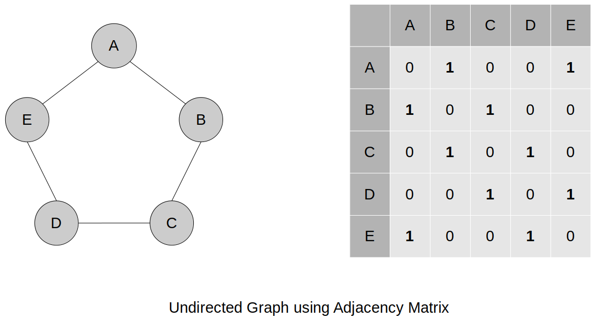
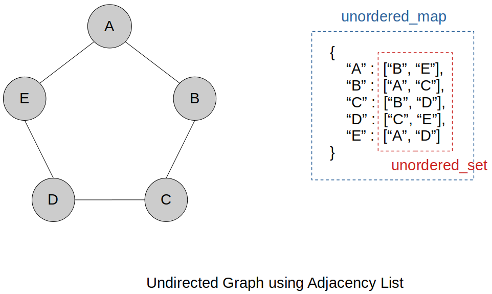

<a href="../../">Home</a> > <a href="../notebook">Notebook</a> > <a href="./">Data Structures & Algorithms</a> > Graphs

# Graphs


## Different Representations of Graphs

### Graphs using Adjacency Matrix





### Graphs using Adjacency List





## Graphs Big-O

### Time Complexity

|               | Adjacency Matrx                                       | Adjacency List                   |
| ------------- | ----------------------------------------------------- | -------------------------------- |
| Add vertex    | O(\|V\|^2^); Have to completely rebuild the 2D matrix | O(1)                             |
| Add edge      | O(1)                                                  | O(1)                             |
| Remove vertex | O(\|V\|^2^); Have to completely rebuild the 2D matrix | O(V); Have to check every vertex |
| Remove edge   | O(1)                                                  | O(1)                             |

* Using an **adjacency list** for a graph consistently offers better time complexity compared to using an adjacency matrix.

### Space Complexity

| Adjacency Matrx | Adjacency List   |
| --------------- | ---------------- |
| O(\|V\|^2^)     | O(\|V\| + \|E\|) |

* One significant disadvantage of representing a graph using an adjacency matrix is that it requires storing information for all vertices and  edges, even those that are not connected.


## Graph using Adjacency List (C++)

### Interface

```c

```

### Implementation

```c

```

### Test Driver

```c

```

```plain

```

