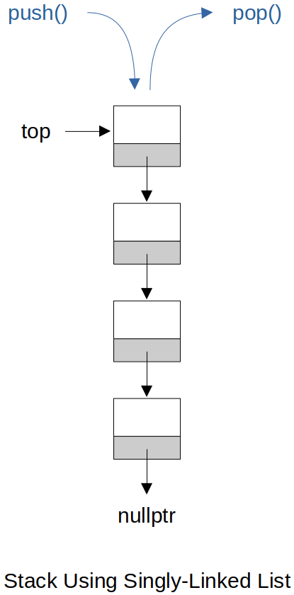

<a href="../../">Home</a> > <a href="../notebook">Notebook</a> > <a href="./">Data Structures & Algorithms</a> > Stacks

# Stacks


## Stack Using Singly-Linked List (C++)

* `push()` and `pop()` operations are designed to be done on the head of the list since both of their time complexity is O(1).





### Interface

```cpp
//========================================================================================
// Filename     : stack.h
// Description  : Interface for Stack using Singly-Linked List
// Author       : Kyungjae Lee
// History      : 06/03/2023 - Created file
//========================================================================================

#ifndef STACK_H
#define STACK_H

// Class for stack (using singly-linked list) nodes
class Node
{
public:
    int value;
    Node *next;

    Node(int value);                    // Constructor
};

// Class for stacks (using singly-linked list)
class Stack
{
public:    
    // Public interface
    Stack(int value);       // Constructor  
    void push(int value);   // Inserts a node into the top of stack
    int pop(void);          // Deletes a node from the top of stack
    int getTop(void);       // Returns the value of the top of stack
    int getHeight(void);    // Returns the number of nodes in the stack
    void printStack(void);  // Prints all nodes in the stack
    ~Stack();               // Destructor

private:
    Node *top;				// Pointer to top of stack
    int height;				// Number of nodes in the stack
};

#endif
```

### Implementation

```cpp
//========================================================================================
// Filename     : stack.cpp
// Description  : Implementation of Stack using Singly-Linked List
// Author       : Kyungjae Lee
// History      : 06/03/2023 - Created file
//========================================================================================

#include <iostream>
#include "stack.h"
#include <climits>  // INT_MIN

using namespace std;

//----------------------------------------------------------------------------------------
// Implementation of Node class interface
//----------------------------------------------------------------------------------------

// Constructor
// T = O(1)
Node::Node(int value)
{
    this->value = value;
    next = nullptr;
}

//----------------------------------------------------------------------------------------
// Implementation of Stack class interface
//----------------------------------------------------------------------------------------

// Constructor
// T = O(1)
Stack::Stack(int value)
{
    Node *newNode = new Node(value);
    top = newNode;
    height = 1;
}

// Inserts a node into the top of stack
// T = O(1)
void Stack::push(int value)
{
    Node *newNode = new Node(value);

    // Push a node into a (empty or non-empty) stack
    newNode->next = top;
    top = newNode;
    height++;
}

// Deletes a node from the top of stack
// T = O(1)
int Stack::pop(void)
{
    // Handle popping from an empty stack
    if (height == 0)
        return INT_MIN;

    Node *delNode = top;
    int poppedValue = top->value;
    top = top->next;
    delete delNode;
    height--;

    return poppedValue;
}

// Returns the value of the top of stack
// T = O(1)
int Stack::getTop(void)
{
    return top->value;
}

// Returns the number of nodes in the stack
// T = O(1)
int Stack::getHeight(void)
{
    return height;
}

// Prints all nodes in the stack
// T = O(n)
void Stack::printStack(void)
{
    Node *temp = top;

    while (temp)
    {
        cout << temp->value << " ";
        temp = temp->next;
    }

    cout << endl;
}

// Destructor
// T = O(n)
Stack::~Stack(void)
{
    // top, height will be destroyed by default, but the nodes will not.
    // So, make sure to delete them manually in the destructor.

    Node *delNode = top;

    while (top)
    {
        top = top->next;
        delete delNode;
        delNode = top;
    }
}
```

### Test Driver

```cpp
//========================================================================================
// File name    : main.cpp
// Description  : Test driver for Stack using Singly-Linked List
// Author       : Kyungjae Lee
// File created : 05/02/2023
//========================================================================================

#include <iostream>
#include "stack.h"

using namespace std;

int main(int argc, char *argv[])
{
    // Create a stack
    Stack *s = new Stack(4);
    
    // Push nodes to stack
    s->push(3);
    s->push(2);
    s->push(1);

    // Print stack information
    cout << "Top: " << s->getTop() << endl;         // 1
    cout << "Height: " << s->getHeight() << endl;   // 4
    cout << "Stack elements: "; s->printStack();    // 1 2 3 4
    
    cout << endl;
    
    // Pop nodes from stack
    s->pop();
    s->pop();

    // Print stack information
    cout << "Top: " << s->getTop() << endl;         // 3
    cout << "Height: " << s->getHeight() << endl;   // 2
    cout << "Stack elements: "; s->printStack();    // 3 4

    return 0;
}
```

```plain
Top: 1
Height: 4
Stack elements: 1 2 3 4 

Top: 3
Height: 2
Stack elements: 3 4 
```
