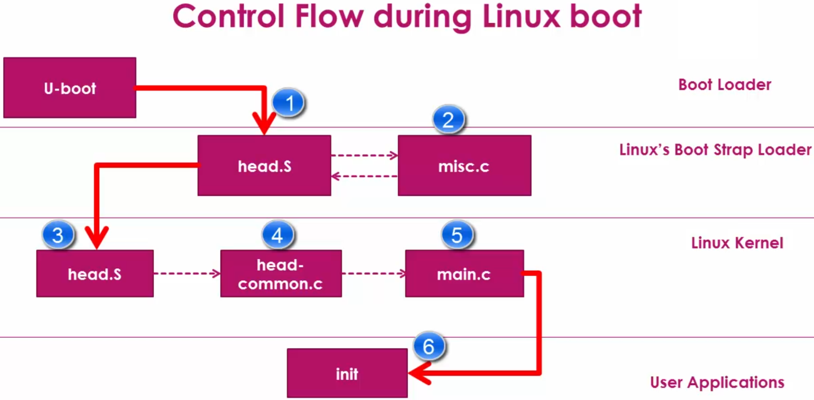
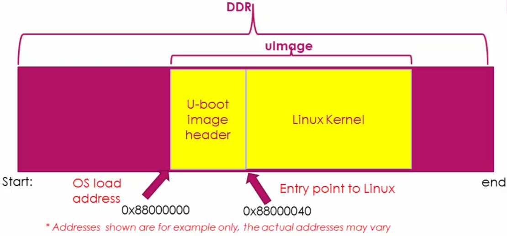
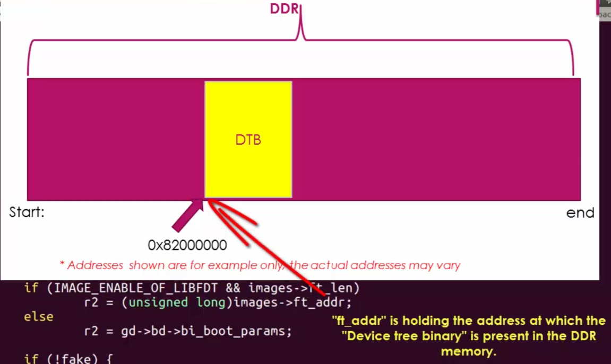
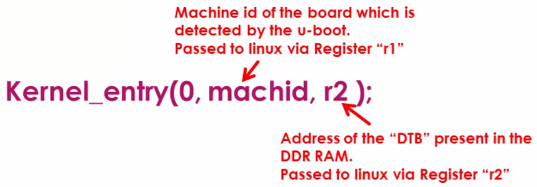
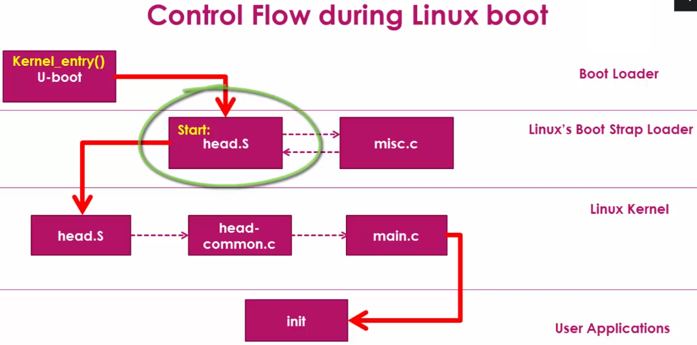

<a href="../">Notebook</a> > <a href="./">Embedded Linux</a> > BBB Linux Boot Sequence - Step 4: Bootstrap Loader

# BBB Linux Boot Sequence - Step 4: Bootstrap Loader


## BBB Linux Boot Sequence





* `misc.c` uncompresses the compressed kernel image.
* `head.S` of the Bootstrap Loader is different from that of Linux kernel.


## How does U-boot Hand Over Control to the Bootstrap Loader of the Linux Kernel?

* Time to explore the source file `bootm.c` of the U-boot source code.

* Download U-boot srouce (`u-boot-2017.05-rc2.tar.bz2 `) from [https://ftp.denx.de/pub/u-boot/](https://ftp.denx.de/pub/u-boot/). 

  `u-boot-2017.05-r2/arch/arm/lib/bootm.c`

* `bootm.c` file is where code to read the Linux kernel from memory, verify the checksum, control hand-over is implemented.

  ```c
  /* bootm.c */
  
  /* Subcommand: GO */
  static void boot_jump_linux(bootm_headers_t *images, int flag)
  {
  	...
  #else
      unsigned long machid = gd->bd->bi_arch_number;
      char *s;
      void (*kernel_entry)(int zero, int arch, uint params);
      unsigned long r2;
      int fake = (flag & BOOTM_STATE_OS_FAKE_GO);
      
      kernel_entry = (void (*)(int, int, uint))images->ep;
      ...
      if (IMAGE_ENABLE_OF_LIBFDT && images->ft_len)
          r2 = (unsigned long)images->ft_addr;
      else
          r2 = gd->bd->bi_boot_params;
  
      if (!fake) {
  #ifdef CONFIG_ARMV7_NONSEC
          if (armv7_boot_nonsec()) {
              armv7_init_nonsec();
              secure_ram_addr(_do_nonsec_entry)(kernel_entry,
                                0, machid, r2);
          } else
  #endif
              kernel_entry(0, machid, r2);
      }
  #endif
  }
  ```

  > * L4: `bootm_headers_t` is defined in `include/image.h`.
  >
  > * L10: `kernel_entry` is a function pointer that is initialized in L14 to the entry point of the Linux kernel image. `ep` is found in the `bootm_headers_t` is defined in `include/image.h`.
  >
  >   
  >
  >   
  >
  >   
  >
  > * L17: r2
  >
  >   
  >
  > 
  >
  > 
  >
  > * Device Tree Binary (DTB) is actually Flattened Device Tree (FDT), which describes various peripherals present on the board. The Linux kernel needs this binary during the boot. Otherwise, Linux boot may not succeed.
  >
  > * L29: U-boot transfers the control to the Bootstrap Loader. The "entry point" (`images->ep`) address is dereferenced.
  >
  >   
  >
  >   
  >
  >   
  >
  >   First argument is ignored by the Linux, `machid` is U-boot saying "Hey, I've detected this machine!". `r2` stores the address of FDT.

* The Boot Loader transfers the control to `head.S` (`Start:`) of the Linux's Bootstrap Loader.





## References

Nayak, K. (2022). *Embedded Linux Step by Step Using Beaglebone Black* [Video file]. Retrieved from https://www.udemy.com/course/embedded-linux-step-by-step-using-beaglebone/