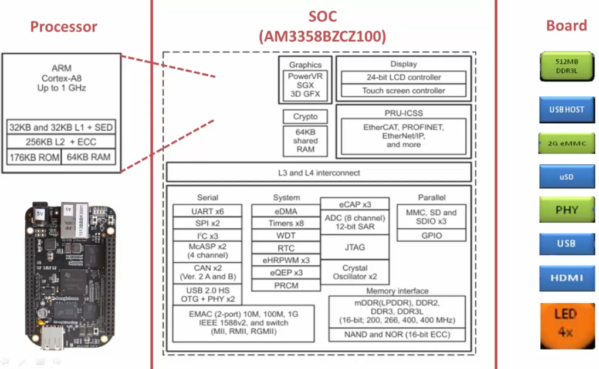
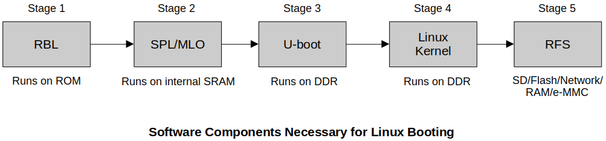
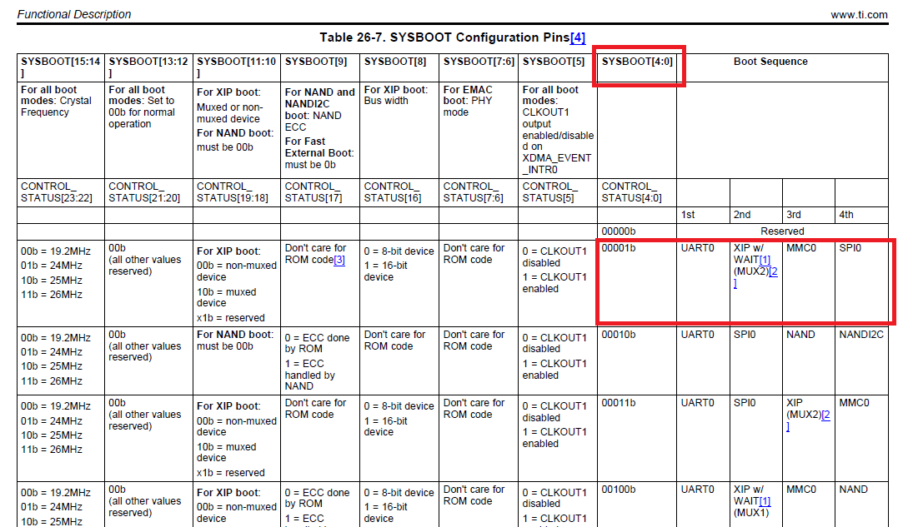
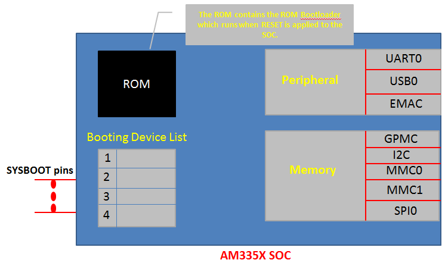
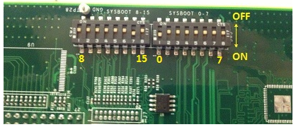
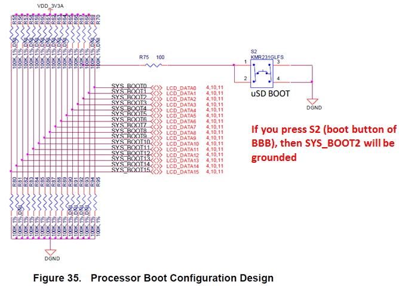
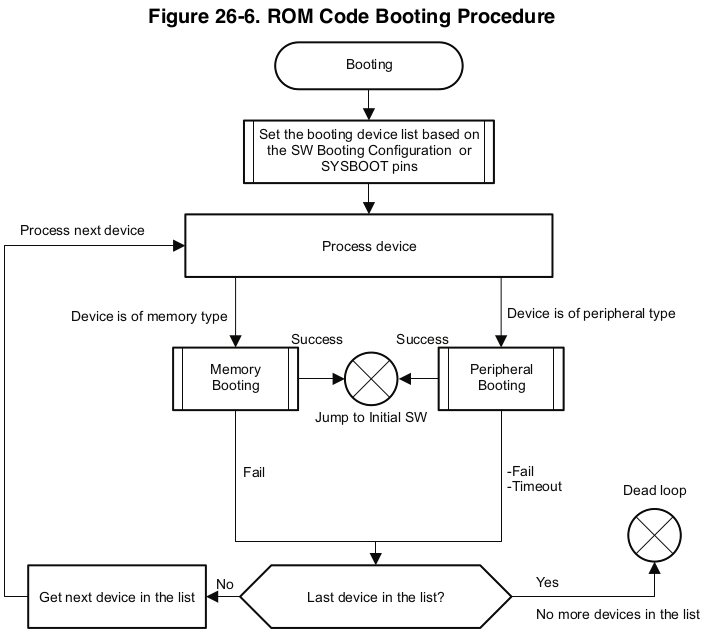

<a href="../">Notebook</a> > <a href="./">Embedded Linux</a> > BBB Linux Booting Sequence

# BBB Linux Booting Sequence

## Linux Boot Requirements

### Hardware 

* e.g., AM335x SoC Functional Blocks

### Software

* **ROM Boot Loader (RBL)**
  * The very first piece of code (tiny boot loader) to run on the SoC when the power is supplied to the board.
  * This boot loader is written by the SoC vendor (e.g., Texas Instrument) and stored in ROM of the SoC during the production of this chip. 
  * This code cannot be modified and is not open to public.
  * The main responsibility of the RBL is to load/run the second stage boot loader such as SPL (or MLO) from the internal memory.
* **Secondary Program Loader (SPL)** - a.k.a. **Memory LOader (MLO)**
  * The responsibility of the second stage boot loader is to load/run the third stage boot loader such U-boot from the DDR memory of the board.
* **U-boot**
  * The responsibility of the third stage boot loader is to load/run the Linux kernel from the DDR memory of the board.
* **Linux kernel**
* **Root File System (RFS)**

## BBB Boot Options

* AM335x SoC can boot from the following boot sources:

  * NAND Flash
  * NOR Flash (eXecute In Place; XIP)
  * USB
  * SD card
  * Ethernet
  * UART
  * SPI

  This mean that you can keep the boot images in any of the above memories or peripherals and boot the SoC.

* SYSBOOT Configuration (in TRM documentation)

  Focus on **SYSBOOT[4:0]**. "SYSBOOT" is one of the registers of this SoC and its first 5 bits decide the boot order.

  

  * SYSBOOT [4:0] = 00000b (This is reserved, you cannot use this configuration)   
  * SYSBOOT [4:0] = 00001b   
    1. On reset, SoC will first try to boot from UART0.
    2. If it fails, then it will try to boot from XIP(XIP stands  for eXutable In Place memory like NOR Flash). 
    3. If it fails, then  it will try to boot from MMC0.
    4. If fails, it will try to boot from SPI0. 
    5. If it fails, then SoC outputs the error message and  stops. 

### SoC Boot Order Decision

* On reset, the code stored in ROM (i.e., ROM Boot Loader; RBL) of the SoC will run first!

## References

Nayak, K. (2022). *Embedded Linux Step by Step Using Beaglebone Black* [Video file]. Retrieved from https://www.udemy.com/course/embedded-linux-step-by-step-using-beaglebone/