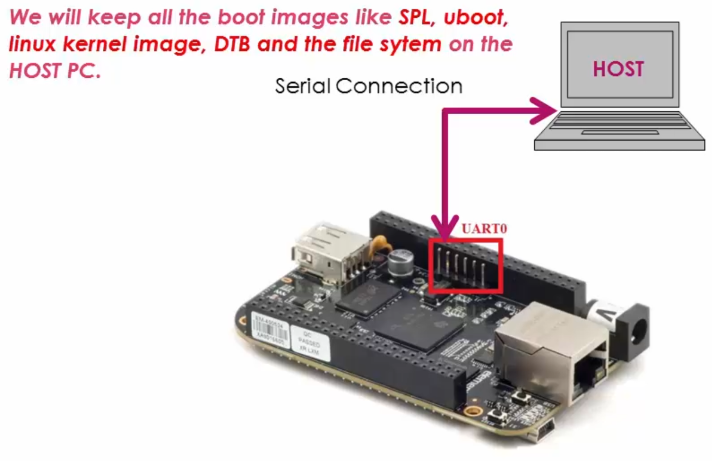
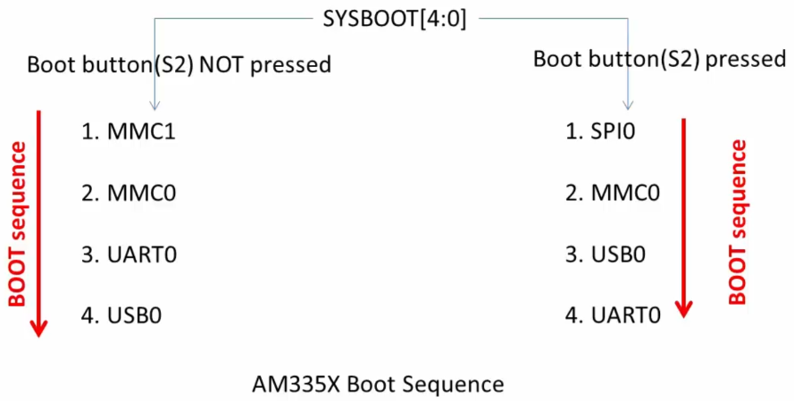

<a href="../">Notebook</a> > <a href="./">Embedded Linux</a> > Booting BBB over Serial Port

# Booting BBB over Serial Port

## Serial Booting

* **Serial booting** means transferring the boot images from **host** to the **target** via the serial port (UART) in order to boot the target board.

  

  

  

  [!] Note: Host may be running on Windows, Linux or Mac because most of the serial monitoring programs support Xmodem, Ymodem, and Zmodem protocols.

* The **protocol** used to transfer a file/information over UART:

  * Xmodem, Ymodem, Zmodem, Kermit, etc.

  [!] Note: The protocol used to transfer a file/information over IP network:

  * TFTP, HTTP, FTP, SMTP, etc.

## Mechanism of Serial Booting

* First of all, make the BBB board to boot via UART peripheral.

  Boot the board exactly the same way you've booted using the micro SD card except that this time the micro SD card is NOT inserted to the board. (Press and hold S2 button $\to$ Press and release S3 button)

  1. Make sure the SD card slot is empty.

  2. Make sure the mini USB cable is NOT connected to the board. 

     This is so the board does not boot from the port P4; USB0. Even if the board cannot detect the boot source over the connected USB, it will wait about 4.5 mins to move on to the next boot source. So, try to power the board using power adapter not the mini USB cable. (Consult the figure "USB Initialization Procedure" of the *Technical Reference Manuel*.)

  3. Power up the board using the power adapter.

  Then, the board will boot over UART0.

* When you keep the board in the **UART boot mode**, the ROM Boot Loader (RBL) is waiting for the second stage boot loader that is SPL image over **Xmodem protocol only**!

  The ROM code will ping the host 10 times in 3s to start Xmodem transfer. If host does not respond, UART boot will timeout.

* Once the SPL executes it also tries to get the third stage boot loader that is U-boot image over Xmodem protocol, and you should send the U-boot image over Xmodem protocol from the host.

* When the U-boot executes, you can use U-boot commands such as `xmodem` or `ymodem` to load the rest of the images like the Linux kernel image, DTB, initramfs into the DDR memory of the board at the recommended addresses.

  Recommended addresses:

  | Binary                      | DDR RAM Load Address |
  | --------------------------- | -------------------- |
  | Linux kernel image (uImage) | 0x82000000           |
  | FDT or DTB                  | 0x88000000           |
  | RAMDISK or INITRAMFS        | 0x88080000           |

  https://stackoverflow.com/questions/45475611/zimage-loadaddr-in-uboot

### Summary

1. Make the board slip into the UART boot mode.
2. Once in the UART boot mode, the ROM Boot Loader will be waiting to receive the SPL over UART via Xmodem protocol, so send SPL form the host PC first.
3. Then, SPL executes on the board and it will be waiting to receive the U-boot image. Send the U-boot image.
4. When getting the control of U-boot on the board, use U-boot commands `xmodem` and `ymodem` protocol to download all the other boot images onto the DDR memory of the board, and then the booting will further proceed from there.

[!] Note: If you are facing issues with U-boot boot after downloading it through Xmodem, then refer to the following threads where TI Software team suggests to use Ymodem protocol to download the uboot image instead of Xmodem. 

https://e2e.ti.com/support/arm/sitara_arm/f/791/t/646278?AM3358-UART-boot-mode

https://e2e.ti.com/support/arm/sitara_arm/f/791/t/646278?AM3358-UART-boot-mode

## Exercise

## References

Nayak, K. (2022). *Embedded Linux Step by Step Using Beaglebone Black* [Video file]. Retrieved from https://www.udemy.com/course/embedded-linux-step-by-step-using-beaglebone/