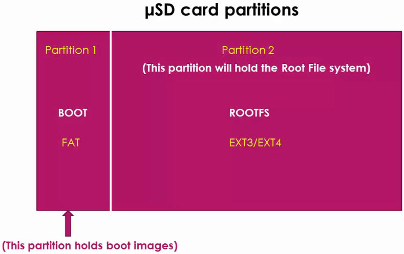

<a href="../">Notebook</a> > <a href="./">Embedded Linux</a> > Exercise - Booting RBL & MLO on BBB

# Exercise - Booting RBL & MLO on BBB

## Micro-SD Card Setup

* Set up your micro-SD card's partitions as follows:

* I've used the partitioning application called "GParted".

  [!] Note: Select the correct device name that corresponds to your SD card. Selecting a wrong device may destroy your system.

* Delete the previously allocated file system and create two partitions as follows.

## References

Nayak, K. (2022). *Embedded Linux Step by Step Using Beaglebone Black* [Video file]. Retrieved from https://www.udemy.com/course/embedded-linux-step-by-step-using-beaglebone/