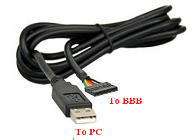

<a href="../">Notebook</a> > <a href="./">Embedded Linux</a> > Introduction

# Introduction


## Board (BeagleBoneBlack - Rev C)

* BeagleBoneBlack Official Website - [https://beagleboard.org/black](https://beagleboard.org/black)

  Full source schematics, hardware layout files, a full Bill of Materials (BOM), and technical reference manuals are available here.

* BeagleBoneBlack Wiki - [https://elinux.org/Beagleboard:BeagleBoneBlack](https://elinux.org/Beagleboard:BeagleBoneBlack)

  11. Hardware Files $\to$ LATEST PRODUCTION FILES (C)

* System Reference Manual - [https://docs.beagleboard.org/latest/boards/beaglebone/black/](https://docs.beagleboard.org/latest/boards/beaglebone/black/)


## Necessary Parts

* **Serial Debug Cable**

  To access the serial(UART) pins of the board for debug purposes, a USB  to Serial TTL converter hardware is required because the Board doesn’t come with on-board serial converter chip. 

  Remember when you connect “USB to Serial Convertor” to any hardware  like BBB, the TX pin of this module should go to the RX pin of the  another board, in this case BBB. 





* **5VDC Power Supply**

  You can power the board by connecting BBB to your PC using mini USB  cable, but the current via the USB port is limited to 500mA by the power management device on the board. The board shuts off if USB current  exceeds this range. Also if you want to drive more peripherals, the  current will be in sufficient. A DC power supply solves this issue.    

  Recommended DC power adapter 5V @ 2A  (*DC Barrel Plug 5.5mm/2.1mm*)

  [!] Note: Remember that the operating current recommended to be 1A to 2A, exceeding this range may damage the board.

* **Micro SD Card**

  Micro SD card of 4GB or above is necessary to carry out the SD card related experiments like eMMC booting, SD booting, etc.


## What is SoC?

* **SoC** stands for System on Chip. As the name indicates, a single chip contains most of the essential computing /communication/storage engine of the computing world, like Flash memory, Graphics processing engine, the image processing engine, the USB communication engine, RS232, SPI, I2C engine and much more. The heart of the SOC is a processor.

  For example AM355x SOC is powered by **ARM cortex A8 processor.**    


## Serial Port Monitoring Software

Software used to monitor serial devices.

* Ubuntu - **Minicom** is very popular
* Windows - **Tera-Term**, **PuTTY**, **Hyper-Terminal**

### Using Minicom

* To run minicom

  ```plain
  sudo minicom -s
  ```


## References

Nayak, K. (2022). *Embedded Linux Step by Step Using Beaglebone Black* [Video file]. Retrieved from https://www.udemy.com/course/embedded-linux-step-by-step-using-beaglebone/