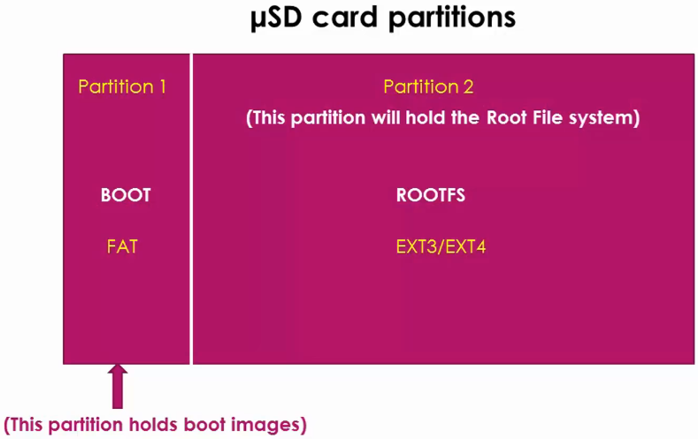

<a href="../">Notebook</a> > <a href="./">Embedded Linux</a> > Writing uEnv.txt File from Scratch

# Writing uEnv.txt File from Scratch

[!] Note: Instead of booting from eMMC completed from the previous steps (Debian image; where there's only one partition, and `boot/` folder does not contain uImage), I've used microSD card (which contains Angstrom image) to boot to follow the lecture. 


## Introduction

* `boot` U-boot command will load the Linux kernel and execute it. `boot` simply runs the environment variable `bootcmd`. So, if you want to change the behavior of `boot`, you have to modify the commands stored in the environment variable `bootcmd`.

* U-boot always try to read the uEnv.txt from the boot source. If uEnv.txt is not found, it will use the default values of the enve variables.

  If you don't want U-boot to use default values, you need to enforce new values using uEnv.txt.

* U-boot's "load from memory device" commands:

  * `fatload` - Loads a binary file from FAT based file system into memory.
  * `load` - Loads a binary file from any file system.

  Examples:

  ```plain
  fatload usb 0:1 0x82000000 uImage
  fatload mmc 0:1 0x88000000 initramfs
  load mmc 0:1 0x88000000 uImage
  ```

  > * 1st arg - Interface (e.g., USB, MMC, etc.)
  >
  > * 2nd arg - Device#:Partition# (Device# can be checked by running something like `mmc list`.)
  >
  > * When the Linux image is properly flashed onto eMMC, eMMC partitions would look like:
  >
  >     
  >


* Our goal is to write our own uEnv.txt file from scratch and update the `bootcmd` so that when we run `boot` command from the U-boot prompt, it will refer to our custom uEnv.txt file while booting.

* Let's load the Linux binary image "uImage" from the second partition of the SD card into the DDR memory.

  ```plain
  => load mmc 0:2 0x82000000 /boot/uImage
  4002080 bytes read in 300 ms (12.7 MiB/s)
  ```
  
  > `/boot/uImage` since uImage file is located inside the directory `boot/` in the 2nd partition of SD card.
  
* Now, let's boot the Linux kernel image.

  This boot fails because the Linux Bootstrap Loader couldn't find the DTB. (This is why the Bootstrap Loader complains about the "Unrecognized machine ID ...". 

  ```plain
  => bootm 0x82000000
  
  ## Booting kernel from Legacy Image at 82000000 ...
     Image Name:   Angstrom/3.8.10/beaglebone
     Created:      2013-04-29  19:56:00 UTC
     Image Type:   ARM Linux Kernel Image (uncompressed)
     Data Size:    4002016 Bytes = 3.8 MiB
     Load Address: 80008000
     Entry Point:  80008000
     Verifying Checksum ... OK
     Loading Kernel Image ... OK
  
  Starting kernel ...
  
  Uncompressing Linux... done, booting the kernel.
  
  Error: unrecognized/unsupported machine ID (r1 = 0x00000e05).
  
  Available machine support:
  
  ID (hex)        NAME
  ffffffff        Generic OMAP4 (Flattened Device Tree)
  ffffffff        Generic AM33XX (Flattened Device Tree)
  ffffffff        Generic OMAP3-GP (Flattened Device Tree)
  ffffffff        Generic OMAP3 (Flattened Device Tree)
  0000060a        OMAP3 Beagle Board
  00000a9d        IGEP OMAP3 module
  00000928        IGEP v2 board
  00000ae7        OMAP4 Panda board
  
  Please check your kernel config and/or bootloader.
  ```

  > L13: The very last message from the U-boot. From this point on, the control is on the Linux Bootstrap Loader.

* To boot successfully, we need to let the Bootstrap Loader know where the correct DTB file is located.


## References

Nayak, K. (2022). *Embedded Linux Step by Step Using Beaglebone Black* [Video file]. Retrieved from https://www.udemy.com/course/embedded-linux-step-by-step-using-beaglebone/