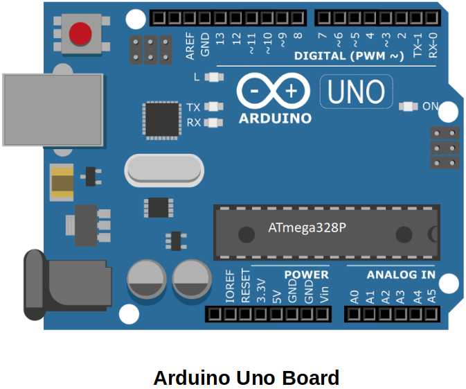
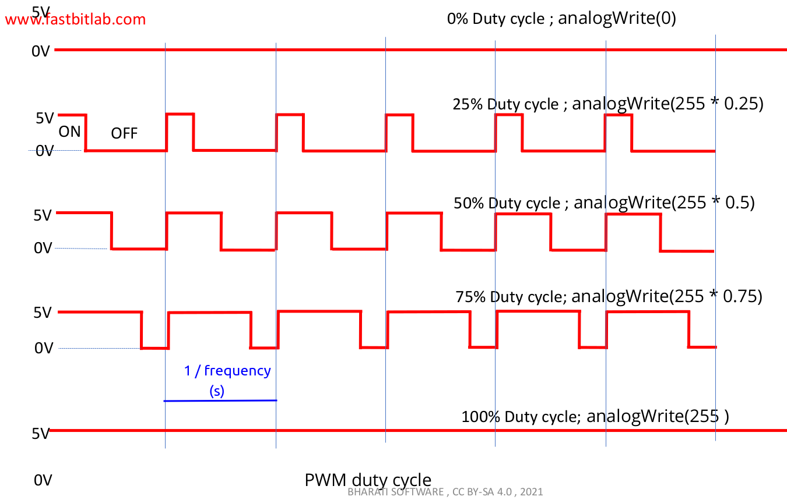
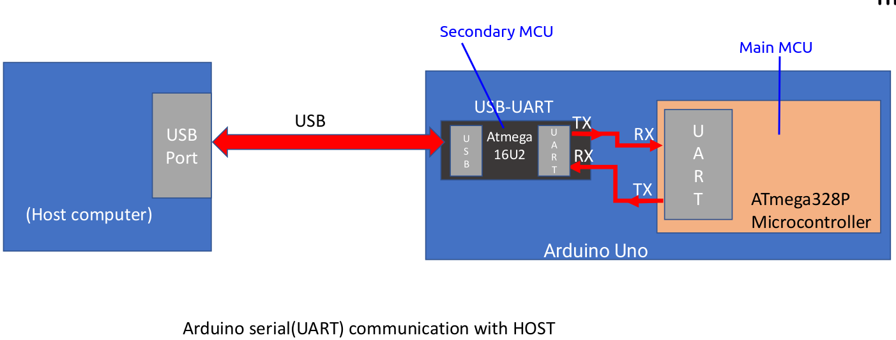
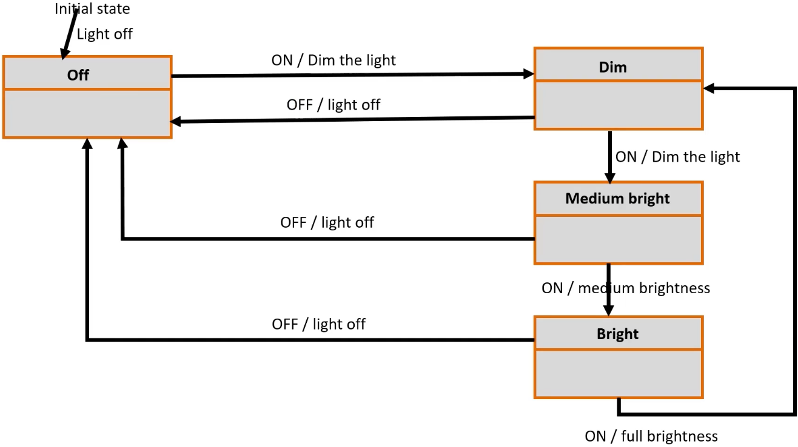

<a href="../../">Home</a> > <a href="../notebook">Notebook</a> > <a href="./">Embedded Systems Design using UML State Machines</a> > Exercise 1: Changing Intensity of an LED

# Exercise 1: Changing Intensity of an LED

## Overview

### Requirements

1. Connect the LED to any one of the PWM pins on the Arduino Uno board.

2. Modify the duty cycle of the PWM wave using the Arduino API's `analogWrite()` function.

   * With the Arduino Uno board, the `analogWrite()` API is not related to internal analog peripherals. Instead, it controls the ON/OFF period through the pin using a timer to achieve the desired duty cycle.

   * Language Reference: [https://www.arduino.cc/reference/en/](https://www.arduino.cc/reference/en/)

3. Utilize the Arduino serial interface to transmit ON and OFF events from the host.

### Components

* Arduino Uno board
* 1, 5mm LED
* Jumper wires

### Hardware

* Arduino Uno board PWM pins
  * Pin 3, 5, 6, 9, 10, 11 are PWM pins
  * On these pins Arudino Uno can generate PWM signals
  * PWM signal frequency:
    * 490Hz on 3, 9, 10, 11
    * 980Hz on 5 and 6

### PWM Duty Cycle

### Arduino Serial (UART) Communication with Host

* Arduino Uno board's secondary MCU acts as a USB-to-Serial converter which has a firmware that converts USB signal to UART signal and vice versa.

  Thanks to this firmware, the Arduino Uno board can be enumerated as a Virtual COM Port on the host.

* When uploading the program from the host to the Arduino board, the program is transferred via the USB cable, converted into UART signals, and then sent to the main MCU. The bootloader, located in the main MCU, writes the received program into the Flash memory.

## Implementation

### Mealy Machine: Light Control

