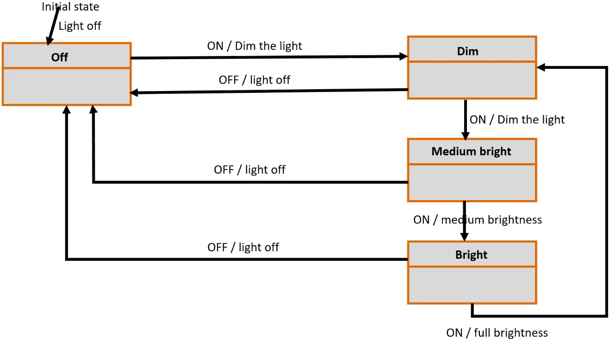

<a href="../../">Home</a> > <a href="../notebook">Notebook</a> > <a href="./">Embedded Systems Design using UML State Machines</a> > Exercise 2: Productivity Timer (ProTimer)

# Exercise 2: Productivity Timer (ProTimer)


## Overview

### Requirements

1. `+` button increments time (minute-level increment).
2. `-` button decrements time (minute-level decrement).
3. `Start/Pause` button starts or pauses the countdown, or shows STAT if pressed together.
4. When the countdown is paused, time can be modified.
5. Press the `+` and `-` button simultaneously to abort the running timer.
6. Application must beep 20 times when it returns to IDLE mode.
7. When the application is in IDLE mode, pressing the `Start/Pause` button should show the STAT for 1 sec and auto return to IDLE mode.

### Components

* Arduino Uno board
* 1, 5mm LED
* Jumper wires

### Hardware


* Arduino Uno board PWM pins
  * Pin 3, 5, 6, 9, 10, 11 are PWM pins
  * On these pins Arudino Uno can generate PWM signals
  * PWM signal frequency:
    * 490Hz on 3, 9, 10, 11
    * 980Hz on 5 and 6

### PWM Duty Cycle


### Arduino Serial (UART) Communication with Host


* Arduino Uno board's secondary MCU acts as a USB-to-Serial converter which has a firmware that converts USB signal to UART signal and vice versa.

  Thanks to this firmware, the Arduino Uno board can be enumerated as a Virtual COM Port on the host.

* When uploading the program from the host to the Arduino board, the program is transferred via the USB cable, converted into UART signals, and then sent to the main MCU. The bootloader, located in the main MCU, writes the received program into the Flash memory.


## Implementation - Mealy State Machine

### Mealy State Machine





### Implementation

```cpp

```


## Implementation - Moore Machine

### Moore State Machine


### Implementation

```cpp

```
