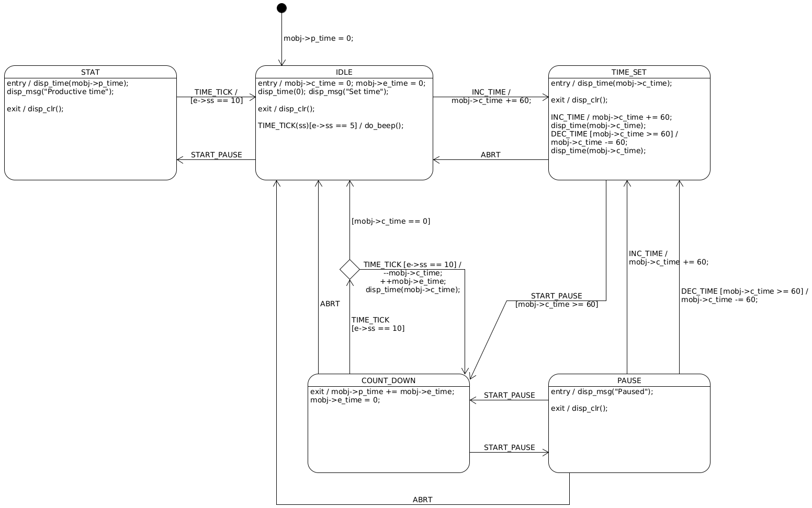

<a href="../../">Home</a> > <a href="../notebook">Notebook</a> > <a href="./">Embedded Systems Design using UML State Machines</a> > Exercise 2: Productivity Timer (ProTimer)

# Exercise 2: Productivity Timer (ProTimer)


## Overview

The application that tracks your productive working time.

### Requirements

1. `+` button increments time (minute-level increment).
2. `-` button decrements time (minute-level decrement).
3. `Start/Pause` button starts or pauses the countdown, or shows STAT if pressed together.
4. When the countdown is paused, time can be modified.
5. Press the `+` and `-` button simultaneously to abort the running timer.
6. Application must beep 20 times when it returns to IDLE mode.
7. When the application is in IDLE mode, pressing the `Start/Pause` button should show the STAT for 1 sec and auto return to IDLE mode.

### Components

* Arduino Uno board
* 1, 5mm LED
* Jumper wires

### States

* IDLE
* TIME_SET
* PAUSE
* COUNTDOWN
* STAT

### Events

| User Activity                      | Event Generated (SIGNAL) | Parameters            | Note                                                         |
| ---------------------------------- | ------------------------ | --------------------- | ------------------------------------------------------------ |
| Press `+` button                   | INC_TIME                 | none                  | This event gets posted to the state machine whenever the user presses the `+` button. |
| Press `-` button                   | DEC_TIME                 | none                  | This event gets posted to the state machine whenever the user presses the `-` button. |
| Press `S/P` button                 | START_PAUSE              |                       | This event gets posted to the state machine whenever the user presses the `S/P` button. |
| Press `+` and  `-` button together | ABRT                     |                       | This event gets posted to the state machine whenever the user presses the `+` and `-` buttons together. |
|                                    | TIME_TICK                | ss <br />(sub second) | This event is system generated for every 100ms.<br />ss parameter value can vary between 1 to 10. |

### Extended State Variables

* curr_time : uint32_t
* elapsed_time : uint32_t
* pro_time : uint32_t

```c
/* The main application structure */
typedef struct protimer_tag
{
    uint32_t curr_time;		// Stores the time user has set
    uint32_t elapsed_time;	// Number of seconds that has elapsed
    uint32_t pro_time;		// Productive time spent by the user
    ...
} protimer_t;
```


## State Machine

### Flat State Machine





## Implementation


