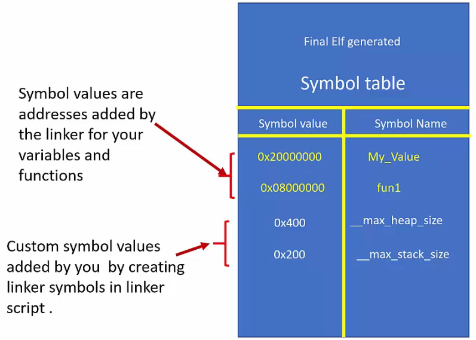

<a href="../">Notebook</a> > <a href="./">Embedded Systems Programming (ARM)</a> > Linker Script

# Linker Script


## Linker Script

* Linker script is a text file which explains how different sections of the object files should be merged to create a single output file.
* **Linker** and **locator** combination assigns unique absolute addresses to the different sections of the output file by referring to the address information mentioned in the linker script.
* Linker script also includes the code and data memory address and size information.
* Linker scripts are written using the GNU linker command language.
* GNU linker script has the file extension of `.ld`
* You must supply linker script at the linking phase to the linker using `-T` flag.


## Linker Script Commands

Before writing a linker script you must understand what the linker script commands mean:

* **ENTRY**

  * Used to set the "**Entry point address**" information in the header of final ELF file generated

  * In our case, `Reset_Handler()` is the entry point into the application. The first piece of code that executes right after the processor reset.

  * The debugger uses this information to locate the first function to execute.

  * Not a mandatory command to use, but required when you debug the ELF file using the debugger (GDB)

  * Syntax: `Entry(_symbol_name_)`

    ```plain
    Entry(Reset_Handler)
    ```

* **MEMORY**

  * Allows you to describe the different memories present in the target and there start address and size information.

  * The linker uses information mentioned in this command to assign addresses to merged sections. (Relocation of sections)

  * The information given under this command also helps the linker to calculate total code and data memory consumed so far and throws an error message if data, code, heap or stack areas cannot fit into available size.

  * By using this command, you can fine-tune various memories available in your target and allow different sections to occupy different memory areas.

  * Typically one linker script has one MEMORY command.

  * Syntax:

    ```plain
    MEMORY
    {
    	name(attr):ORIGIN =origin, LENGTH =len
    }
    ```

    > [!] Note: There must be a space before each `=`.
    >
    > * name(attr): "label" - defines name of the memory region present in your target which will be later referenced by other parts of the linker script. 
    >
    > * (attr): defines the attribute list of the memory region. Valid attribute list must be made up of the characters "ALIRWX" that match section attributes:
    >
    >   * R - read-only sections
    >   * W - read/write sections
    >   * X - sections containing executable code
    >   * A - allocated sections
    >   * I - initialized sections
    >   * L - same as 'I'
    >   * ! - Invert the sense of the following attributes
    >
    >   Attributes can be lower/upper cases. Two or more can be combined.
    >
    > * ORIGIN: defines origin(start) address of the memory region
    >
    > * LENGTH: defines the length of the memory region

  * Example:

    STM32F4VGT6 / FLASH (1024 KB) / SRAM1 (112 KB) / SRAM2 (16 KB)

    ```plain
    MEMORY
    {
        FLASH(rx): ORIGIN=0x08000000, LENGTH=1024K
            /* rx since code memory contains information not writable by user program */
        SARM(rwx): ORIGIN=0x20000000, LENGTH=128K
    
        /* continue defining other memory regions here, if necessary */
    }
    ```

* **SECTIONS**

  * Used to create multiple output sections in the final ELF executable generated.

  * Important command by which you can instruct the linker how to merge the sections with the same name (from the input files) to yield one output section in the output file 

    (All `.text` sections from input files $\to$ merge into one `.text` section in the output file.)

  * This command also controls the order in which different output sections appear in the ELF file generated.

  * By using this command, you also mention the placement of a section in a memory region. For example, you instruct the linker to place the `.text` section in the FLASH memory region, which is described by the MEMORY command.

  * Eample:

    ```plain
    SECTIONS
    {
    	/* This section should include .text section of all input files. */
    	.text :
    	{
    		/*
    	 	* merge all .isr_vector section of all intput files
    	 	* merge all .text section of all input files
    	 	* merge all .rodata section of all input files
    	 	*/
    	 }>(vma) AT>(lma) /* informs to which address this section should go */
    	 
    	 /* This section should include .data section of all input files */
    	 .data :
    	 {
    	 	/*
    	 	 * merge all .data section of all input files
    	 	 */
    	 }>(vma) AT>(lma)
    }
    ```

    > [!] Note: There must be a space between a section name and a `:`. e.g., `.text :` (`.text:` will cause a syntax error.)

* **KEEP**

* **ALIGN**

* **AT>**


## Location Counter (`.`)

* Location counter is a special linker symbol denoted by a dot (`.`).
* This symbol is called "location counter" since linker automatically updates this symbol with location (address) information. (Location counter always tracks **VMA** of the section in use, not LMA)
* You can use this symbol inside the linker script to track and define boundaries of various sections (e.g., `_edata`, `_sdata`, `etext`). This will be used when we write a section of `Reset_Handler()` where we copy the `.data` section into the  SRAM.
* You can also set location counter to any specific value while writing linker script.
* Location counter should appear only inside the SECTIONS command. Attempting to use the location counter outside the SECTIONS command will result in a linker error.
* The location counter is incremented by the size of the output section.
* Example: *See the exmple in the "Linker Script Symbols" section.*


## Linker Script Symbols

* A linker symbol is a name of an address.

* An identifier such as a variable name, a function name is essentially a human-friendly representation of the memory address that is bound to that specific identifier. What we call as an identifier is called a symbol in the compiler's language! The compiler maintains what's called a "**Symbol table**" in every object file which is a group of **symbol-to-Address mappings**.

  Symbols are created and maintained by the compiler.

* A symbol declaration is not equivalent to a variable declaration what you do in your C program. It is done in a linker sript. We need to be able to create linker script symbols so we can capture some important information such as the boundary addresses of `.data` section, etc.

  ```plain
  /* linker script */
  __max_heap_size = 0x400;	/* a symbol declaration (NOT a C variable!!!) */
  __max_stack_size = 0x200;	/* a symbol declaration (NOT a C variable!!!) */
  
  ...
  SECTIONS
  {
  	.text:
  	{
  		...
  		end_of_text = .;	/* capture the updated location counter value into this symbol */
  		/* at this point (.) will represent (VMA of .text) + (size of .text) */
  	}
  	
  	.data:
  	{
  		start_of_data = 0x20000000;	/* assign a value to a symbol 'start_of_data' */
  		...
  	}
  }
  ```

  > L11: Usage of the "location counter (.)"

  These linker symbols added to the linker script will get added to the symbol table of the final executable by the linker. Remember! This is the **linking phase** that we are talking about and the compiler has nothing to do with the linker script symbols.





* Linker script symbols are accessible by the C program. This is how we can write a section of program inside the `Reset_Handler()`  to copy `.data` section from FLASH to RAM.


## LInking & Linker Flags

* To link all the object files (suppose our main application does not use standard library calls):

  ```plain
  arm-none-eabi-gcc -nostdlib -T stm32_ls.ld *.o -o final.elf
  ```

  > `-nostdlib` since we are not using standard library calls in our main application
  >
  > `-T` flag is followed by the linker script name
  >
  > `*.o` since we are linking all the object files


## References

Nayak, K. (2022). *Embedded Systems Programming on ARM Cortex-M3/M4 Processor* [Video file]. Retrieved from  https://www.udemy.com/course/embedded-system-programming-on-arm-cortex-m3m4/
