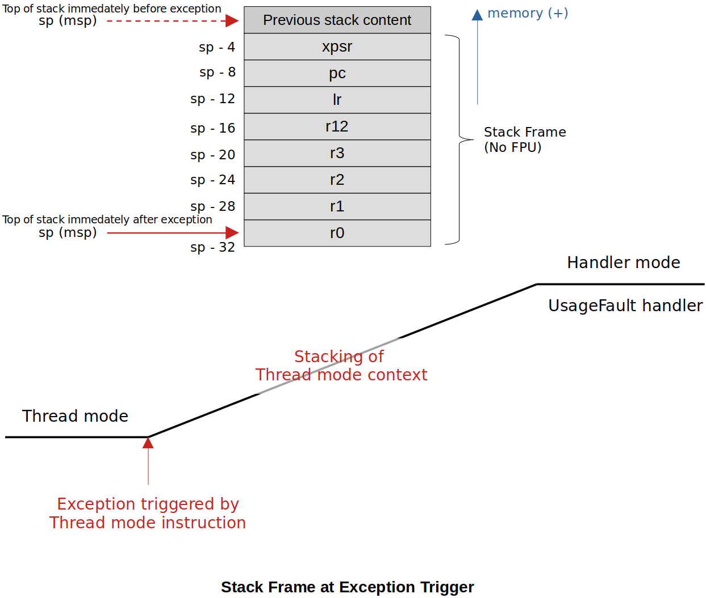

<a href="../">Notebook</a> > <a href="./">Embedded Systems Programming (ARM)</a> > Stack Analysis Using `__attribute__((naked))` Function

# Stack Frame Analysis Using `__attribute__((naked))` Function


## Introduction

* At times, you may want to analyze the stack frame pushed onto stack immediately after the exception has triggered to understand what exactly has gone wrong in the Thread mode code.

  In this case, if you understand the processor's stacking process at exception trigger you will be able to print the contents of the pushed stack frame and analyze them. The key here is to obtain the **stack pointer immediately after the exception has triggered**.





## Prologue & Epilogue of a C Function

* Every C function will be added two sections called "Prologue" and "Epilogue" when the compiler generates the assembly code for it.
  - **Prologue** - What happens at the beginning of a function. Its responsibility is to set up the stack frame of the called function.
  - **Epilogue** - What happens last in a function. Its purpose is to restore the stack frame of the calling function. (The exact opposite of Prologue).

* When debugging the following code, you'll realize that the compiler automatically generates some assembly code that manipulates SP before the first line of `UsageFault_Handler()`. $\to$ "Prologue"

  ```c
  // Stack frame analysis using UsageFault_Handler()
  // First mission is to secure the stack pointer (MSP) immediately after the exception trigger.
  
  void UsageFault_Handler(uint32_t *pBaseStackFrame)
  {
      __asm("mrs r0, msp"); // secure MSP and store it in r0
      register uint32_t msp_value __asm("r0"); // copy MSP into C variable msp_value
      uint32_t *pMSP = (uint32_t *)msp_value;
      uint32_t *pUFSR = (uint32_t *)0xE000ED2A;
      printf("Exception: UsageFault\n");
      printf("UFSR = %lx\n", (*pUFSR) & 0xFFFF);
      while (1);
  }
  ```

  > L4: Notice the keyword `register` has been used so that `msp_value` doesn't consume stack memory, and use a register to keep its value instead. This prevents the stack pointer from being updated.

* To secure the stack pointer (MSP) immediately after the exception trigger without allowing the prologue to manipulate it, you need to use **`__attribute__((naked))`** functions.


## Stack Frame Analysis Using `__attribute__((naked))` Function

* This attribute tells the compiler that the function is an embedded assembly function. You can write the body of the function entirely in assembly code using `__ams` statements.
* The compiler does not generate **prologue** and **epilogue** sequences for functions with `__attribute__((naked))`.
* Use naked functions only to write a group of assembly instructions (`__asm` statements). Introducing regular C code might not work properly.

* Now using a `__attribute__((naked))` function, we can re-write the previous incomplete stack frame analysis code as follows:

  ```c
  // caller
  __attribute__((naked)) void UsageFault_Handler(void)
  {
      // extract the value of MSP which happens to be the base address of the stack frame 
      // (belongs Thread mode code) which got saved during the exception entry from Thread mode
      // to Handler mode
      __asm("mrs r0, msp");
      __asm("b UsageFault_Handler_c");
  }
  
  // callee
  void UsageFault_Handler_c(uint32_t *pBaseStackFrame)
  {
      uint32_t *pUFSR = (uint32_t *)0xE000ED2A;
      printf("Exception: UsageFault\n");
      printf("UFSR = %lx\n", (*pUFSR) & 0xFFFF);
      printf("pBaseStackFrame = %p\n", pBaseStackFrame);
      printf("Value of r0 = %lx\n", pBaseStackFrame[0]);
      printf("Value of r1 = %lx\n", pBaseStackFrame[1]);
      printf("Value of r2 = %lx\n", pBaseStackFrame[2]);
      printf("Value of r3 = %lx\n", pBaseStackFrame[3]);
      printf("Value of r12 = %lx\n", pBaseStackFrame[4]);
      printf("Value of lr = %lx\n", pBaseStackFrame[5]);
      printf("Value of pc = %lx\n", pBaseStackFrame[6]);
      printf("Value of xpsr = %lx\n", pBaseStackFrame[7]);
      while (1);
  }
  ```

  > L7: According to the AACPS, the contents of r0 will be passed to the callee as the 1st argument. This way we can capture the SP we want and pass it to the 1st argument `pBaseStackFrame` of `UsageFault_Handler_c()`.
  >
  > L17: Now `pBaseStackFrame` contains the SP value immediately after the exception trigger which is not yet been manipulated by the prologue of this function.

* CubeIDE also provides functionality of capturing stack frame for the analysis purpose. Check out the"**Fault Analyzer**" window during the debug mode.


## References

Nayak, K. (2022). *Embedded Systems Programming on ARM Cortex-M3/M4 Processor* [Video file]. Retrieved from  https://www.udemy.com/course/embedded-system-programming-on-arm-cortex-m3m4/
