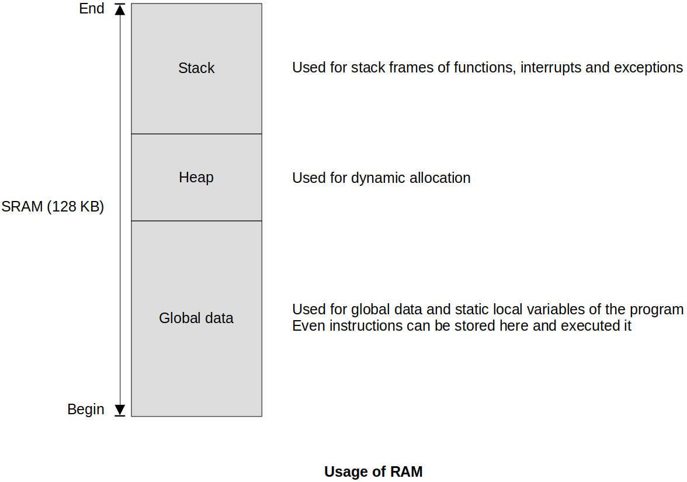
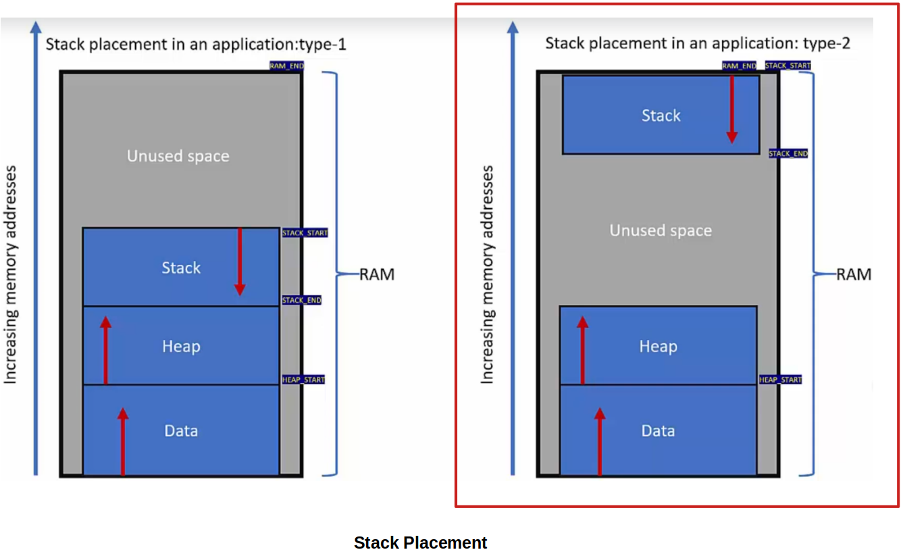

<a href="../">Notebook</a> > <a href="./">Embedded Systems Programming (ARM)</a> > Stack Memory

# Stack Memory

## Stack Memory

* Stack memory is part of the main memory (internal RAM or external RAM) reserved for the temporary storage of data (transient data)
* Mainly used during function, interrupt/exception handling
* Stack memory is accessed in Last-In-First-Out (LIFO) fashion
* Stack can be accessed using `push` and `pop` instructions or using any memory manipulation instructions (`ld`, `str`)
* Stack is traced using stack pointer (`sp` or`r13`) register. `push` and `pop` instructions affect (decrement or increment) the stack pointer register.
* Stack can expand and shrink dynamically within its boundary during the run-time. (Crossing the boundary will cause errors referred to as "Stack overflow", or "Stack underflow" and your software must have a way to prevent/handle these errors.)

## Stack Memory Usage

1. The temporary storage of processor register values
2. The temporary storage of local variables of the function
3. During system exception or interrupt, stack memory will be used to save the context (status of general-purpose registers, processor status register, return address, etc.) of the currently executing code

* STM32F407 microcontroller has 2 SRAMs (SRAM1 + SRAM2). They are collectively called as SRAM and its size is 128 KB.
* Boundaries of each section can be set by programmers using tool chains or linker scripts according to the project's requirement.

## Stack Operation Models

Stack operation model is determined at the processor design time. This is not configurable by the programmer.

* Full Ascending (FA)
* **Full Descending (FD) - ARM Cortex Mx processors**
  * Stack pointer is initialized to the higher memory address
  * `push` decrements, and `pop` increments the stack pointer
  * Stack pointer points to the last pushed item (or next item to be popped)
* Empty Ascending (FA)
* Empty Descending (E)

## Stack Placement

* In which portion of RAM would you place the stack? $\to$ Various ways you can do this!

  In our applications, the second model will be used. (Stack pointer is initialized to the highest address of RAM.)

* This is generally set by the linker script of the program, or the configuration files of the tool chain.

## Banked Stack Pointers

## References

Nayak, K. (2022). *Microcontroller Embedded C Programming: Absolute Beginners* [Video file]. Retrieved from  https://www.udemy.com/course/microcontroller-embedded-c-programming/

Nayak, K. (2022). *Embedded Systems Programming on ARM Cortex-M3/M4 Processor* [Video file]. Retrieved from  https://www.udemy.com/course/embedded-system-programming-on-arm-cortex-m3m4/
