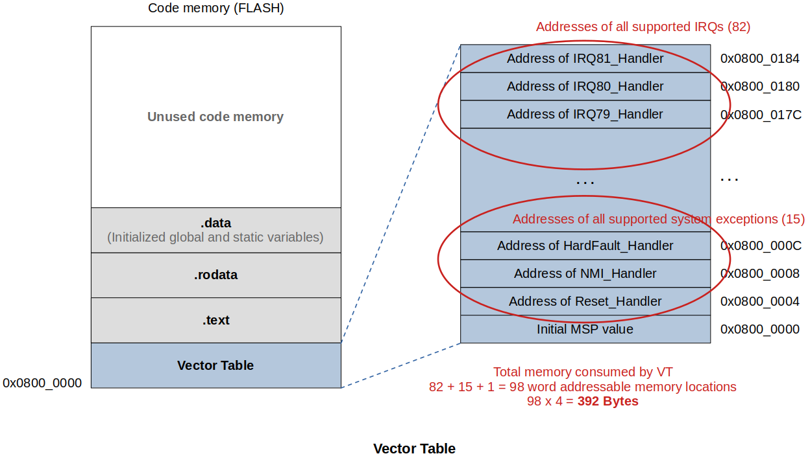

<a href="../">Notebook</a> > <a href="./">Embedded Systems Programming (ARM)</a> > Startup File

# Startup File


## Importance of Startup File

* A **startup file** is responsible for setting up the proper environment for the main user code to run.
* Code written in startup file runs before `main()` and `main()` gets called by the startup code.
* Some part of the startup file is target (i.e., processor) dependent. (e.g., Vector table, initializing the stack, turning on/off the processor-specific peripherals such as FPU, etc.)
* Startup code takes care of the vector table placement in code memory as required by the ARM Cortex-M processor.
* Startup code may also take care stack reinitialization. (You can alter the stack placement.)
* Startup code is responsible for `.data` and `.bss` sections initialization in main memory. It needs to properly copy the `.data` section from FLASH to SRAM, and properly initialize the `.bss` section to SRAM.
* Only after the initial environment is properly setup, the startup code can call the `main()`.


## Write the Startup File

### Instruction

1. Create a vector table for your microcontroller. Vector tables are MCU-specific.
2. Write a startup code which initializes `.data` and `.bss` section in SRAM. (`Reset_Handler()`)
3. Call `main()`

Startup file can be a C file (.c) or an assembly file (.s).

[!] Note: Vector table information can be found in the *MCU Reference Manual*. Different exceptions for different microcontrollers. Check the documentation!





#### 1. Create a Vector table

* A vector table is essentially an array of addresses. Create an array to hold MSP and the addresses of handlers for system exceptions and IRQs.

  ```c
  uint32_t vectors[] = {
      MSP address, 
      System exception handler addresses, 
      IRQ handler addresses
  };
  ```

* This array is an "Initialized data" from the program's point of view so, by default, the compiler will try to placed it in the `.data` section. We don't want that! Vector table must be located in the starting address of the code memory! 

  $\to$ Instruct the linker to place this array in a user defined section (NOT the `.data` section!)

  $\to$ GCC documentation $\to$ Common Variable Attributes $\to$ section ("*section-name*")

  > Normally, the compiler places the objects it generates in sections like `data` and `bss`.  Sometimes, however, you need additional sections, or you need certain particular variables to appear in special sections, for example to map to special hardware.  The `section` attribute specifies that a variable (or function) lives in a particular section. 
  >
  > Syntax:
  >
  > ```c
  > truct duart a __attribute__ ((section ("DUART_A"))) = { 0 };
  > 	// place object 'a' in 'DUART_A' section
  > struct duart b __attribute__ ((section ("DUART_B"))) = { 0 };
  > char stack[10000] __attribute__ ((section ("STACK"))) = { 0 };
  > int init_data __attribute__ ((section ("INITDATA")));
  > void func(void) __attribute__ ((section (".random section")));
  > 
  > main()
  > {
  >   /* Initialize stack pointer */
  >   init_sp (stack + sizeof (stack));
  > 
  >   /* Initialize initialized data */
  >   memcpy (&init_data, &data, &edata - &data);
  > 
  >   /* Turn on the serial ports */
  >   init_duart (&a);
  >   init_duart (&b);
  > }
  > ```
  >
  > You can test these by inspecting the object file using the **objdump** tool.

* Updated vector table with the section to be placed specified:

  ```c
  uint32_t vectors[] __attribute__((section(".isr_vector")))= {	// leading '.' not mandatory
      MSP address, 
      System exception handler addresses, 
      IRQ handler addresses
  };
  ```

  Or,

  ```c
  uint32_t vectors[] = {	// leading '.' not mandatory
      MSP address, 
      System exception handler addresses, 
      IRQ handler addresses
  }; __attribute__((section(".isr_vector")))
  ```

  Then you can check with the following command that `.isr_vector` section has been created:

  ```plain
  $ arm-none-eabi-objdump -h stm32_startup.o
  
  stm32_startup.o:     file format elf32-littlearm
  
  Sections:
  Idx Name          Size      VMA       LMA       File off  Algn
    0 .text         00000000  00000000  00000000  00000034  2**1
                    CONTENTS, ALLOC, LOAD, READONLY, CODE
    1 .data         00000008  00000000  00000000  00000034  2**2
                    CONTENTS, ALLOC, LOAD, RELOC, DATA
    2 .bss          00000000  00000000  00000000  0000003c  2**0
                    ALLOC
    3 .isr_vector   0000000c  00000000  00000000  0000003c  2**1
                    CONTENTS, ALLOC, LOAD, READONLY, CODE
    4 .comment      00000034  00000000  00000000  00000048  2**0
                    CONTENTS, READONLY
    5 .ARM.attributes 0000002e  00000000  00000000  0000007c  2**0
                    CONTENTS, READONLY
  ```

* Now, we've got 97 exceptions (15 system exceptions + 82 interrupts). Do we need to write the handlers for all these at this point?

  Not required! You can create a single default handler for all the exceptions and allow the programmer to implement the required handlers as per the application requirements. (Not all applications require all 97 exceptions to be implemented.)

  We'll create a `Default_Handler()` for this reason!

* GCC attributes for functions: `weak` and `alias`

  * `weak`

    Lets programmer to override already defined weak function (dummy) with the same function name

  * `alias`

    Lets programmer to give alias for a function

  Check GCC documentation for more info!

  ```c
  void NMI_Handler(void)          __attribute__((weak, alias("Default_Handler")));
  void HardFault_Handler(void)    __attribute__((weak, alias("Default_Handler")));
  ```

  > Here, `Default_Handler()` is an alias for `NMI_Handler()`. 
  >
  > In the vector table array, address of `Default_Handler()` function will be stored in place of the address of an unimplemented handler. So, when NMI exception (which is not yet defined at this point) triggers, `Default_Handler()` will be executed. (Redirected!)
  >
  > Thanks to the `weak` attribute, a programmer can simply override the handler function (with the same function name without `__attribute__...` attached when necessary. Then the control will not be directed to the `Default_Handler()` but to the overridden function.

* Except for the first entry, which must contain a valid SP value, every **Reserved** entry must be set to 0!

#### 2. Write the `Reset_Handler()`

* Initializing `.data` and `.bss` section in SRAM is taken care of by the `Reset_Handler()`.
* Copying `.data` section from FLASH to SRAM requires some boundary addresses; `_edata`, `_sdata`, `etext`, etc. These information are to be exported from the linker script. So, these are declared with `extern` keyword in the startup file.

#### 3. Call `main()`


## References

Nayak, K. (2022). *Embedded Systems Programming on ARM Cortex-M3/M4 Processor* [Video file]. Retrieved from  https://www.udemy.com/course/embedded-system-programming-on-arm-cortex-m3m4/
