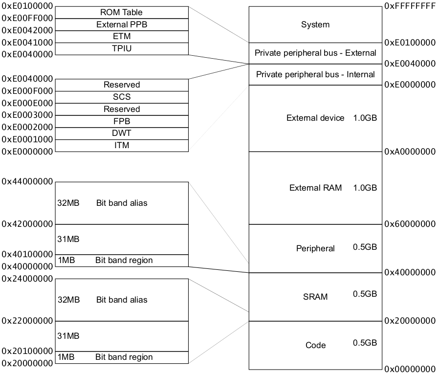
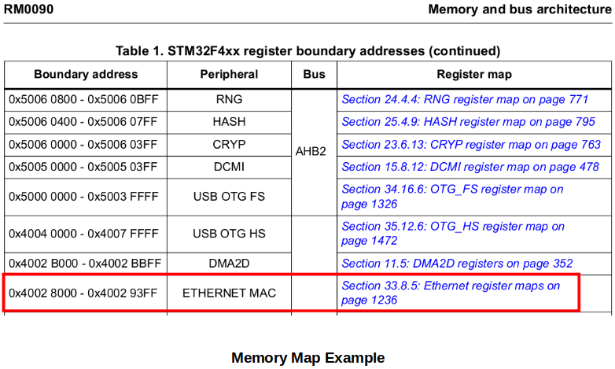

<a href="../">Notebook</a> > <a href="./">Embedded Systems Programming on ARM Cortex-M3/M4 Processor</a> > Memory Map

# Memory Map

## Terms

* **Memory Mapped I/O**

  I/O pins are controlled using peripheral registers which are mapped on to processor addressable memory locations.

* **Processor Addressable Memory Locations**

  For a system with 32-bit wide address bus - 0x0000_00000 - 0xFFFF_FFFF (4G different addresses)

  For a system with 64-bit wide address bus - 0x0000_00000_0000_0000 - 0xFFFF_FFFF_FFFF_FFFF

  When an instruction is decoded, the Address Generation Unit (AGU) inside the processor will get activated.

* **Address Generation Unit (AGU)**

  An execution unit inside central processing units (CPUs) that calculates addresses used by the CPU to access main memory.

## Memory Map of ARM Cortex Mx Processor

* The following is the generic memory map which must be followed by all MCUs which use ARM Cortex Mx processor. Program memory, data memory, registers of various peripherals are organized within the same linear 4GB of address space.

* For example, the registers used to control and configure the Ethernet MAC peripheral and registers used to read/write data from/to Ethernet MAC peripheral are mapped in the address range of 0x4002_8000 to 0x4002_93FF.

  

  

  

* Different types of MCUs have different memory maps but the fundamentals are the same. Consult the MCU reference manual for the MCU specific information.

## References

Nayak, K. (2022). *Microcontroller Embedded C Programming: Absolute Beginners* [Video file]. Retrieved from  https://www.udemy.com/course/microcontroller-embedded-c-programming/

Nayak, K. (2022). *Embedded Systems Programming on ARM Cortex-M3/M4 Processor* [Video file]. Retrieved from  https://www.udemy.com/course/embedded-system-programming-on-arm-cortex-m3m4/
