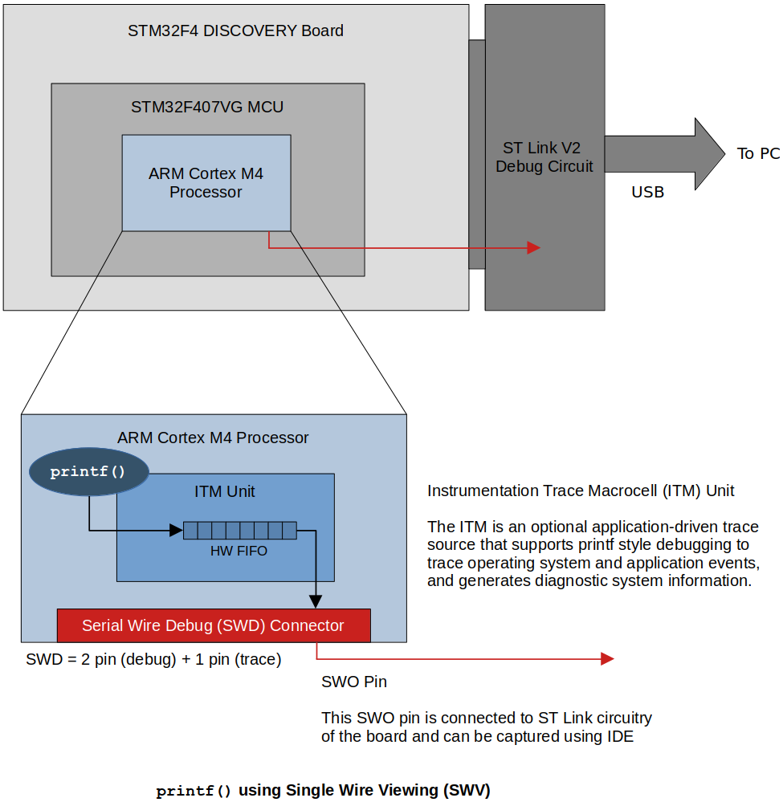
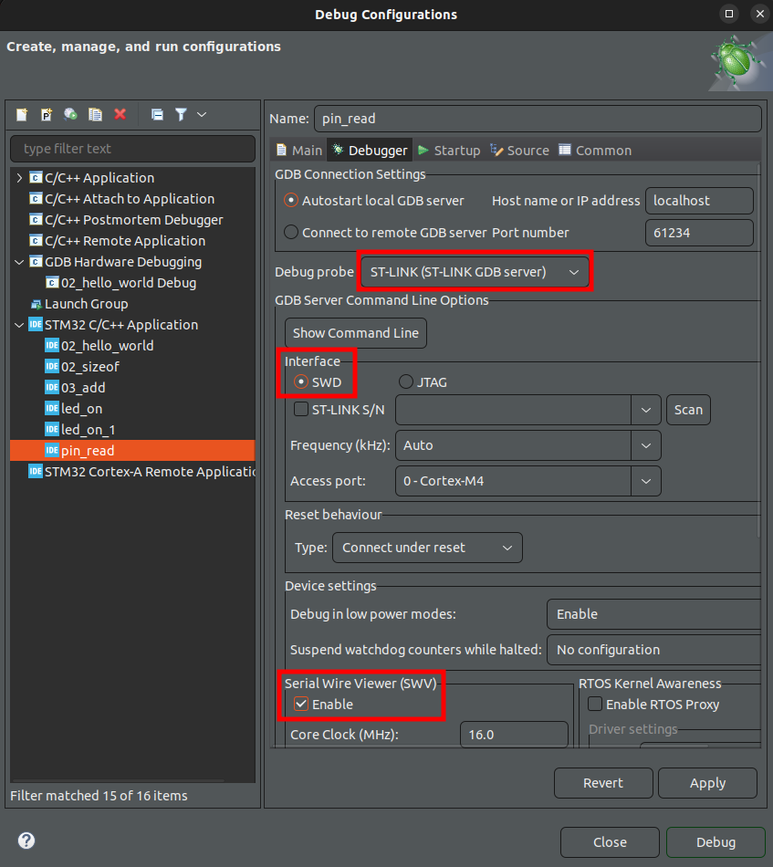

<a href="../">Notebook</a> > <a href="./">Embedded Systems Programming on ARM Cortex-M3/M4 Processor</a> > Using `printf()` on ARM Cortex M3/M4/M7 Based MCUs

# Using `printf()` on ARM Cortex M3/M4/M7 Based MCUs


## Introduction

This discussion in only applicable to MCUs based on ARM Cortex M3/M4/M7 or higher processors. (Not avilable on ARM Cortex M0 processor.)

* `printf()` works over **Serial Wire Output (SWO)** pin of **Serial Wire Debug (SWD)** interface.

* Serial Wire Debug (SWD)

  * Two-wire protocol for accessing the ARM debug interface

  * Part of the ARM Debug Interface Specification v5 and is an alternative to JTAG

  * The physical layer of SWD consists of two lines:

    * SWDIO - A bidirectional data line that carries debug-related data (e.g., break point)
    * SWCLK - A clock driven by the host (i.e., ST Link circuitry)

    Both of these are managed by the ST Link circuitry on the board.

  * By using SWD interface you should be able to program MCUs internal flash, you can access memory regions, and break points, stop/run CPU.

    Also, you can use the serial wire viewer for your `printf()` statements for debugging.

    





* Not all IDEs support capturing SWO pin. **CubeIDE** and **TrueSTUDIO** does!


## Test

* Copy and past the following code (implementation of `ITM_SendChar()`) into the `syscall.c` file of your project. (It goes right after the `#include`s.)

  ```c
  // Implementation of printf like feature using ARM Cortex M3/M4/ ITM functionality
  // This function will not work for ARM Cortex M0/M0+
  // If you are using Cortex M0, then you can use semihosting feature of openOCD
  
  //Debug Exception and Monitor Control Register base address
  #define DEMCR        			*((volatile uint32_t*) 0xE000EDFCU )
  
  /* ITM register addresses */
  #define ITM_STIMULUS_PORT0   	*((volatile uint32_t*) 0xE0000000 )
  #define ITM_TRACE_EN          	*((volatile uint32_t*) 0xE0000E00 )
  
  void ITM_SendChar(uint8_t ch)
  {
  
  	//Enable TRCENA
  	DEMCR |= ( 1 << 24);
  
  	//enable stimulus port 0
  	ITM_TRACE_EN |= ( 1 << 0);
  
  	// read FIFO status in bit [0]:
  	while(!(ITM_STIMULUS_PORT0 & 1));
  
  	//Write to ITM stimulus port0
  	ITM_STIMULUS_PORT0 = ch;
  }
  ```

* The way `printf()` works is as follows:

  ```c
  /* your project */
  printf();
  ```

  ```c
  /* printf implementation in the standard library */
  printf()
  {
      __write();
  }
  ```

  ```c
  /* your project (in syscall.c) */
  __write()
  {
      ITM_SendChar();
      LCD_SendChar();		/* if using LCD */
      UART_SendChar();	/* if using UART */
      ...
  }
  ```

* To use `printf()` on the program for target board, set the Debug Configurations as follows:

  

  

  

* Debug as target application

  Window $\to$ SWV $\to$ SWV ITM Data Console

  Click "Configure trace" and select the port 0

  Now, click on the "Start trace" button and run the code.


## SWD vs. JTAG

* JTAG was the traditional mechanism for debug connections for ARM 7/9 family, but with the Cortex-M family, ARM introduced the Serial Wire Debug (SWD) interface.
* SWD is designed to reduce the pin countr required for debug from 4 used by JTAG (excluding GND) down to 2. 
* In addition, SWD interface provides one more pin called Serial Wire Output (SWO) which is used for Single Wire Viewing (SWV), which is a loc cost tracing technology.


## References

Nayak, K. (2022). *Microcontroller Embedded C Programming: Absolute Beginners* [Video file]. Retrieved from  https://www.udemy.com/course/microcontroller-embedded-c-programming/

Nayak, K. (2022). *Embedded Systems Programming on ARM Cortex-M3/M4 Processor* [Video file]. Retrieved from  https://www.udemy.com/course/embedded-system-programming-on-arm-cortex-m3m4/
