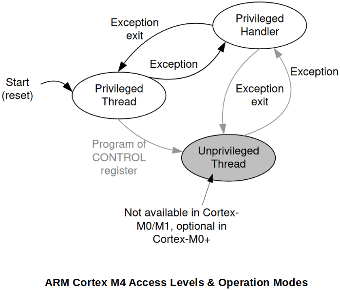

<a href="../">Notebook</a> > <a href="./">Embedded Systems</a> > ARM Cortex M4 - Access Level & Operation Modes of the Processor

# ARM Cortex M4 - Access Level & Operation Modes of the Processor

This section applies to **ARM Cortex M0/M3/M4 Processors**. If you are using any other processors, please consult the corresponding document.

## Operational Modes

* The processor provides 2 operation modes:

  1. **Thread mode (User mode)**

     All program code will execute under "Thread mode" of the processor by default. It can be privileged (full access to CPU resources) or unprivileged (limited access to CPU resources) software execution.

  2. **Handler mode**

     All the exception handlers (or interrupt handlers) will run under the "Handler mode" or the processor. It is ALWAYS privileged software execution.

* The processor always starts with "Thread mode".

  When there occurs a **system exception** or any **external interrupt** then the core will transition to "Handler mode" in order to service the Interrupt Service Routine (ISR) associated with the system exception or the external interrupt.

## Access Levels

* The processor provides 2 access levels:

  1. **Privileged Access Level (PAL)**

     Code running with PAL has a FULL access to all the processor specific resources and the restricted registers. Program will run with PAL by default.

  2. **Non-Privileged Access Levels (NPAL)**

     Code running with NPAL has a LIMITED access to the processor specific resources and the restricted registers.

* When the processor is in "Thread mode" with PAL, it is possible to change its access level to NPAL. Once the processor's access level changes from PAL to NPAL, then it is NOT possible for the processor to come back to PAL unless the processor operation mode transitions into "Handler mode" first.

* When a program runs in "Handler mode", its access level will always be PAL.

* Use the **CONTROL register** of the processor to switch back and forth between the access levels.

  Every program will start running with PAL, and the Control Register must be modified to change the program's access level to NAPL.

## References

Nayak, K. (2022). *Microcontroller Embedded C Programming: Absolute Beginners* [Video file]. Retrieved from  https://www.udemy.com/course/microcontroller-embedded-c-programming/
