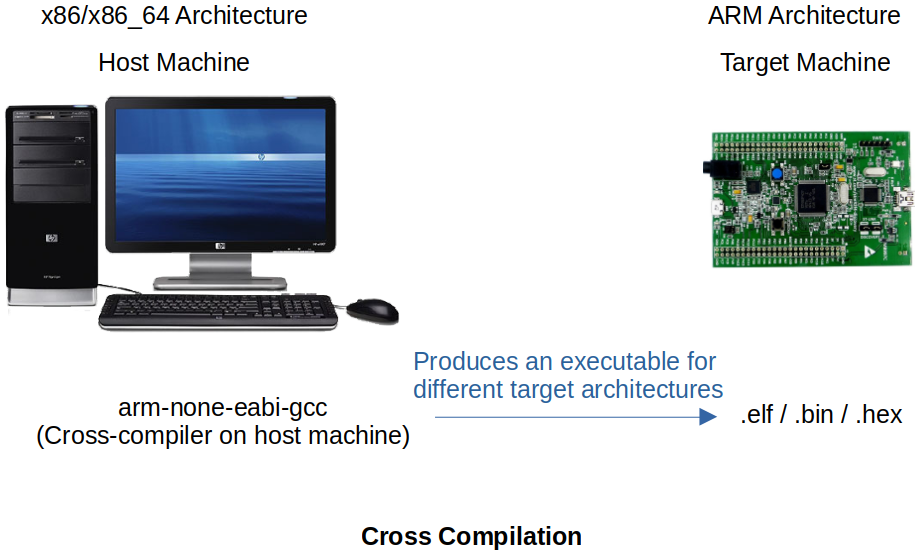

<a href="../">Notebook</a> > <a href="./">Embedded Systems</a> > Cross Compilation

# Cross Compilation

## Cross Compilation

* Cross-compilation is the act of compiling code for one computer system (often known as the target) on a different system, called the host.

* Cross compiler runs on one computer architecture, and produces the code that runs on a different computer architecture.

* Produced executable types:

  * `.elf` - Stands for **Executable and Linkable Format** and is **used for debugging**.
  * `.bin`, `hex` - Pure binary executables which are **used for productions**.

  When delivering the project, make sure that it is in `.bin` or `.hex` format. It must not be `.elf` format because it has all the debug information and anyone can use ELF analyzers to read the contents of the ELF or disassemble the ELF to obtain the implementation of the project.

## Native Compilation

* Native compilation is that the compiler runs on a host machine produces executable which also runs on the same machine.
* Native compiler examples:
  * MinGW, gcc, g++, etc.

## References

Nayak, K. (2022). *Microcontroller Embedded C Programming: Absolute Beginners* [Video file]. Retrieved from  https://www.udemy.com/course/microcontroller-embedded-c-programming/
