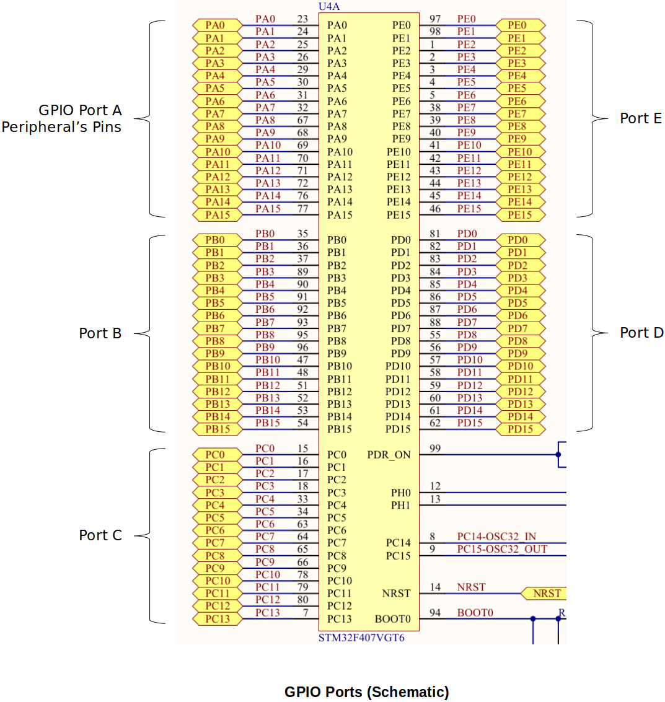

<a href="../">Notebook</a> > <a href="./">Embedded Systems</a> > GPIO Control - LEDs

# GPIO Control - LEDs

## GPIO

* Stands for **General Purpose Input/Output**
* In STM32Fx based MCUs, each port has 16 pins where you can connect external peripherals (LED, display, button, bluetooth transceiver, external memory (e.g., EEPROM), joy stick, keypad, etc.)

## Procedure to Turn On an LED

In the process of turning on an LED, you will need to consult the **schematic**, **user manual (UMx)**, **reference manual (RMx)** of the board, be able to read the memory map, register layouts, do the address calculation, and directly access the registers to set/unset the bits within them.

Let's say we want to you want to control the LED4. Your goal is to control the I/O pin PD12's state either HIGH or LOW through software to make LED turn ON or OFF. (PD12 refers to 12^th^ pin of the GPIO PORT D peripheral.)

1. **Identify the GPIO port (a peripheral) used to connect the LED**
   - e.g., GPIOD (to turn on LED4 - PD12; Port D Pin 12)
   - Consult the schematic of the board
2. **Identify the GPIO pin where the LED is connected**
   - e.g., 12
   - Consult the schematic of the board
3. **Activate the GPIO peripheral (i.e., enable the clock)**
   - Until you enable the clock for a peripheral, the peripheral is dead and it neither functions nor takes any configuration values set by you.
   - Once you activate the clock for a peripheral, the peripheral is ready to take your configuration and control-related commands or arguments (configuration values).
   - For some microcontrollers the peripheral may be ON by default, and you need not do any activation. (You should consult the data sheet or reference manual for the device.)
4. **Configure the GPIO pin mode as output**
   - Since you are driving an LED (to ON/OFF), the operation mode of the GPIO pin has to be configured as output.
5. **Write to the GPIO pin**
   - 1 (HIGH) to make the GPIO pin state HIGH (3.3V)
   - 0 (LOW) to make the GPIO pin state LOW (0V)

## References

Nayak, K. (2022). *Microcontroller Embedded C Programming: Absolute Beginners* [Video file]. Retrieved from  https://www.udemy.com/course/microcontroller-embedded-c-programming/
