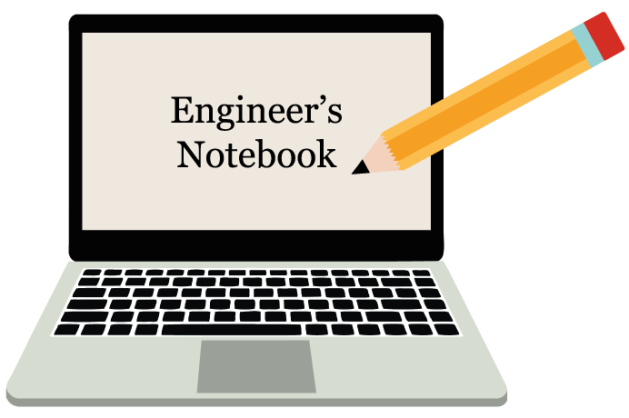

Notebook

# Engineer's Notebook

###### One-stop knowledge management system - by Kyungjae Lee (kjxlee@gmail.com)

### Contents: 

* **<a href="./c-programming/">C Programming</a>**
* **<a href="./cpp-programming/">C++ Programming</a>**
* **<a href="./data-structures/">Data Structures</a>**
* **<a href="./embedded-systems/">Embedded Systems</a>**
* **<a href="./operating-systems/">Operating Systems</a>**
* **<a href="./computer-architecture-and-organization/">Computer Architecture & Organization</a>**
* **<a href="./multi-threading/">Multi-Threading (POSIX Threads)</a>**
* **<a href="./computer-networks-and-network-security/">Computer Networks & Network Security</a>**
* **<a href="./unix-linux/">Unix/Linux</a>**
* **<a href="./makefile-and-build-system/">Makefile & Build System</a>**
* **<a href="./problem-solving/">Problem Solving</a>**

