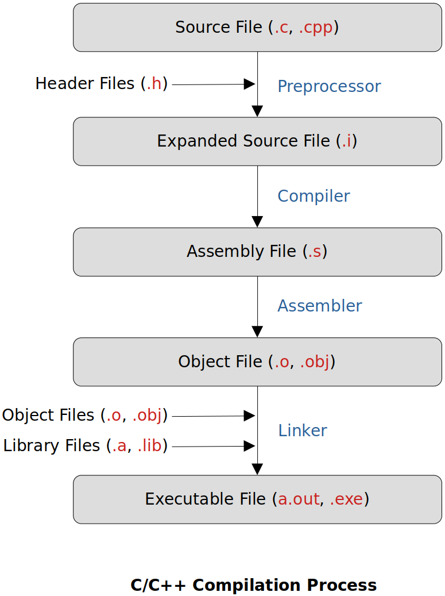

<a href="../">Notebook</a> > <a href="./">Makefile & Build System</a> > C/C++ Compilation Process

# C/C++ Compilation Process


## C/C++ Compilation Process





## C/C++ Possible Outputs

* **Binary Executable (a.out)**

  ```shell
  g++ sample.cpp				// a.out
  g++ sample.cpp -o sample	// sample
  ```

* **Shared Object/Library (.so)** 

  ```shell
  g++ -shared sample.cpp -o libSample.so		// libSample.so
  ```

* **Static Library (.a)**

  In general, static libraries are nothing but a collection of one or more object files (.o).

  ```shell
  ar rcs libSample.a sample1.o sample2.o sample3.o	// libSample.a
  ```

​		**ar**chive **r**eplace (old files), create (if not exist), **s**ort (create a sorted index of the library) 

* **Object Code (.o)** 

  ```shell
  g++ -c sample.cpp -o sample.o	// sample.o
  ```


## References

Subrata, S. (2022). *GNU Make & Makefile To Build C/C++ Projects - (LINUX,MAC)* [Video file]. Retrieved from  https://www.udemy.com/course/gnu-make-makefile-to-build-cc-projects-linuxmac/

