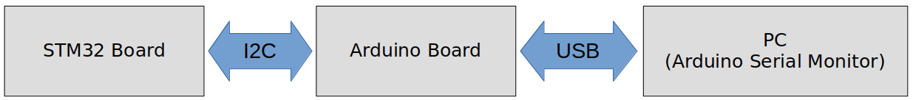
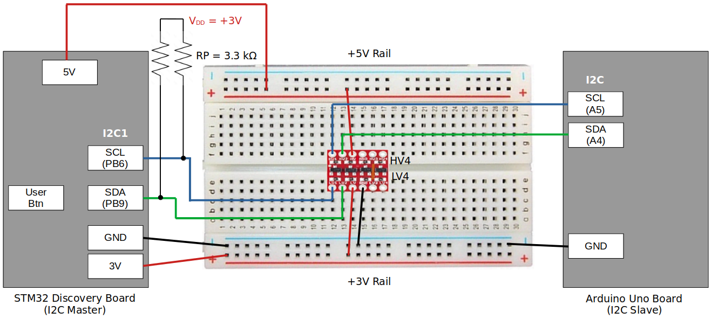

<a href="../../">Home</a> > <a href="../notebook">Notebook</a> > <a href="./">MCU Peripheral Drivers</a> > I2C Application 1: Master Tx (`i2c_01_master_tx.c`)

# I2C Application 1: Master Tx (`i2c_01_master_tx.c`)


## Requirements

* I2C master (STM32 Discovery board) and I2C slave (Arduino board) communication.

* When the button on the STM32 board (master) is pressed, the master shall send data to the Arduino board (slave). The data received by the Arduino board shall be displayed on the serial monitor terminal of the Arduino IDE.

  1. Use I2C SCL = 100 kHz (i.e., standard mode)
  2. Use external pull-up resistors (3.3 kΩ) for SDA and SCL line

  [!] Note: If you don't have external pull-up resistors, you can also try activating the STM32 I2C pin's internal pull-up resistors.

### External Pull-Up Resistance Calculation


$$
R_p(max) = \frac{t_r(max)}{0.8473 \times C_b} = \frac{1000 \times 10^{-9}}{0.8473 \times 400 \times 10^{-12}} \approx 3k \ohm
$$

$$
t_r(max) \approx 0.8 \times R_p \times C_b
$$

* According to the I2C specification:
  * $t_r(max)$ = 1000 ns (in standard mode)
  * $C_b$ = 400 pF

### Parts Needed

1. Arduino board

2. STM32 board

3. Logic level converter

4. Breadboard and jumper wires

5. 2 pull-up resistors of resistance 3.3 kΩ or 4.7 kΩ (You can also use internal pull-up resistors of the pins in place of external resistors.)

   > Q: We calculated the Rp(max) to be 3 kΩ. If 3 is the max, then why would 3.3 or 4.7 kΩ resistors work? Wouldn't these be higher resistance  than the max? Is there a tolerable range? If so, how do I find this  range?
   >
   > A: Rp(max) refers to the maximum recommended value for the pull-up  resistor. If the calculated Rp(max) is 3kOhms, it means that the  manufacturer or standard recommends using a pull-up resistor with a  value equal to or lower than 3kOhms for reliable operation.
   >
   > However, using a resistor with a slightly higher value, such as 3.3kOhms or  4.7kOhms, is generally acceptable in practice. The bus capacitance and  other factors in the system design can influence the actual pull-up  resistor value that works reliably. As long as the chosen resistor value is close to the recommended range and the overall system performance is satisfactory, using 3.3kOhms or 4.7kOhms resistors should be fine.
   >
   > It's important to note that selecting a pull-up resistor with a  significantly higher value than Rp(max) may lead to slower rise times  and increased susceptibility to noise or signal integrity issues. On the other hand, choosing a resistor with a significantly lower value may  result in excessive current flow and power dissipation. Therefore, it's  generally best to stay within the recommended range while considering  the specific requirements and constraints of the system.

### STM32 Board and Arduino Board Communication Interfaces





### STM32 Board and Arduino Board Voltage Levels

* To work around the voltage level difference, a **logic level shifter** will be necessary.


## Setup

### 1. Find out the GPIO pins that can be used for IC2 communication

* For this application, I2C communication lines SCL, SDA will be used. Find out the GPIO pins over which I2C can communicate! Look up the "Alternate function mapping" table in the datasheet.
  * I2C1_SCL $\to$ PB6 (AF4)
  * I2C1_SDA $\to$ PB9 (AF4)

### 2. Connect STM32 Discovery board with Arduino Uno board I2C pins

* Be careful not to directly supply 5 volts to the STM32 board pins when the board is not powered up as they may be damaged. When the **logic level shifter** is used, you don't need to worry about this issue.





* To analyze the communication with the logic analyzer, connect the channels as follows:

  * CH0 - SCL

  * CH1 - SDA

  * GND - Common GND of the bread board


## Code

### `i2c_01_master_tx.c`

Path: `Project/Src/`

```c

```


## Arduino Sketch (`001I2CSlaveRxString.ino`)

```c
// Wire Slave Receiver
//Uno, Ethernet A4 (SDA), A5 (SCL)
#include <Wire.h>

#define MY_ADDR   0x68

int LED = 13;
char rx_buffer[32] ;
uint32_t cnt =0;
uint8_t message[50];
void setup() {

  Serial.begin(9600);
  // Define the LED pin as Output
  pinMode (LED, OUTPUT);
  
 // Start the I2C Bus as Slave on address 0X69
  Wire.begin(MY_ADDR); 
  
  // Attach a function to trigger when something is received.
  Wire.onReceive(receiveEvent);

  sprintf(message,"Slave is ready : Address 0x%x",MY_ADDR);
  Serial.println((char*)message );  
  Serial.println("Waiting for data from master");  
}

void loop(void)
{
  
}

void receiveEvent(int bytes) 
{
 while( Wire.available() )
 {
   rx_buffer[cnt++] = Wire.read();
 }
  rx_buffer[cnt] = '\0';
  cnt=0;
  Serial.print("Received:");  
  Serial.println((char*)rx_buffer);  
}
```

