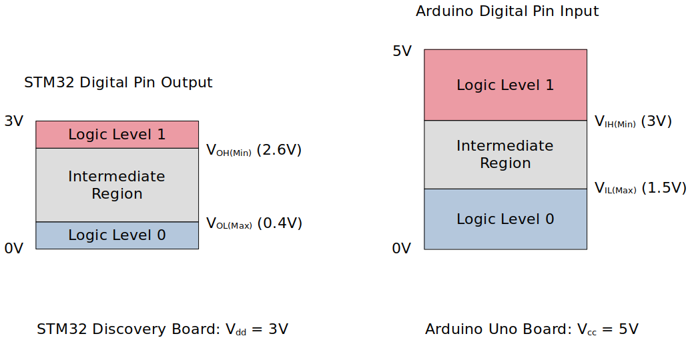
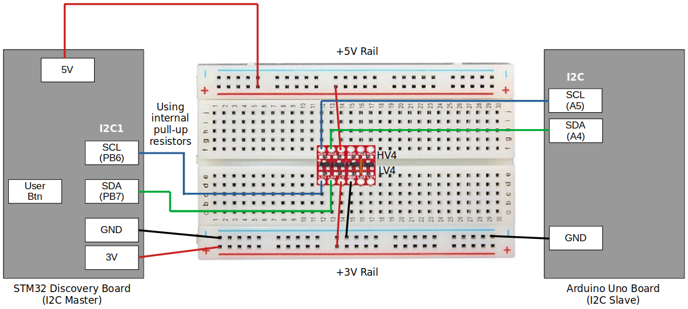
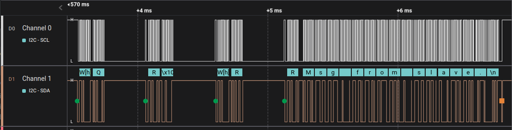
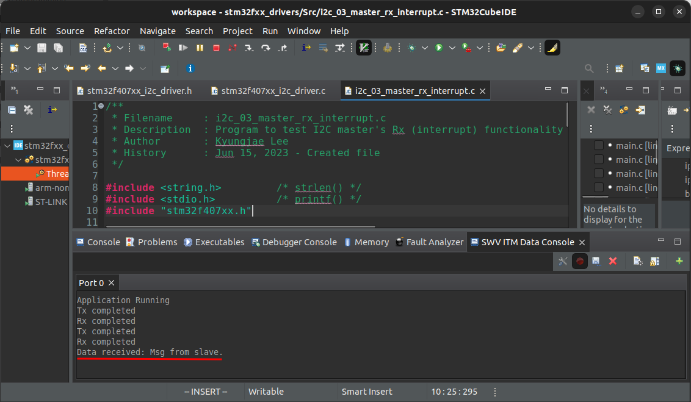

<a href="../../">Home</a> > <a href="../notebook">Notebook</a> > <a href="./">MCU Peripheral Drivers</a> > I2C Application 3: Master Rx (Interrupt) (`i2c_03_master_rx_interrupt.c`)

# I2C Application 3: Master Rx (Interrupt) (`i2c_03_master_rx_interrupt.c`)


## Requirements

* I2C master (STM32 Discovery board) and I2C slave (Arduino board) communication.

* When the button on the STM32 board (master) is pressed, the master shall read and display data from the Arduino board (slave). First, the master has to get the length of the data from the slave for it to properly read all data from the slave.

  1. Use I2C SCL = 100 kHz (i.e., standard mode)
  2. Use internal pull-up resistors for SDA and SCL line

  [!] Note: 3.3 kΩ or 4.7 kΩ external pull-up resistors are necessary in case your MCU pins do not support internal pull-up resistors.

### External Pull-Up Resistance Calculation


$$
R_p(max) = \frac{t_r(max)}{0.8473 \times C_b} = \frac{1000 \times 10^{-9}}{0.8473 \times 400 \times 10^{-12}} \approx 3k \ohm
$$

$$
t_r(max) \approx 0.8 \times R_p \times C_b
$$

* According to the I2C specification:
  * $t_r(max)$ = 1000 ns (in standard mode)
  * $C_b$ = 400 pF

### Parts Needed

1. Arduino board

2. STM32 board

3. Logic level converter

4. Breadboard and jumper wires

5. 2 pull-up resistors of resistance 3.3 kΩ or 4.7 kΩ (You can also use internal pull-up resistors of the pins in place of external resistors.)

   > Q: We calculated the Rp(max) to be 3 kΩ. If 3 is the max, then why would 3.3 or 4.7 kΩ resistors work? Wouldn't these be higher resistance  than the max? Is there a tolerable range? If so, how do I find this  range?
   >
   > A: Rp(max) refers to the maximum recommended value for the pull-up  resistor. If the calculated Rp(max) is 3kOhms, it means that the  manufacturer or standard recommends using a pull-up resistor with a  value equal to or lower than 3kOhms for reliable operation.
   >
   > However, using a resistor with a slightly higher value, such as 3.3kOhms or  4.7kOhms, is generally acceptable in practice. The bus capacitance and  other factors in the system design can influence the actual pull-up  resistor value that works reliably. As long as the chosen resistor value is close to the recommended range and the overall system performance is satisfactory, using 3.3kOhms or 4.7kOhms resistors should be fine.
   >
   > It's important to note that selecting a pull-up resistor with a  significantly higher value than Rp(max) may lead to slower rise times  and increased susceptibility to noise or signal integrity issues. On the other hand, choosing a resistor with a significantly lower value may  result in excessive current flow and power dissipation. Therefore, it's  generally best to stay within the recommended range while considering  the specific requirements and constraints of the system.

### STM32 Board and Arduino Board Communication Interfaces


### STM32 Board and Arduino Board Voltage Levels

* To work around the voltage level difference, a **logic level shifter** will be necessary.




### Procedure to Read Data from Slave (Arduino)

1. Master sends command code 0x51 to read the 1 byte of length information from the slave.
2. Master sends command code 0x52 to read the complete data from the slave. (Reading byte-by-byte based on the length information fetched in Step 1)
3. (Master displays the received data using semihosting.)

### Using `printf()` to Print Messages in STM32CubeIDE Console

* See <a href="./using-printf-with-serial-wire-viewer">Using `printf()` with Serial Wire Viewer (SWV)</a>


## Setup

### 1. Find out the GPIO pins that can be used for IC2 communication

* For this application, I2C communication lines SCL, SDA will be used. Find out the GPIO pins over which I2C can communicate! Look up the "Alternate function mapping" table in the datasheet.
  * I2C1_SCL $\to$ PB6 (AF4)
  * I2C1_SDA $\to$ PB7 (AF4)
  
    > Although, in the documentation, it is said that PB9 can be used as I2C1_SDA, some interference has been detected while testing due to the hardware circuitry called "SWIM" so ended up using PB7 instead. 

### 2. Connect STM32 Discovery board with Arduino Uno board I2C pins

* Be careful not to directly supply 5 volts to the STM32 board pins when the board is not powered up as they may be damaged. When the **logic level shifter** is used, you don't need to worry about this issue.





* To analyze the communication with the logic analyzer, connect the channels as follows:

  * CH0 - SCL

  * CH1 - SDA

  * GND - Common GND of the bread board

### 3. Power Arduino board and download SPI slave sketch to Arduino

* Sketch name: `002I2CSlaveTxString.ino`
  * You don't need to write an application for Arduino board. It is already provided as a sketch.
  * As soon as you download this sketch to the Arduino board, it will operate as a slave.


## Code

### `i2c_03_master_rx_interrupt.c`

Path: `Project/Src/`

```c
/**
 * Filename		: i2c_03_master_rx_interrupt.c
 * Description	: Program to test I2C master's Rx (interrupt) functionality
 * Author		: Kyungjae Lee
 * History 		: Jun 15, 2023 - Created file
 */

#include <string.h> 		/* strlen() */
#include <stdio.h> 			/* printf() */
#include "stm32f407xx.h"

#define DUMMY_ADDR			0x61
#define SLAVE_ADDR			0x68	/* Check Arduino IDE serial monitor */

/* Global variables */
I2C_Handle_TypeDef I2C1Handle;
uint8_t rxCmplt = RESET;

/**
 * Pin selection for I2C communication
 *
 * I2C1_SCL  - PB6 (AF4)
 * I2C1_SDA  - PB7 (AF4)
 */

/**
 * delay()
 * Desc.	: Spinlock delays the program execution
 * Param.	: None
 * Returns	: None
 * Note		: N/A
 */
void delay(void)
{
	/* Appoximately ~200ms delay when the system clock freq is 16 MHz */
	for (uint32_t i = 0; i < 500000 / 2; i++);
}

/**
 * I2C1_PinsInit()
 * Desc.	: Initializes and configures GPIO pins to be used as I2C1 pins
 * Param.	: None
 * Returns	: None
 * Note		: N/A
 */
void I2C1_PinsInit(void)
{
	GPIO_Handle_TypeDef I2CPins;

	I2CPins.pGPIOx = GPIOB;
	I2CPins.GPIO_PinConfig.GPIO_PinMode = GPIO_PIN_MODE_ALTFCN;
	I2CPins.GPIO_PinConfig.GPIO_PinOutType = GPIO_PIN_OUT_TYPE_OD;
	I2CPins.GPIO_PinConfig.GPIO_PinPuPdControl = GPIO_PIN_PU;
	I2CPins.GPIO_PinConfig.GPIO_PinAltFcnMode = 4;
	I2CPins.GPIO_PinConfig.GPIO_PinSpeed = GPIO_PIN_OUT_SPEED_FAST;

	/* SCL */
	I2CPins.GPIO_PinConfig.GPIO_PinNumber = GPIO_PIN_6;
	GPIO_Init(&I2CPins);

	/* SDA */
	I2CPins.GPIO_PinConfig.GPIO_PinNumber = GPIO_PIN_7;
	GPIO_Init(&I2CPins);
}

/**
 * I2C1_Init()
 * Desc.	: Creates an SPI2Handle initializes SPI2 peripheral parameters
 * Param.	: None
 * Returns	: None
 * Note		: N/A
 */
void I2C1_Init(void)
{

	I2C1Handle.pI2Cx = I2C1;
	I2C1Handle.I2C_Config.I2C_ACKEnable = I2C_ACK_ENABLE;
	I2C1Handle.I2C_Config.I2C_DeviceAddress = DUMMY_ADDR;
		/* Since STM32 board is master, I2C_DeviceAddress field does not have
		 * to be configured. However, you can assign some dummy value to it if
		 * you wanted to. When selecting the dummy address value, make sure to
		 * avoid using the reserved addresses defined in the I2C specification.
		 */
	I2C1Handle.I2C_Config.I2C_FMDutyCycle = I2C_FM_DUTY_2;
	I2C1Handle.I2C_Config.I2C_SCLSpeed = I2C_SCL_SPEED_SM;

	I2C_Init(&I2C1Handle);
}

/**
 * GPIO_ButtonInit()
 * Desc.	: Initializes a GPIO pin for button
 * Param.	: None
 * Returns	: None
 * Note		: N/A
 */
void GPIO_ButtonInit(void)
{
	GPIO_Handle_TypeDef GPIOBtn;

	/* Zero-out all the fields in the structures (Very important! GPIOLed and GPIOBtn
	 * are local variables whose members may be filled with garbage values before
	 * initialization. These garbage values may set (corrupt) the bit fields that
	 * you did not touch assuming that they will be 0 by default. Do NOT make this
	 * mistake!
	 */
	memset(&GPIOBtn, 0, sizeof(GPIOBtn));

	/* GPIOBtn configuration */
	GPIOBtn.pGPIOx = GPIOA;
	GPIOBtn.GPIO_PinConfig.GPIO_PinNumber = GPIO_PIN_0;
	GPIOBtn.GPIO_PinConfig.GPIO_PinMode = GPIO_PIN_MODE_IN;
	GPIOBtn.GPIO_PinConfig.GPIO_PinSpeed = GPIO_PIN_OUT_SPEED_FAST; /* Doesn't matter */
	//GPIOBtn.GPIO_PinConfig.GPIO_PinOutType = GPIO_PIN_OUT_TYPE_PP;	/* N/A */
	GPIOBtn.GPIO_PinConfig.GPIO_PinPuPdControl = GPIO_PIN_NO_PUPD;
		/* External pull-down resistor is already present (see the schematic) */
	GPIO_Init(&GPIOBtn);
}

int main(int argc, char *argv[])
{
	printf("Application Running\n");

	uint8_t cmdCode;
	uint8_t len;

	/* Create an Rx buffer
	 * (The Arduino sketch is written using the Arduino Wire library. The wire
	 * library has limitation on how many bytes can be transferred or received
	 * in single I2C transaction and the limit is 32 bytes. So, don't
	 * send/receive more than 32 bytes in a single I2C transaction. You may want
	 * to split it into multiple I2C transactions in such cases.)
	 */
	uint8_t rxBuff[32];

	/* Initialize GPIO pin for button */
	GPIO_ButtonInit();

	/* Initialize I2C pins */
	I2C1_PinsInit();

	/* Configure I2C peripheral */
	I2C1_Init();

	/* I2C IRQ configurations */
	I2C_IRQInterruptConfig(IRQ_NO_I2C1_EV, ENABLE);
	I2C_IRQInterruptConfig(IRQ_NO_I2C1_ER, ENABLE);

	/* Enable I2C peripheral (PE bit gets set here) */
	I2C_PeriControl(I2C1, ENABLE);

	/* Enable ACK
	 * ACK bit is set and cleared by SW, and cleared by HW when PE=0.
	 * Since PE bit has just been set in the 'I2C_PeriControl()' function,
	 * now you can set the ACK bit. */
	I2C_ManageACK(I2C1, ENABLE);

	/* Wait for button press */
	while (1)
	{
		/* Wait until button is pressed */
		while (!GPIO_ReadFromInputPin(GPIOA, GPIO_PIN_0));

		/* Introduce debouncing time for button press */
		delay();

		/* Send the command to fetch 1 byte length info */
		cmdCode = 0x51;	/* Command code for asking 1 byte length info */
		while (I2C_MasterTxInterrupt(&I2C1Handle, &cmdCode, 1, SLAVE_ADDR, I2C_REPEATED_START_EN) != I2C_READY);

		/* Fetch and store the length info received from the slave in @len */
		while (I2C_MasterRxInterrupt(&I2C1Handle, &len, 1, SLAVE_ADDR, I2C_REPEATED_START_EN) != I2C_READY);

		/* Send the command to receive the complete data from slave */
		cmdCode = 0x52;	/* Command code for reading complete data from slave */
		while (I2C_MasterTxInterrupt(&I2C1Handle, &cmdCode, 1, SLAVE_ADDR, I2C_REPEATED_START_EN) != I2C_READY);

		/* Receive the complete data from slave */
		while (I2C_MasterRxInterrupt(&I2C1Handle, rxBuff, len, SLAVE_ADDR, I2C_REPEATED_START_DI) != I2C_READY);
			/* Since this is the last transaction, disable the repeated start.
			 * After this transaction, you should be able to see the whole
			 * data received in the Rx buffer.
			 */

		/* Reset rxCmplt set by the previous 'I2C_MasterRxInterrupt()' function */
		rxCmplt = RESET;

		/* Wait till Rx operation is finished */
		while (rxCmplt != SET);

		/* Print the data received to the console
		 *
		 * Note: To use printf() function to print the data to console,
		 * 		 a couple of settings have to be done.
		 * 		 See, https://kyungjae.dev/arm-cortex-m3-m4-processor-architecture/using-printf-on-arm-cortex-m3-m4-m7-based-mcus
		 *
		 * 		 You can also use semihosting feature instead.
		 */
		rxBuff[len + 1] = '\0';
			/* Due to the I2C_MasterRxBlocking() mechanism, rxBuff does not contain
			 * the terminating null ('\n') character. Add it here!
			 */
		printf("Data received: %s\n", rxBuff);

		/* Reset rxCmplt for the next operation */
		rxCmplt = RESET;
	}
}

/**
 * I2C1_ER_IRQHandler()
 * Desc.	: Handles I2C error IRQ
 * Param.	: None
 * Return	: None
 * Note		: This function calls 'I2C_ER_IRQHandling()' function which
 * 			  implements the actual error IRQ handling functionality.
 */
void I2C1_ER_IRQHandler(void)
{
	I2C_ER_IRQHandling(&I2C1Handle);
}

/**
 * I2C1_EV_IRQHandler()
 * Desc.	: Handles I2C event IRQ
 * Param.	: None
 * Return	: None
 * Note		: This function calls 'I2C_EV_IRQHandling()' function which
 * 			  implements the actual event IRQ handling functionality.
 */
void I2C1_EV_IRQHandler(void)
{
	I2C_EV_IRQHandling(&I2C1Handle);
}

/**
 * I2C_ApplicationEventCallback()
 * Desc.	: Notifies the application of the event occurred
 * Param.	: @pSPIHandle - pointer to SPI handle structure
 * 			  @appEvent - SPI event occurred
 * Returns	: None
 * Note		: N/A
 */
void I2C_ApplicationEventCallback(I2C_Handle_TypeDef *pI2CHandle, uint8_t appEvent)
{
	/*
	#define I2C_EV_TX_CMPLT			0
	#define I2C_EV_RX_CMPLT			1
	#define I2C_EV_STOP				2
	#define I2C_ERROR_BERR			3
	#define I2C_ERROR_ARLO			4
	#define I2C_ERROR_AF  			5
	#define I2C_ERROR_OVR 			6
	#define I2C_ERROR_TIMEOUT		7
	#define I2C_EV_DATA_REQ			8
	#define I2C_EV_DATA_RCV			9
	*/

	if (appEvent == I2C_EV_TX_CMPLT)
	{
		printf("Tx completed\n");
	}
	else if (appEvent == I2C_EV_RX_CMPLT)
	{
		printf("Rx completed\n");
		rxCmplt = SET;
	}
	else if (appEvent == I2C_ERROR_AF)
	{
		printf("Error: ACK failure\n");

		/* Master ACK failure occurs when slave fails to send ACK for the byte
		 * sent from the master.
		 * If this is the case, there's no reason to keep the communication
		 * going. So close the communication.
		 */
		I2C_CloseTx(pI2CHandle);

		/* Generate STOP condition to release the bus */
		I2C_GenerateSTOPCondition(pI2CHandle->pI2Cx);

		/* Hang in infinite loop */
		while (1);
	}

}
```

> To test ACK failure error, simply try and modify the master's address to 0x66, compile and run the program. See if the error message appears in the console.


## Arduino Sketch (`002I2CSlaveTxString.ino`)

```c
// Wire Slave Transmitter and receiver
//Uno, Ethernet A4 (SDA), A5 (SCL)
#include <Wire.h>

// Include the required Wire library for I2C<br>#include <Wire.h>
int LED = 13;
uint8_t active_command = 0xff,led_status=0;
char name_msg[32] = "Msg from slave.\n";

uint16_t device_id = 0xFF45;

#define SLAVE_ADDR 0x68

uint8_t get_len_of_data(void)
{
  return (uint8_t)strlen(name_msg);
}
void setup() {
  // Define the LED pin as Output
  pinMode (LED, OUTPUT);
  
  // Start the I2C Bus as Slave on address 9
  Wire.begin(SLAVE_ADDR); 
  
  // Attach a function to trigger when something is received.
  Wire.onReceive(receiveEvent);
  Wire.onRequest(requestEvent);


}


//write
void receiveEvent(int bytes) {
  active_command = Wire.read();    // read one character from the I2C 
}

//read
void requestEvent() {

  if(active_command == 0X51)
  {
    uint8_t len = get_len_of_data();
    Wire.write(&len,1);
    active_command = 0xff;
  }
  

  if(active_command == 0x52)
  {
   // Wire.write(strlen(name));
    Wire.write(name_msg,get_len_of_data());
   // Wire.write((uint8_t*)&name_msg[32],18);
    active_command = 0xff;
  }
  //Wire.write("hello "); // respond with message of 6 bytes
  // as expected by master
}
void loop() {
  

}
```


## Testing

The following snapshots are taken using the Logic Analyzer.


### Entire Communication





### Cross-Checking using the STM32CubeIDE Console



