<a href="../../">Home</a> > <a href="../notebook">Notebook</a> > <a href="./">MCU Peripheral Drivers</a> > Introduction to I2C

# Introduction to I2C

### Inter-Integrated Circuit (I2C) Protocol

* Pronounced as "I squared C" or "I two C"
* I2C is a protocol to achieve serial data communication between integrated circuits (ICs) which are close to each other. (Considered more serious protocol than SPI because companies have come to design a specification.)
* I2C protocol details such as how data should be sent/received, how hand shaking should happen between sender and receiver, error handling, etc. are more complex than those of SPI's. In other words, SPI is a simpler protocol compared to I2C.)

## Difference Between SPI and I2C

* I2C is based on a dedicated global specification which can be downloaded from https://www.nxp.com/docs/en/user-guide/UM10204.pdf.

  For SPI, however, there's no dedicated global specification. Only some vendors such as TI and Motorola have their own proprietary specifications.

* I2C supports multi-master mode, whereas SPI provides no official guidelines to achieve this (it depends on MCU designers or vendors.)

  e.g., STM SPI peripherals can be used in multi-master mode, but software is responsible for the arbitration. (In the case of I2C, arbitration is taken care of by the hardware automatically.)

  $\to$ One of the most important features of the I2C peripheral!

* I2C hardware automatically ACKs upon reception of every byte, whereas SPI does not support automatic ACKing. (Must be implemented in the software)
* I2C needs just 2 pins to connect all the masters and slaves, whereas SPI may need 4 or more pins depending on the number of slaves involved in communication.

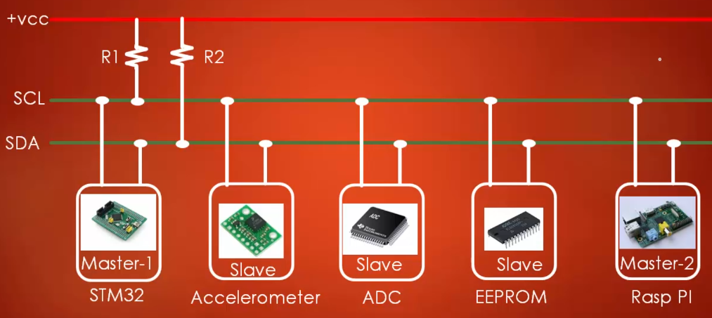

* I2C master talks to slaves based on their addresses, whereas in SPI a dedicated pin (SS) is used to select the slave to talk to. (Each device has their own address.)

* I2C is half-duplex, whereas SPI is full-duplex.

* I2C's max speed is 4 MHz in ultra speed plus mode (which is supported by some higher-end MCUs). For some STM MCUs, the max speed is even slower (e.g., 400 KHz). However, SPI's max speed is its F~pclk~/2, which means that if the peripheral clock is 20 MHz, then SPI max speed can be 10 MHz.

  I2C is slower than SPI in general!

* In I2C, slave can make master wait by holding the clock down if it's busy thanks to the clock stretching feature (supported by most of the MCUs) of I2C. However, in SPI, slave has no control over the clock. Programmers must come up with their own tricks and solutions to overcome this situation.

* I2C's data rate (i.e., number of bits transferred from sender to receiver in 1 second) is much less than that of the SPI's. For example, when the STM32F4xx MCU supports the peripheral clock of 40 MHz, SPI can support up to 20 Mbps, whereas I2C can support only 400 Kbps.

  Due to this advantage of SPI over I2C, it is impossible to simply replace all SPI applications with that of I2Cs.

## I2C Terminology

* Definitions of I2C bus terminology

  | Term            | Description                                                  |
  | --------------- | ------------------------------------------------------------ |
  | Transmitter     | Device sending data (to bus)                                 |
  | Receiver        | Device receiving data (from bus)                             |
  | Master          | Device that initiates data transfer, generates clock signals and terminates data transfer |
  | Slave           | Device addressed by master                                   |
  | Multi-master    | More than one master can attempt to control the bus at the same time without corrupting the message |
  | Arbitration     | Procedure to ensure that if more than one master tries to control the bus simultaneously, only one is allowed to do so and the winning message is not corrupted |
  | Synchronization | Procedure to synchronize the clock signals of two or more devices |

  > I2C communication is always initiated by the master.

## SDA & SCL Signals

* Both the SDA and SCL are bidirectional lines connected to a positive supply voltage via pull-up resistors. When the bus is free, both lines are pulled to HIGH.
* The output stages of devices connected to the bus must have an open-drain or open-collector configuration.
* The bus capacitance limits the number of interfaces connected to the bus.
* Both the SDA and SCL pins must be in open-drain configuration and must use pull-up resistors (either internal or external).

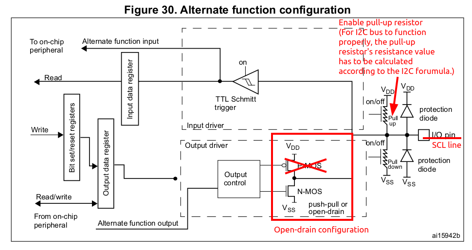

* Troubleshooting tip: When the bus is idle, both the SDA and SCL are pulled to +V~DD~.

  Whenever you face problems in I2C, probe the SDA and SCL line after I2C initialization. (The voltage between GND-SDA(or SCL) should read 3.3V or 1.8V depending on the I/O voltage levels of the board.)

## I2C Modes

| Mode            | Data Rate      | Notes                                                    |
| --------------- | -------------- | -------------------------------------------------------- |
| Standard mode   | Up to 100 Kbps | Supported by STM32F4xx                                   |
| Fast mode       | Up to 400 Kbps | Supported by STM32F4xx                                   |
| Fast mode +     | Up to 1Mbps    | Supported by some STM32F4xx (check the reference manual) |
| High speed mode | Up to 3.4 Mbps | Not supported by STM32F4xx                               |

> bps: bits per second

### Standard Mode

* In standard mode communication, data transfer rate can reach up to maximum of 100 Kbps.
* Standard mode was the very first mode introduced when the first I2C specification was released.
* Standard-mode devices, however, are not forward compatible. (They cannot communicate with the devices of fast mode or above.)
* Standard-mode devices include basic sensors such as RTC, temperature sensor, etc. (The devices that does not require fast communication.)

### Fast Mode

* In fast mode, devices can transmit and receive data up to 400 Kbps.
* Fast-mode devices are backward-compatible and can communicate with standard-mode devices in a 0-100 Kbps I2C bus system.
* Standard-mode devices, however, are not forward compatible. So, they should not be incorporated in a fast-mode I2C bus system as they cannot follow the faster transfer rate which in turn can lead to unpredictable states.
* To achieve data transfer rate up to 400 Kbps, you must put the I2C device in the fast mode.

## I2C Protocol

* I2C communication is always initiated by the master generating the "start condition" on the SDA line.

* Every byte put on the SDA line must be eight-bit long.
* Each byte must byte must be followed by an ACK bit.
* Data is transferred with the Most Significant Bit (MSB) first.

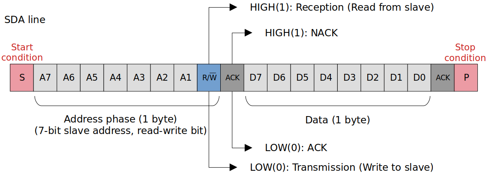

* Slave with matching address will send an ACK bit.

* Upon detecting the ACK bit, the master will read/write one byte of data depending on the value of the read/write bit.

* If the master wants to send more data, it will send more data like this.

  If not, the master will generate the "stop condition" and will close the communication.

* Once the stop condition is generated, the bus is released and the master no longer has the control over the bus. Other masters can initiate the communication.

### START & STOP Conditions

* All transactions begin with a START (S) and are terminated by a STOP (P).

* A HIGH-to-LOW transition on the SDA line while SCL is HIGH defines a START condition.

  A LOW-to-HIGH transition on the SDA line while SCL is HIGH defines a STOP condition.

  > Good source of interview question!

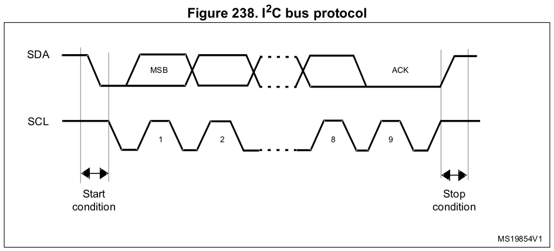

* Points to Remember

  * START and STOP conditions are always generated by the master. The bus is considered to be busy after the START condition.

  * The bus will be free again after certain amount of time from the STOP condition.

  * When the bus is free, another master (if present) can claim the bus.

  * The bus stays busy if a repeated START (Sr) is generated instead of a STOP condition.

  * Most of the MCU's I2C peripherals support both master and slave modes. You don't need to configure the their modes because when the peripheral generates the START condition it automatically becomes the master and when it generates the STOP condition it goes back to the slave mode.

    Some devices (e.g., sensors) will always be in the slave mode while others (e.g., MCUs) are capable of being both the master and the slave.

### ACK

* The Acknowledge signal is defined as follows:

  The transmitter releases the SDA line during the acknowledge clock pulse so the receiver can pull the SDA line LOW and it remains stable LOW during the HIGH period of this clock pulse.

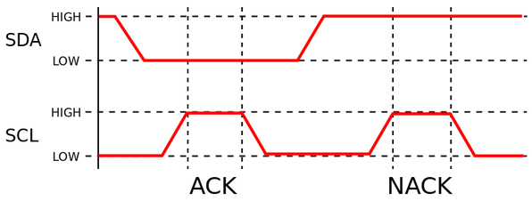

* The acknowledge takes place after every byte.

* The acknowledge bit allows the receiver to signal the transmitter that the byte was successfully received and another byte may be sent.

* The master generates all clock pulses, including the acknowledge 9^th^ clock pulse.

* When SDA remains HIGH during this 9^th^ clock pulse. this is defined as Not Acknowledge (NACK) signal.

  The master can then generate either a STOP condition to abort the transfer, or a repeated START condition to start a new transfer.

* An ACK from the master is an indication for the slave to send one more byte to the master.

  An ACK from the slave is an indication that the slave has received the data successfully.

### Data Validity

> Good source of interview question!

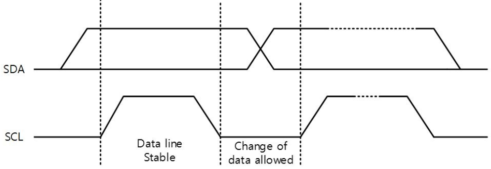

* The data on the SDA line must be stable during the HIGH period of the clock. **The HIGH or LOW state of the data line can only change when the clock signal on the SCL line is LOW.**

  The only exceptions are START condition (i.e., HIGH-to-LOW transition on the SDA line while SCL line is HIGH), and the STOP condition (i.e., LOW-to-HIGH transition on the SDA line while SCL line is HIGH).

* One clock pulse is generated for each data bit tranferred.

### Repeated START

* START again without a STOP
  * STOPping before the goal of the I2C communication has been achieved may introduce the risk of giving other potential masters to take over the bus.
  * By using the **repeated START** technique, an already started I2C communication can secure the bus until it completes its job.
* In a single-master single-slave scenario, repeated START is not necessarily advantageous since there are no other masters that can potentially take over the bus.

### I2C Protocol Example

* The following example shows the master requesting and reading 2 bytes of data from the register with the address 0x00 of the device with the address 0x48.

  (Can be improved by using the "repeated START" instead of STOPing and STARTing again!)

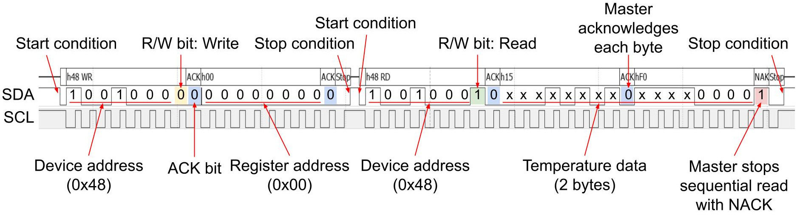

> Image reference: https://www.digikey.be/en/maker/projects/getting-started-with-stm32-i2c-example/ba8c2bfef2024654b5dd10012425fa23

* An ACK from the master is an indication for the slave to send one more byte to the master.
* An ACK from the slave is an indication that the slave has received the data successfully.

## Block Diagram

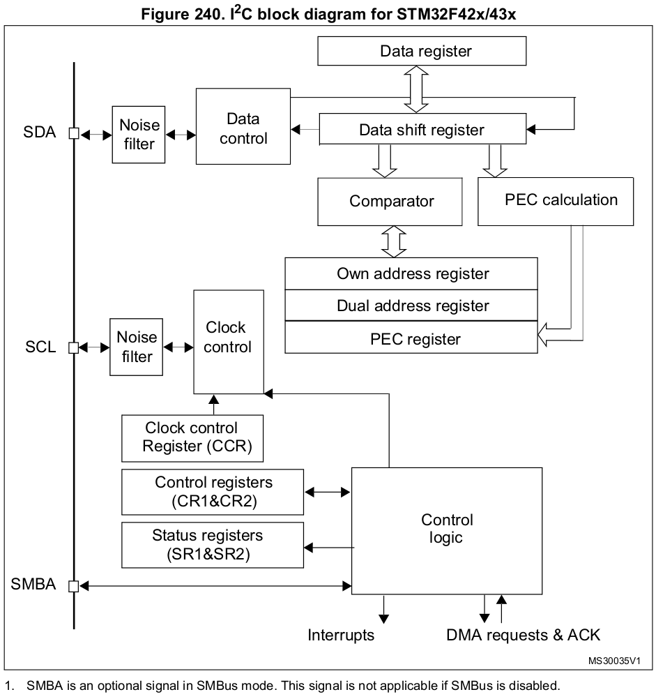

* SMBA protocol is optional and we will not cover it here.

* Since I2C communication is half-duplex, only one data register is necessary. 

* Tx

  The I2C driver code will write to the data register whose contents will in turn be copied to the data shift register. Then the data will be sent out to the bus through SDA line.

* Rx

  The data will come through the SDA line to the data shift register whose contents will in turn be copied to the data register. Then the I2C driver code will read from the data register.

* "Own address register" is used to store slave's address in case the device itself is in slave mode.

* "Clock control register (CCR)" must be configured in order to produce different clock frequency on the SCL pin.

## I2C Serial Clock (SCL) Control Settings

* In STM32F4x I2C peripheral, CR2 and CCR registers are used to control the I2C serial clock settings and other I2C timings like setup time and hold time.

  

  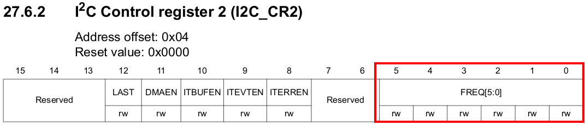

  > FREQ[5:0]: Peripheral clock frequency (Must be configured with the APB clock frequency value - I2C peripheral connected to APB).

  

  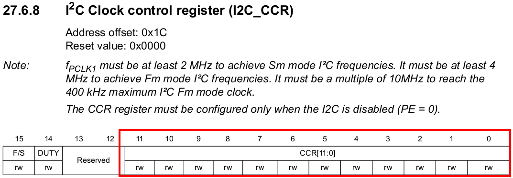

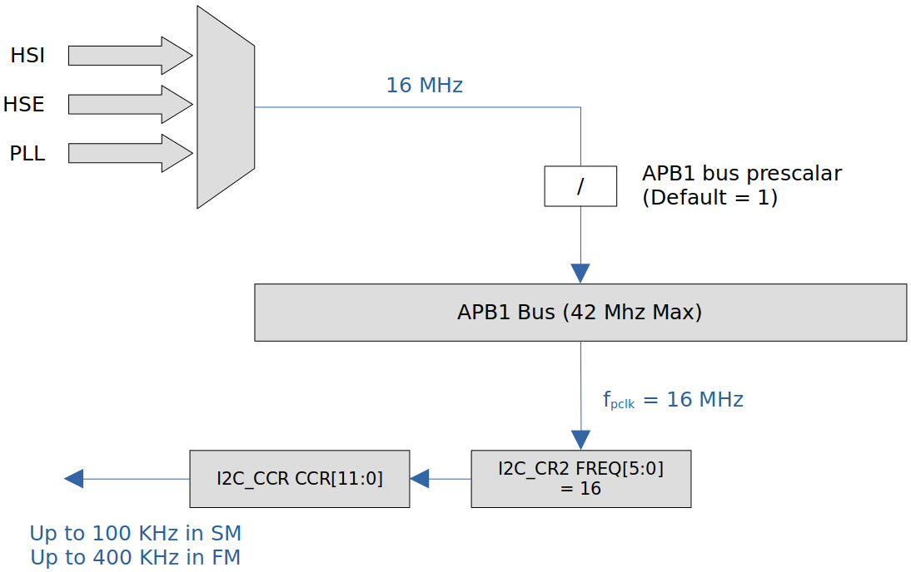

## Clock Stretching

* Clock stretching is one of the most powerful feature of I2C protocol.
* Clock stretching means holding the clock to 0 or GND level.
* The moment clock is held at low, the whole interface pauses until clock is recovered to its normal operation level.
* Usage of clock stretching:
  * I2C devices, either Master or Slave, uses this feature to **slow down the communication** by stretching SCL to low, **which prevents the clock to rise high again** and the I2C communication stops for a while.
  * There may be situations where an I2C slave is not able to cooperate with the clock speed generated by the master and needs to slow down a little.
  * If slave needs time, then it takes the advantage of clock stretching, and by holding clock at low, it momentarily pauses the I2C operation.
