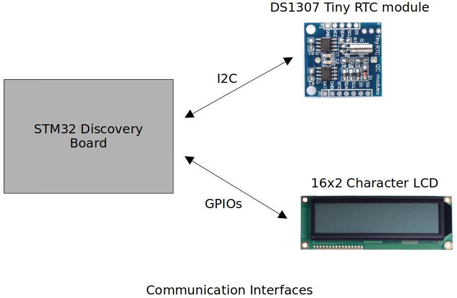
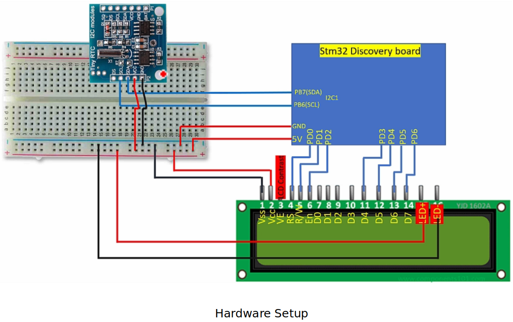
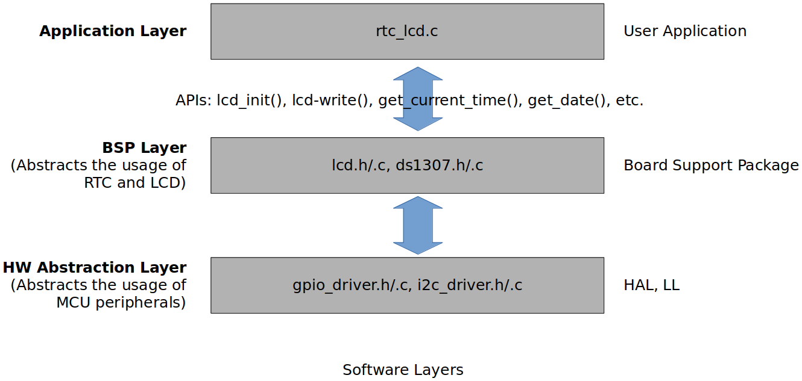

<a href="../../">Home</a> > <a href="../notebook">Notebook</a> > <a href="./">MCU Peripheral Drivers</a> > Introduction to Real-Time Clock on LCD

# Introduction to Real-Time Clock on LCD

## Project Requirements

* Interfacing **DS1307 RTC Chip** and **16x2 Character LCD** to **STM32 Discovery Board**
* Read current time and date information from the DS1307 chip and display it on the LCD
* No Logic Level Shifter will be necessary since the voltage levels between the STM32 Discovery board and the RTC module are compatible. (Check the refernce manuals of the STM32F407xx MCUs and the DS1307 RTC chip.)

### Communication Interfaces

### Hardware Setup

### Software Layers

* Hardware Abstraction Layer is MCU-Family dependent.

