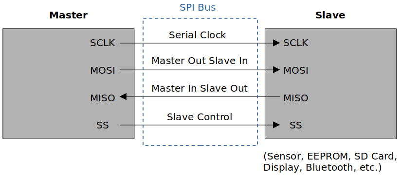

<a href="../../">Home</a> > <a href="../notebook">Notebook</a> > <a href="./">MCU Peripheral Drivers</a> > Introduction to SPI

# Introduction to SPI

## Serial Peripheral Interface (SPI)

* Serial Peripheral Interface (SPI) is a synchronous serial communication protocol commonly used for  communication between microcontrollers, sensors, and other devices.
* The SPI bus allows the communication between one master device and one or more slave devices.
* Four I/O pins are dedicated to SPI communication:
  * **MOSI (Master Out Slave In)**
    * The data line used by the master to send data to the slave.
    * In general, this pin is used to transmit data in master mode and receive data in slave mode.
  * **MISO (Master In Slave Out)**
    * The data line used by the slave to send data to the master.
    * In general, this pin is used to transmit data in slave mode and receive data in master mode.
  * **SCLK (Serial Clock)**
    * The clock signal generated by the master to synchronize data transfer.
    * Slaves have no control over the serial clock.
    * Without this clock properly working, communication is not at all possible. So, the #1 debugging tip when SPI communication is not working is to check the clock is being produced or not.
  * **SS (Slave Select)**
    * The signal used by the master to select a specific slave device with which it wants to communicate. 
    * Each slave typically has its own SS line.
    * When there's only one slave, SS line is not necessary.

