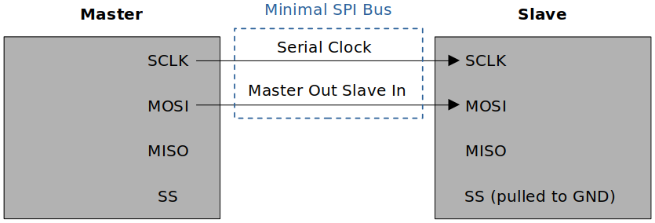
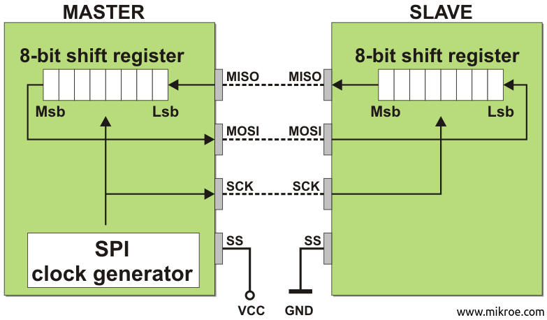
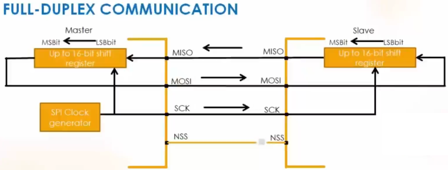
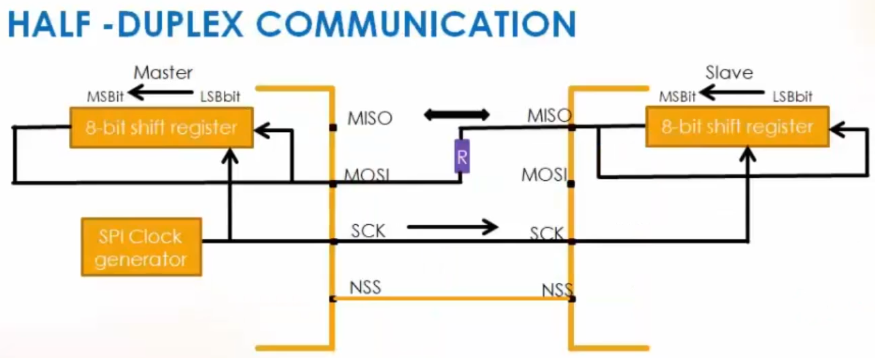
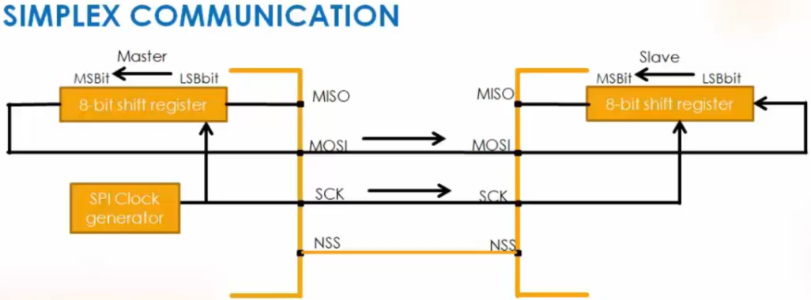

<a href="../../">Home</a> > <a href="../notebook">Notebook</a> > <a href="./">MCU Peripheral Drivers</a> > Introduction to SPI

# Introduction to SPI

## Serial Peripheral Interface (SPI)

* Serial Peripheral Interface (SPI) is a synchronous serial communication protocol commonly used for  communication between microcontrollers, sensors, and other devices.
* The SPI bus allows the communication between one master device and one or more slave devices.
* Four I/O pins are dedicated to SPI communication:
  * **MOSI (Master Out Slave In)**
    * The **data line** used by the master to send data to the slave.
    * In general, this pin is used to transmit data in master mode and receive data in slave mode.
  * **MISO (Master In Slave Out)**
    * The **data line** used by the slave to send data to the master.
    * In general, this pin is used to transmit data in slave mode and receive data in master mode.
  * **SCLK (Serial Clock)**
    * The clock signal generated by the master to synchronize data transfer.
    * Slaves have no control over the serial clock.
    * Without this clock properly working, communication is not at all possible. So, the #1 debugging tip when SPI communication is not working is to check the clock is being produced or not.
  * **SS (Slave Select)**
    * The signal used by the master to select a specific slave device with which it wants to communicate. 
    * Each slave typically has its own SS line.
    * When there's only one slave, SS line is not necessary.
    * This is NOT a data line.
* For any two devices (i.e., master and slave) to be able to communicate using SPI protocol, both of the devices have to support SPI interfaces.

## SPI Communication Sequence

1. The master selects the slave device by asserting the Slave Select (SS) line.
   * Only after the SS line is pulled to GND, the other three lines (SCLK, MOSI, MISO) will be activated.
   * Without SS being pulled to GND, the slave's data communication lines (MOSI, MISO) will be in HI-Z (or high impedance) state.
2. The master generates a clock signal (SCK) to establish the timing. (Synchronization)
3. The master sends data on the MOSI line, while the slave reads it.
4. Simultaneously, the slave prepares its response and sends it on the MISO line.
5. The clock cycles, and data is exchanged bit by bit until the desired number of bits is transmitted.
6. Once the data transfer is complete, the master deasserts the Slave Select (SS) line, indicating the end of communication.

## Minimal SPI Bus

* Depending on the requirements of your application, the number of pins to use for the SPI communication can be customized.

* For example, if a master device is communicating with just one slave device, the SPI bus may consist of just two wires:

  * Clock signal line (SCLK)
  * Synchronous data transfer line (MOSI)

  Since there's only one slave, the slave's SS line can be fixed to GND internally or externally.

  Other signals can be added depending on the data exchange between SPI nodes and their slave select (SS) signal management.

## SPI Hardware: Behind the Scenes

* The following diagram shows when the slave is sending data to the master.

* Notice that when the Msb of the slave is transferred to the Lsb of the master, the Msb of the master shifted out of the shift register gets shifted into the Lsb of the slave's shift register. 

  This is inevitable due to the design and happens in master-to-slave data transfer as well. 

## Customizing SPI Bus: Bus Configuration

* The SPI allows the MCU to communicate using different configurations, depending on the device targeted and the application requirements.

### Full-Duplex Communication

* By default, the SPI is configured for full-duplex communication. 

* In full-duplex configuration, the shift registers of the master and slave are linked using two unidirectional lines between the MOSI and the MISO pins. (Can send and receive data simultaneously)
* During SPI communication, data is shifted synchronously on the SCK clock edges provided by the master.
* The master transmits the data to be sent to the slave via the MOSI line and receives data from the slave via the MISO line.

### Half-Duplex Communication

> Typical resistance of the resistor placed between MOSI and MISO line is 1Kohm.

* In this configuration, one single cross connection line is used to link the shift registers of the master and slave together. 
* During this communication, data is synchronously shifted between the shift registers on the SCK clock edge in the transfer direction selected reciprocally by both master and slave.
* Since it is half-duplex, sending and receiving cannot take place simultaneously. At any given time, the sender must be configured to transmitter mode and the receiver must be configured to receiver mode. This configuration can be done in software.
  * When the master is in transmitter mode, the slave must be in receiver mode, and vice versa.
* By using this configuration, unused pins can be used for other purposes.
  * MISO of master not necessary
  * SS of master not necessary since there's only one slave.
* Although most of the MCU support the half-duplex SPI communication, not all do. So, please double-check the MCU reference manual.

### Simplex Communication

* Applicable to single master, single slave application (Master in transmit-only mode / slave in receive-only mode)

* This configuration settings are the same as full-duplex.
* The application has to ignore the information captured on the unused input pin (MISO). This unused pin can be used as a standard GPIO.

## Various Serial Communication Protocols

| Protocol | Type                | Max Distance (ft.)                      | Max Speed               | Typical Usage                                       |
| -------- | ------------------- | --------------------------------------- | ----------------------- | --------------------------------------------------- |
| USB 3.0  | Dual simplex serial | 9 (typical) (Up to 49 with 5 hubs) | 5G                      | Mass storage video                                  |
| USB 2.0  | Half duplex serial  | 16 (98 ft. with 5 hubs)                 | 1.5M, 12M, 480M         | Keyboard, mouse, drive, speakers, printer, camera   |
| Ethernet | Serial              | 1600                                    | 10G                     | Network, communications                             |
| I2C      | Synchronous serial  | 18                                      | 3.4M in high-speed mode | Microcontroller communications                      |
| RS-232   | Asynchronous serial | 50-100                                  | 20K                     | Modem, mouse, instrumentation                       |
| RS-485   | Asynchronous serial | 4000                                    | 10M                     | Data acquisition and control systems SPI            |
| SPI      | Synchronous serial  | 10                                      | fPCLK/2                 | Collect data from sensors, communicate with display |

> SPI - Achieving **high-speed** data transfer rate within **short distance** between the devices.
>
> I2C - Similar usage to SPI but supports lower-speed
>
> In general, SPI/I2C can be used for communications between on-board peripherals or devices. To cover greater distances and support better quality of service CAN, Ethernet, RS485, RS232 or combination of these can be used.
