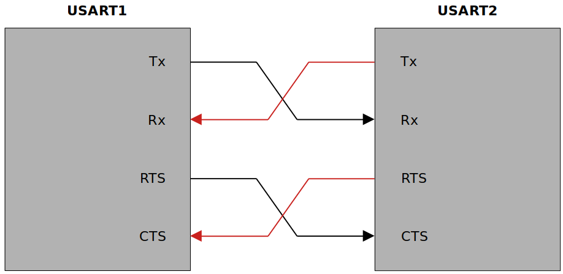

<a href="../../">Home</a> > <a href="../notebook">Notebook</a> > <a href="./">MCU Peripheral Drivers</a> > Introduction to USART/UART

# Introduction to USART/UART

## USART vs. UART

* USART - Universal Synchronous Asynchronous Receiver Transmitter
  * Supports both synchronous and asynchronous modes
  * USART is just a piece of hardware embedded in MCUs which transmits and receives data bits either in synchronous or in asynchronous mode.
  * If a USART is used in asynchronous mode, then the clock will note be sent along with the data. Instead, the synchronization bits such as START or STOP bits will be used along with the data to be transferred.
* UART - Universal Asynchronous Receiver Transmitter
  * Supports only asynchronous modes
* In general, MCUs come with USART module instead of UART so you can use both the synchronous and asynchronous modes according to your project's needs.
* There's no specific port for USART communication. USARTs are commonly used in conjugation with the protocols like RS-232, RS-434, USB, etc.
* In synchronous transmission, the clock is sent separately from the data stream and no START/STOP bits are used.

## USART Hardware Components

* Baudrate generator
* Tx and Rx shift registers
* Transmit/receive control blocks
* Transmit/receive buffers
* First-In, First-Out (FIFO) buffer memory (Powerful but expensive)

## Unaderstanding USART Pins and Communication

### USART Pins

* USART bidirectional communication requires at least 2 pins; Tx and Rx.
  * **Tx pin**
    * The pin USART module uses to transmits data.
    * When there's no transmission, Tx line is held HIGH. (i.e., Idle state)
  * **Rx pin**
    * The pin USART module uses to receive data.
    * The USART Rx engine continuously samples this line to detect the start bit of a frame.
    * Once the start bit of the frame is detected the frame reception begins on the Rx line.

* USART uses RTS and CTS pins for hardware flow control.
  * **Clear To Send (CTS) pin**
    * Active LOW pin
    * When hard flow control is used, the USART module will send the data through Tx line only when the CTS line is pulled to LOW.
  * **Request To Send (RTS) pin**
    * Active LOW pin
    * The USART module uses this line to request data from other devices.

### USART Communication Mechanism

* When USART1 module wants to receive data from USART2 module:
  1. The RTS pin of USART1 will be asserted  LOW.
  2. Subsequently the CTS pin of USART2 will go LOW. 
  3. Then USART2 will transmit data through its Tx pin.
  4. Then USART1 will receive the data through its Rx pin.
* USART supports full-duplex communication.
  * USART uses two Data Registers (DRs) to achieve this.

## USART Frame Format

## USART Baudrate

* The term **baudrate** refers to how fast the data is sent over a serial line.

* Baudrate is usually expressed in units of bits-per-second (bps).

* By inverting the baudrate, one can find out how long it takes to transmit a single bit. This value determines how long the transmitter holds a serial line HIGH or LOW.

  e.g., If the baudrate is 9600 bps, then 1 bit duration is 1/9600 = 104 µs.

* Both the trasmitter device and the receiver device must operate at the same baudrate.

  * Most common baudrates for USART communication where speed is not a critical factor: 9600 bps
  * Other standard baudrates that are typically used:
    * 2400, 4800, 9600, 19200, 38400, 57600, 115200
  * The greater the baudrate, the faster the data will be transmitted/received. However, there is a limitation of course.
  * The baudrates usually depend on the peripheral clock frequency of the USART peripheral.

## USART Synchronization Bits

* USART uses START and STOP bits to synchronize communication:
  * START bit marks the beginning of a frame. (Always 1 start bit)
    * Always indicated by an idle data line transitioning from HIGH to LOW.
  * STOP bit(s) mark(s) the end of a frame. (Configurable; 1, 1.5 or 2 bits)
    * If your baud rate is very high (e.g., in terms of MHz), you may want to add 2 stop bits.
    * STOP bit will transition back to the idle state, which is HIGH.

## USART Parity Bits

* Adding a **parity bit** is a simplest method of error detection.

  * e.g., If both devices agree to use even parity, then receiver is supposed to receive even number of 1s including the parity bit. If not, then the data is considered to be corrupted and it will be discarded.

* Parity is refers to **the number of ones that appear in the binary representation of a number**.

  e.g., 55~(10)~ $\to$ 00110111~(2)~; parity = 5

* Two variants of parity bits

  * Even parity bit
    * If the count of 1s in a given set of bits is odd, the parity bit is set to 1 to make the entire count of 1s EVEN.
    * Otherwise, the parity bit is set to 0 to keep the entire count of 1s EVEN.
    * For 55~(10)~, the even parity bit will be 1.
  * Odd parity bit
    * If the count of 1s in a given set of bits is even, the parity bit is set to 1 to make the entire count of 1s ODD.
    * Otherwise, the parity bit is set to 1 to keep the entire count of 1s ODD.
    * For 55~(10)~, the odd parity bit will be 0.

  In a nutshell, **even parity bit** results in even number of 1s whereas **odd parity bit** results in odd number of 1s when counted including the parity bit.

## USART Functional Block

## USART Peripheral Clock

* The clock speed at which each USART peripheral can run is dependant on the bus the USART peripheral is connected to.
* This peripheral clock frequency will be used by the baudrate generation block of the USART peripheral to produce different baudrates.

## USART Transmitter & Receiver

### Transmitter

* The heart of the transmitter is the **Transmit Shift Register** where parallel data is converted to serial data.

* The Transmit Shift Register obtains its data from the **Transmit Data Register (TDR)**.

  * The contents (i.e., data) of TDR is not loaded into Transmit Shift Register until the STOP bit has been tranmitted from the previous load.
  * As soon as the STOP bit is transmitted, the Transmit Shift Register is loaded with new data from the Transmit Data Register.

* The Tranmit Data Register (TDR) is loaded by the software.

* **Steps to setup USART transmission:**

  1. Program the M bit in USART_CR1 to define the word length (8-bit or 9-bit). 

     * Both the transmitter and receiver must agree upon the same word length.

  2. Program the number of STOP bit(s) in USART_CR2 register.

  3. Select the desired baudrate using the USART_BRR register.

     * Before the buadrate selection you must check the peripheral clock frequency, because the peripheral frequency limits the maximum baudrate you can generate.
     * The baudrate of the USART transmitter and receiver must be the same.

  4. Set the TE bit in USART_CR1 to enable the transmit block.

  5. Enable the USART by writing the UE (USART Enable) bit in USART_CR1 to 1.

  6. If the TxE flag is set, write the data byte to send to USART_DR.

  7. Repeat Step 6 for each data to be transmitted.

  8. After writing the very last dat into USAR_DR, wait until TC (Transmission Complete) flag is set. This indicates that the transmission of the last frame is complete.

     Remember if software wants to disable USART or UART peripheral, it has to do it after TC bit is set.

### Receiver

* During a USART reception, the data shifts in least significant bit (lsb) first through the Rx pin to the Receive Data Register (RDR) via the Receive Shift Register.
* The heart of the USART receiver is the **Receive Shift Register** where the serial data is converted to parallel data.
* After sampling the Rx pin for the STOP bit, the received data bits in the Receive Shift Register are transferred to the **Received Data Register (RDR)**.
* **Steps to setup USART reception:**
  1. Program the M bit in USART_CR1 to define the word length (8-bit or 9-bit). 
     * Both the transmitter and receiver must agree upon the same word length.
  2. Program the number of STOP bit(s) in USART_CR2 register.
  3. Select the desired baudrate using the USART_BRR register.
     * Before the buadrate selection you must check the peripheral clock frequency, because the peripheral frequency limits the maximum baudrate you can generate.
     * The baudrate of the USART transmitter and receiver must be the same.
  4. Enable the USART by writing the UE (USART Enable) bit in USART_CR1 to 1.
  5. Set the RE flag in USART_CR1, which enables the receiver block of the USART peripheral.
  6. When a character is received, wait till the RxNE flag is set and read the data byte from the data register.
     * If the RxNE flag is set, it indicates that the content of the Receive Shifte Register is transferred to the Read Data Register (RDR). In other words, the data has been received and it is now ready to be read by the software.
     * Instead of polling on RxNE flag, interrupt can also be used to detect RxNE flag set. (To use interrupt for checking RxNE flag, the RxNEIE control bit in the control register must be set.)
     * Clearing the RxNE flag is performed by the software reading the Receive Data Register.
  7. The RxNE flag must be cleared by reading the data register before the end of the reception of the next character to avoid an overrun error.

* USART receiver timing diagram

