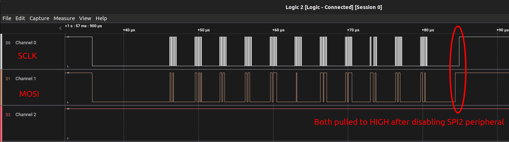
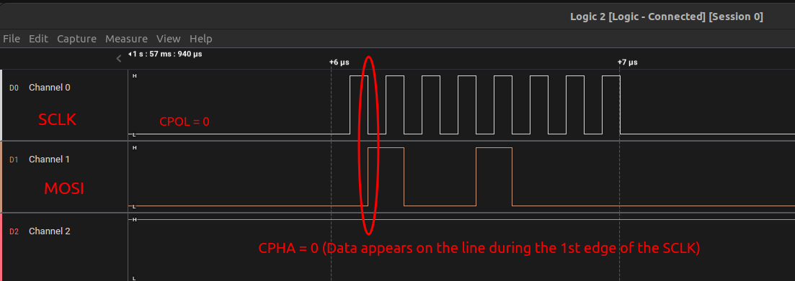

<a href="../../">Home</a> > <a href="../notebook">Notebook</a> > <a href="./">MCU Peripheral Drivers</a> > SPI Application 1: Send Data (`01_spi_tx_data.c`)

# SPI Application 1: Send Data (`01_spi_tx_data.c`)


## Requirements

* Test the `SPI_TxData()` API to send the string "Hello world" with the following configurations:
  * SPI2 - Master mode
  * SCLK - Max possible
  * DFF = 0, and DFF = 1
* For this application, only MOSI and SCLK pins will be used. (No slave, so MISO, NSS pins are not necessary.) Find out the GPIO pins over which SPI2 can communicate! Look up the "Alternate function mapping" table in the datasheet.
  * **SPI2_MOSI $\to$ PB15 (AF5)**
  * **SPI2_SCK $\to$ PB13 (AF5)**
  * SPI2_MISO $\to$ PB14 (AF5)
  * SPI2_NSS $\to$ PB12 (AF5)


## Code

### `01_spi_tx_data.c`

Path: `Project/Src/`

```c
/**
 * Filename		: 01_spi_tx_data
 * Description	: Program to test SPI send data functionality
 * Author		: Kyungjae Lee
 * History   	: May 27, 2023 - File created
 * 				  Jun 02, 2023 - Added 'Wait until SPI no longer busy' logic
 * 				  				 before terminating the SPI communication
 */

#include <string.h> 		/* strlen() */
#include "stm32f407xx.h"

/**
 * Pin selection for SPI communication
 *
 * SPI2_NSS  - PB12 (AF5)
 * SPI2_SCK  - PB13 (AF5)
 * SPI2_MISO - PB14 (AF5)
 * SPI2_MOSI - PB15 (AF5)
 */

/**
 * SPI2_PinsInit()
 * Desc.	: Initializes and configures GPIO pins to be used as SPI2 pins
 * Param.	: None
 * Returns	: None
 * Note		: N/A
 */
void SPI2_PinsInit(void)
{
	GPIO_Handle_TypeDef SPIPins;

	SPIPins.pGPIOx = GPIOB;
	SPIPins.GPIO_PinConfig.GPIO_PinMode = GPIO_PIN_MODE_ALTFCN;
	SPIPins.GPIO_PinConfig.GPIO_PinAltFcnMode = 5;
	SPIPins.GPIO_PinConfig.GPIO_PinOutType = GPIO_PIN_OUT_TYPE_PP;
		/* I2C - Open-drain only!, SPI - Push-pull okay! */
	SPIPins.GPIO_PinConfig.GPIO_PinPuPdControl = GPIO_PIN_NO_PUPD;	/* Optional */
	SPIPins.GPIO_PinConfig.GPIO_PinSpeed = GPIO_PIN_OUT_SPEED_FAST; /* Medium or slow ok as well */

	/* SCLK */
	SPIPins.GPIO_PinConfig.GPIO_PinNumber = GPIO_PIN_13;
	GPIO_Init(&SPIPins);

	/* MOSI */
	SPIPins.GPIO_PinConfig.GPIO_PinNumber = GPIO_PIN_15;
	GPIO_Init(&SPIPins);

	/* MISO (Not required for this application, save it for other use) */
	//SPIPins.GPIO_PinConfig.GPIO_PinNumber = GPIO_PIN_14;
	//GPIO_Init(&SPIPins);

	/* NSS (Not required for this application, save it for other use) */
	//SPIPins.GPIO_PinConfig.GPIO_PinNumber = GPIO_PIN_12;
	//GPIO_Init(&SPIPins);
}

/**
 * SPI2_Init()
 * Desc.	: Creates an SPI2Handle initializes SPI2 peripheral parameters
 * Param.	: None
 * Returns	: None
 * Note		: N/A
 */
void SPI2_Init(void)
{
	SPI_Handle_TypeDef SPI2Handle;

	SPI2Handle.pSPIx = SPI2;
	SPI2Handle.SPI_Config.SPI_BusConfig = SPI_BUS_CONFIG_FULL_DUPLEX;
	SPI2Handle.SPI_Config.SPI_DeviceMode = SPI_DEVICE_MODE_MASTER;
	SPI2Handle.SPI_Config.SPI_SCLKSpeed = SPI_SCLK_SPEED_PRESCALAR_2;	/* Generates 8MHz SCLK */
		/* Min prescalar -> maximum clk speed */
	SPI2Handle.SPI_Config.SPI_DFF = SPI_DFF_8BITS;
	SPI2Handle.SPI_Config.SPI_CPOL = SPI_CPOL_LOW;
	SPI2Handle.SPI_Config.SPI_CPHA = SPI_CPHA_LOW;
	SPI2Handle.SPI_Config.SPI_SSM = SPI_SSM_EN; /* SW slave mgmt enabled for NSS pin since NSS is not used */

	SPI_Init(&SPI2Handle);
}

int main(int argc, char *argv[])
{
	char userData[] = "Hello world";
	/* Initialize and configure GPIO pins to be used as SPI2 pins */
	SPI2_PinsInit();

	/* Initialize SPI2 peripheral parameters */
	SPI2_Init();
		/* At this point, all the required parameters are loaded into SPIx control registers.
		 * But, this does not mean that SPI2 peripheral is enabled.
		 *
		 * SPI configuration must be completed before it is enabled. When SPI is enabled, it
		 * will be busy communicating with other device(s) and will not allow modifying its
		 * control registers.
		 */

	/* To make NSS signal pulled to high internally and avoid MODF error */
	SPI_SSIConfig(SPI2, ENABLE);

	/* Enable SPI2 peripheral (Set SPI_CR1 bit[6] SPE - Peripheral enabled) */
	SPI_PeriControl(SPI2, ENABLE);

	/* Send data */
	SPI_TxData(SPI2, (uint8_t *)userData, strlen(userData));

	/* Wait until SPI no longer busy */
	while (SPI2->SR & (0x1 << SPI_SR_BSY));
		/* SPI_SR bit[7] - BSY (Busy flag)
		 * 0: SPI (or I2S) not busy
		 * 1: SPI (or I2S) is busy in communication or Tx buffer is not empty
		 * This flag is set and cleared by hardware.
		 */

	/* Disable SPI2 peripheral (Terminate communication) */
	SPI_PeriControl(SPI2, DISABLE);

	while (1);

	return 0;
}
```


## Testing

* Logic Analyzer - Zoomed out overview ("Hello world" being transferred through MOSI line)




* Logic Analyzer - Zoomed in partial view
  * Since CPOL = 0, SCLK begins LOW, and stays LOW during the idle state.
  * Since CPHA = 0, the data appears on the MOSI line during the 1st edge of the SCLK.




## Note

* Here we used SSM (software Slave Management) is enabled. For master, the NSS signal should be tied to +VCC when not used to avoid MODF error which happens in multi-master situation. So, be sure to set SSI bit to pull NSS pin to +VCC internally.

* Remember!

  SSI bit influences NSS state when SSM = 1. By default, SSI = 0, so NSS will be pulled low which is not acceptable for master when working in non-multi-master situation.
