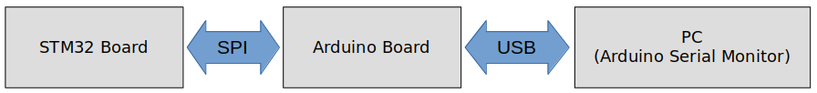
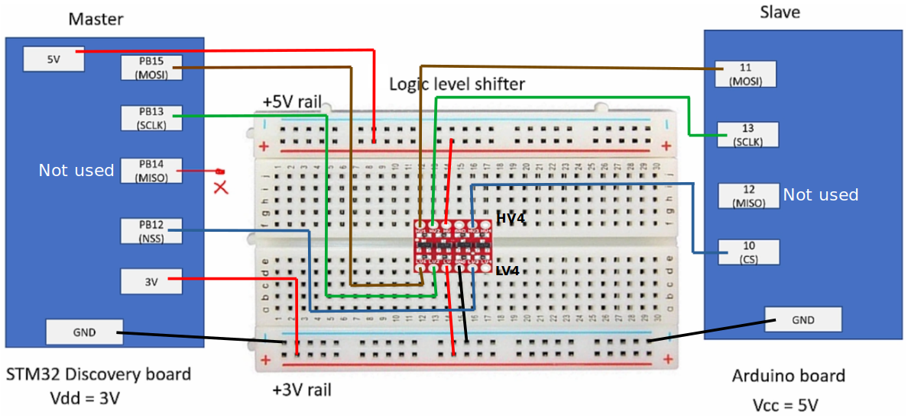

<a href="../../">Home</a> > <a href="../notebook">Notebook</a> > <a href="./">MCU Peripheral Drivers</a> > SPI Application 2: Master-Slave Communication (`02_spi-master-slave-communication.c`)

# SPI Application 2: Master-Slave Communication (`02_spi-master-slave-communication.c`)


## Requirements

* SPI master(STM) and SPI slave(Arduino) communication
* When the button on the master is pressed, master shall send a string of data to the slave in connection. The data received by the slave shall be displayed on the slave's serial port.
* Requirements
  1. Use SPI full duplex mode
  2. ST board will be in SPI master mode, and Arduino board will be in SPI slave mode.
  3. Use DFF = 0
  4. Use hardware slave management (SSM = 0)
  5. SCLK speed = 2MHz, f~clk~ = 16MHz
* In this application, master is not going to receive anything from the slave. So, configuring the MISO pin is not necessary.
* The slave does not know how many bytes of data master is going to send. So, the master must first send the number of bytes the slave should expect to receive.

### Parts Needed

1. Arduino board
2. STM32 board
3. Logic level converter
4. Breadboard and jumper wires

### STM32 Board and Arduino Board Communication Interfaces





### STM32 Board and Arduino Board Voltage Levels

* To work around the voltage level difference, a **logic level shifter** will be necessary.


## Procedure

### 1. Connect STM32 Discovery board with Arduino Uno board SPI pins

* Be careful not to directly supply 5 volts to the STM32 board pins when the board is not powered up as they may be damaged. When the **logic level shifter** is used, you don't need to worry about this issue.





* To analyze the communication with the logic analyzer, connect the channels as follows:
  * CH0 - SCLK
  * CH1 - MOSI
  * CH2 - MISO
  * CH3 - NSS
  * GND - Common GND of the bread board

### 2. Power Arduino board and download SPI slave sketch to Arduino

* Sketch name: `001SPISlaveRxString.ino`
  * You don't need to write an application for Arduino board. It is already provided as a sketch.
  * As soon as you download this sketch to the Arduino board, it will operate as a slave.

### 3. Find out the GPIO pins that can be used for SPI2 communication


## Code

### `02_spi-master-slave-communication.c`

Path: `Project/Src/`

```c

```

