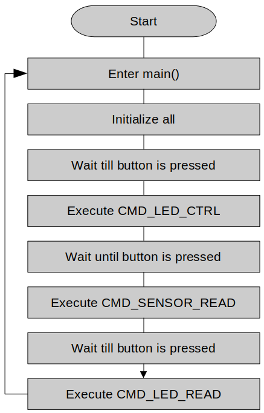
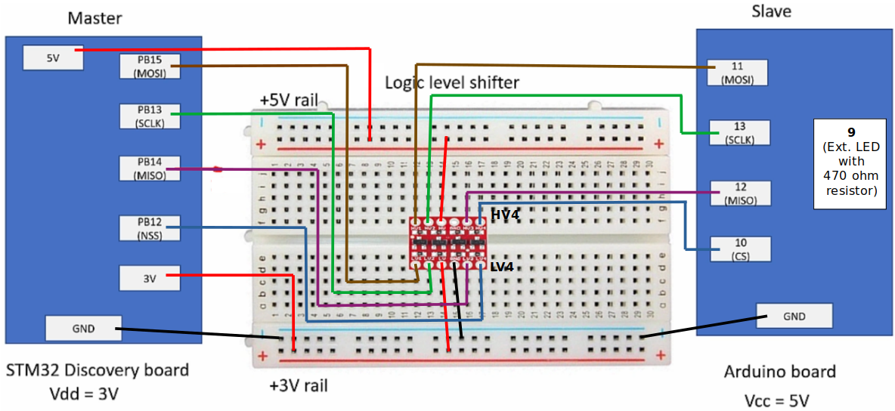
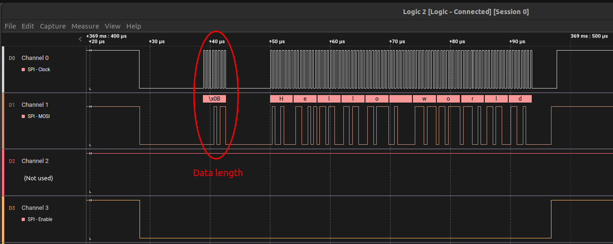

<a href="../../">Home</a> > <a href="../notebook">Notebook</a> > <a href="./">MCU Peripheral Drivers</a> > SPI Application 3: Master-Slave Command & Response (`03_spi-master-slave-command-and-response.c`)

# SPI Application 3: Master-Slave Command & Response (`03_spi-master-slave-command-and-response.c`)


## Requirements

* SPI master(STM) and SPI slave(Arduino) command & response based communication
* When the button on the master is pressed, master shall send a command to the slave and slave shall respond as per the command implementation.
* Requirements
  1. Use SPI full duplex mode
  2. ST board will be in SPI master mode, and Arduino board will be in SPI slave mode.
  3. Use DFF = 0
  4. Use hardware slave management (SSM = 0)
  5. SCLK speed = 2MHz, f~clk~ = 16MHz
* In this application, master is not going to receive anything from the slave. So, configuring the MISO pin is not necessary.
* The slave does not know how many bytes of data master is going to send. So, the master must first send the number of bytes the slave should expect to receive.

### Parts Needed

1. Arduino board
2. STM32 board
3. Logic level converter
4. Breadboard and jumper wires

### STM32 Board and Arduino Board Communication Interfaces


### STM32 Board and Arduino Board Voltage Levels

* To work around the voltage level difference, a **logic level shifter** will be necessary.


### Master - Slave Communication

* Communication sequence:

  1. Master sends a command to slave.

  2. Slave responds with `ACK(0xF5)` or `NACK(0xA5)` byte.

  3. If master recieves `ACK`, it sends 1 or more command arguments.

     * Slave takes action and responds to master according to the command/arguments it has received

     If master receives `NACK`, it displays error message.

* Command formats

  Following commands are provided by the Arduino sketch

  ```plain
  <command_code(1)>		<arg1>					<arg2>
  ======================	======================	=============
  CMD_LED_CTRL			<pin no(1)>				<value(1)> (ON/OFF)
  CMD_SENSOR_READ			<analog pin number(1)>
  CMD_LED_READ			<pin no(1)>
  CMD_PRINT				<len(2)>				<message(len)>
  CMD_ID_READ
  ```

  > `CMD_LED_CTRL <pin no> <value>` is the command to turn on/off LED connected to a specific Arduino pin
  >
  > * `<pin no>` - Digital pin number of the Arduino board (0 to 9) (1 byte)
  > * `<value>` - 1 = ON, 0 = OFF (1 byte)
  >
  > Slave action: Controls the digital pin on/off
  >
  > Slave returns: Nothing

  > `CMD_SENSOR_READ <analog pin number>`
  >
  > * `<analog pin number>` - Analog pin number of the Arduino board (A0 to A5) (1 byte)
  >
  > Slave action: Slave shall read the analog value of the supplied pin
  >
  > Slave returns: 1 byte of analog read value

  > `CMD_LED_READ <pin no>`
  >
  > * `<pin no>` - Digital pin number of the Arduino board (0 to 9)
  >
  > Slave action: Reads the status of the supplied pin number
  >
  > Slave returns: 1 byte of LED status (1 = ON, 0 = OFF)

  > `CMD_PRINT <len> <message>`
  >
  > * `<len>` - 1 byte of length information of the message to follow
  > * `<message>` - Message of `len` bytes
  >
  > Slave action: Receives the message and displays it via serial port
  >
  > Slave returns: Nothing

  > `CMD_ID_READ`
  >
  > Slave returns: 10 bytes of board ID string

### Application Flow Chart





### Semihosting Setup for Using `printf()` to Print Debug Messages in Eclipse Console

* Semihosting will work only when the Eclipse IDE and the board are in debug mode. (Keep the board in debugging mode!)

* Semihosting setup steps:

  1. Linker argument settings

     ```plain
     -specs=rdimon.specs -lc -lrdimon
     ```

  2. Debug configuration of your application

     ```plain
     monitor arm semohosting enable
     ```

  3. In `main.c`, add the following lines of code

     ```c
     extern void initialise_monitor_handles();
     initialise_monitor_handles();
     ```

     


## Procedure

### 1. Connect STM32 Discovery board with Arduino Uno board SPI pins

* Be careful not to directly supply 5 volts to the STM32 board pins when the board is not powered up as they may be damaged. When the **logic level shifter** is used, you don't need to worry about this issue.





* To analyze the communication with the logic analyzer, connect the channels as follows:
  * CH0 - SCLK
  * CH1 - MOSI
  * CH2 - MISO
  * CH3 - NSS
  * GND - Common GND of the bread board

### 2. Power Arduino board and download SPI slave sketch to Arduino

* Sketch name: `002SPISlaveCmdHandling.ino`
  * You don't need to write an application for Arduino board. It is already provided as a sketch.
  * As soon as you download this sketch to the Arduino board, it will operate as a slave.

### 3. Find out the GPIO pins that can be used for SPI2 communication

* For this application, all four SPI communication lines (i.e., MOSI, MISO, SCK and NSS pins) will be used. Find out the GPIO pins over which SPI2 can communicate! Look up the "Alternate function mapping" table in the datasheet.
  * **SPI2_MOSI $\to$ PB15 (AF5)**
  * **SPI2_SCK $\to$ PB13 (AF5)**
  * **SPI2_MISO $\to$ PB14 (AF5)**
  * **SPI2_NSS $\to$ PB12 (AF5)**


## Code

### `03_spi-master-slave-command-and-response.c`

Path: `Project/Src/`

```c
		/* Wait until button is pressed */
		while (!GPIO_ReadFromInputPin(GPIOA, GPIO_PIN_0));

		/* Introduce debouncing time for button press */
		delay();

		cmdCode = CMD_PRINT;

		/* Send command */
		SPI_TxData(SPI2, &cmdCode, 1);
			/* Remember! In SPI communication, when master or slave sends 1 byte of data
			 * it also receives 1 byte in return.
			 *
			 * This transmission of 1 byte results in 1 garbage byte collection in
			 * Rx buffer of the master and therefore RXNE flag will be set. So, do the
			 * dummy read and clear the flag.
			 */

		/* Dummy read to clear the RXNE bit */
		SPI_RxData(SPI2, &dummyRead, 1);

		/* Send a dummy byte (or 2 bytes if 16-bit DFF) to fetch the response from the slave.
		 * (To init the communication)
		 */
		SPI_TxData(SPI2, &dummyWrite, 1);
			/* When this API call returns, response from the slave would've arrived at
			 * the master. So, let's read next.
			 */

		/* Read the ACK byte received */
		SPI_RxData(SPI2, &ackByte, 1);

		uint_8_t message[] = "Hello, how are you?";
		if (SPI_VerifyResponse(ackByte))
		{
			/* Compose arguments */
			args[0] = strlen((char *)message);

			/* Send arguments */
			SPI_TxData(SPI2, args, 1);	/* Sending length */

			/* Dummy read to clear the RXNE bit */
			SPI_RxData(SPI2, &dummyRead, 1);

			/* Introduce delay to give slave enough time to do ADC conversion
			 * (Master should wait before generating the dummy bits to fetch
			 * the result.)
			 */
			delay();
			
			/* Send message */
			for (int i = 0; i < args[0]; i++)
			{
				SPI_TxData(SPI2, &message[i], 1);
				SPI_RxData(SPI2, &dummyRead, 1);
			}

			printf("CMD_PRINT executed\n");
		}
		/* End of CMD_PRINT */

		/**
		 * 5. CMD_ID_READ
		 */

		/* Wait until button is pressed */
		while (!GPIO_ReadFromInputPin(GPIOA, GPIO_PIN_0));

		/* Introduce debouncing time for button press */
		delay();

		cmdCode = CMD_PRINT;

		/* Send command */
		SPI_TxData(SPI2, &cmdCode, 1);
			/* Remember! In SPI communication, when master or slave sends 1 byte of data
			 * it also receives 1 byte in return.
			 *
			 * This transmission of 1 byte results in 1 garbage byte collection in
			 * Rx buffer of the master and therefore RXNE flag will be set. So, do the
			 * dummy read and clear the flag.
			 */

		/* Dummy read to clear the RXNE bit */
		SPI_RxData(SPI2, &dummyRead, 1);

		/* Send a dummy byte (or 2 bytes if 16-bit DFF) to fetch the response from the slave.
		 * (To init the communication)
		 */
		SPI_TxData(SPI2, &dummyWrite, 1);
			/* When this API call returns, response from the slave would've arrived at
			 * the master. So, let's read next.
			 */

		/* Read the ACK byte received */
		SPI_RxData(SPI2, &ackByte, 1);

		uint8_t id[11];
		uint32_t i = 0;
		if (SPI_VerifyResponse(ackByte))
		{
			/* Read 10 bytes ID from the slave */
			for (i = 0; i < 10; i++)
			{
				/* Send dummy byte to fetch data from slave */
				SPI_TxData(SPI2, &dummyWrite, 1);
				SPI_RxData(SPI2, &id[i], 1);
			}

			id[10] = '\0';

			printf("CMD_ID: %s\n", id);
		}
		/* End of CMD_ID_READ */

		/* Wait until SPI no longer busy */
		while (SPI2->SR & (0x1 << SPI_SR_BSY));
			/* SPI_SR bit[7] - BSY (Busy flag)
			 * 0: SPI (or I2S) not busy
			 * 1: SPI (or I2S) is busy in communication or Tx buffer is not empty
			 * This flag is set and cleared by hardware.
			 */

		/* Disable SPI2 peripheral (Terminate communication) */
		SPI_PeriControl(SPI2, DISABLE);

		printf("SPI communication closed.\n");
	}

	return 0;
}
```


## Arduino Sketch (`002SPISlaveCmdHandling.ino`)

```c
/*

 * SPI pin numbers:
 * SCK   13  // Serial Clock.
 * MISO  12  // Master In Slave Out.
 * MOSI  11  // Master Out Slave In.
 * SS    10  // Slave Select
 *

 */

#include <SPI.h>

const byte led = 9;           // Slave LED digital I/O pin.

boolean ledState = HIGH;      // LED state flag.

uint8_t dataBuff[255];

uint8_t board_id[10] = "ARDUINOUNO";

#define NACK 0xA5
#define ACK 0xF5


//command codes
#define COMMAND_LED_CTRL          0x50
#define COMMAND_SENSOR_READ       0x51
#define COMMAND_LED_READ          0x52
#define COMMAND_PRINT           0x53
#define COMMAND_ID_READ         0x54

#define LED_ON     1
#define LED_OFF    0

//arduino analog pins
#define ANALOG_PIN0   0
#define ANALOG_PIN1   1
#define ANALOG_PIN2   2
#define ANALOG_PIN3   3
#define ANALOG_PIN4   4

//Initialize SPI slave.
void SPI_SlaveInit(void) 
{ 
  // Initialize SPI pins.
  pinMode(SCK, INPUT);
  pinMode(MOSI, INPUT);
  pinMode(MISO, OUTPUT);
  pinMode(SS, INPUT);
  //make SPI as slave
  
  // Enable SPI as slave.
  SPCR = (1 << SPE);
}

//This function returns SPDR Contents 
uint8_t SPI_SlaveReceive(void)
{
  /* Wait for reception complete */
  while(!(SPSR & (1<<SPIF)));
  /* Return Data Register */
  return SPDR;
}


//sends one byte of data 
void SPI_SlaveTransmit(uint8_t data)
{
  /* Start transmission */
  SPDR = data;
  
  /* Wait for transmission complete */
  while(!(SPSR & (1<<SPIF)));
}
  

// The setup() function runs after reset.
void setup() 
{
  // Initialize serial for troubleshooting.
  Serial.begin(9600);
  
  // Initialize slave LED pin.
  pinMode(led, OUTPUT);
  
  digitalWrite(led,LOW);
  
  // Initialize SPI Slave.
  SPI_SlaveInit();
  
  Serial.println("Slave Initialized");
}


byte checkData(byte commnad)
{
  //todo
  return ACK;
}

// The loop function runs continuously after setup().
void loop() 
{
  byte data,command,len,ackornack=NACK;
  
  //1. fist make sure that ss is low . so lets wait until ss is low 
  Serial.println("Slave waiting for ss to go low");
  while(digitalRead(SS) );
  
  //2. now lets wait until rx buffer has a byte
  command = SPI_SlaveReceive();
  ackornack = checkData(command);
  
  SPI_SlaveTransmit(ackornack);
  
  len = SPI_SlaveReceive(); //dummy byte
  
  if(command == COMMAND_LED_CTRL)
  {
    //read 2 more bytes pin number and value 
    uint8_t pin = SPI_SlaveReceive(); 
    uint8_t value = SPI_SlaveReceive(); 
    Serial.println("RCVD:COMMAND_LED_CTRL");
    if(value == (uint8_t)LED_ON)
    {
      digitalWrite(pin,HIGH);
    }else if (value == (uint8_t) LED_OFF)
    {
      digitalWrite(pin,LOW);
    }
  
  }else if ( command == COMMAND_SENSOR_READ)
  {
    //read analog pin number 
    uint16_t aread;
    uint8_t pin = SPI_SlaveReceive(); 
    //pinMode(pin+14, INPUT_PULLUP);
    uint8_t val;
    aread = analogRead(pin+14);
    val = map(aread, 0, 1023, 0, 255);
    
    SPI_SlaveTransmit(val);
  
    val = SPI_SlaveReceive(); //dummy read
    
    Serial.println("RCVD:COMMAND_SENSOR_READ");
  
    
  
  }else if ( command == COMMAND_LED_READ)
  {
    uint8_t pin = SPI_SlaveReceive(); 
    uint8_t val = digitalRead(pin);
    SPI_SlaveTransmit(val);
    val = SPI_SlaveReceive(); //dummy read
    Serial.println("RCVD:COMMAND_LED_READ");
  
  }else if ( command == COMMAND_PRINT)
  {
    uint8_t len = SPI_SlaveReceive(); 
    for(int i=0 ; i < len ; i++)
    {
      dataBuff[i] = SPI_SlaveReceive();
    }
    Serial.println((char*)dataBuff);
    
    Serial.println("RCVD:COMMAND_PRINT");
  
  }else if ( command == COMMAND_ID_READ)
  {
    for(int i=0 ; i < strlen(board_id) ; i++)
    {
      SPI_SlaveTransmit(board_id[i]);
    }
      SPI_SlaveReceive();
    Serial.println("RCVD:COMMAND_ID_READ");
  }
 

}
```


## Testing

* Logic analyzer snapshot




> Notice that as soon as `SPE` is set to 0, `NSS` is pulled to GND (LOW), and as soon as `SPE` is set to 1, `NSS` is pulled to HIGH automatically by the hardware.

* Although data was successfully sent out by the STM32 Discovery board (as shown in the snapshot above), the Arduino Uno R3 board didn't seem to receive the data. 

  SPI pins of the STM32 board was set to 2MHz, and Arduino board serial monitor baudrate was set to 9600.

  Test and debug this application again!
