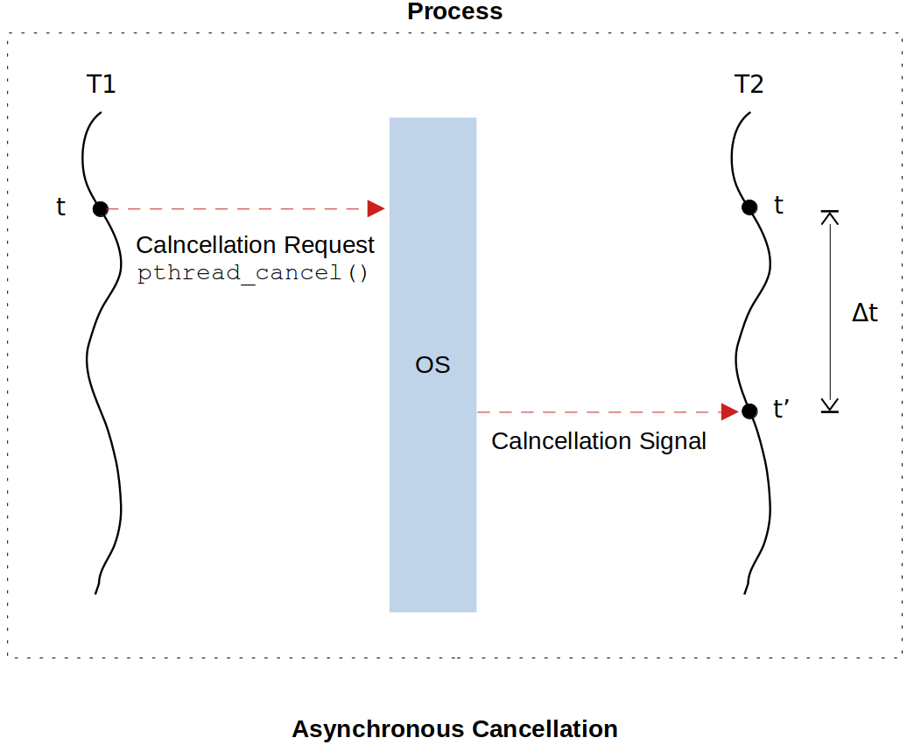

<a href="../">Notebook</a> > <a href="./">Multi-Threading (POSIX Threads)</a> > Thread Cancellation

# Thread Cancellation


## Introduction to Thread Cancellation

* Often times, a thread in execution needs to be canceled for various reasons. For example:

  * You may want to cancel on-going search operation.
  * You may want to stop sending periodic packets.
  * You may want to stop downloading the file.

  So, thread cancellation is quite common in the programming world!

* Thread cancellation is a lot like telling a person to stop something that he/she is doing.

* Any thread of a process can choose to cancel any other threads of the process.

* Once the thread is canceled, it is terminated; thread cease to exist.

* By default, threads are non-cancellable and calling `pthread_cancel()` API on a non-cancellable will take no efffect. To make the thread cancellable, you need to specify it using `pthread_setcancelstate()` at the beginning of the thread function.

  ```c
  /* set the thread eligible for cancellation */
  pthread_setcancelstate(PTHREAD_CANCEL_ENABLE /*PTHREAD_CANCEL_DISABLE */, 0);
  ```

* Two types of thread cancellation:

  * **Asynchronous cancellation**

    One thread terminates immediately the target thread.

    Can be set to this mode using the API `pthread_setcanceltype()`

    ```c
    pthread_setcanceltype(PTHREAD_CANCEL_ASYNCHRONOUS, 0);
    ```
  
  * **Deferred cancellation**
  
    The target thread checks periodically whether it should terminate, allowing it an opportunity to terminate itself in an orderly fashion. Deferred cancellation has been introduced to address the drawbacks and pitfalls of asynchronous cancellation of threads.
    
    Can be set to this mode using the API `pthread_setcanceltype()`
    
    ```c
    pthread_setcanceltype(PTHREAD_CANCEL_DEFERRED, 0);
    ```
  
* Note that `pthread_setcancelstate()` and `pthread_setcanceltype()` APIs do not take the thread handle as an argument. This implies that the thread that invokes these APIs can only affect itself. In other words, no thread can set the **cancelstate** or the **canceltype** of another thread.


## Asynchronous Cancellation





* The cancellation request (CR) sent by the thread T1 is **queued** by the OS before directly canceling the target thread T2. This is because the OS may be busy carrying out other tasks such as context switching between processes when it receives the cancellation request from a thread. Therefore, the OS may or may NOT terminate the target thread T2 instantaneously. (This is where the name "asynchronous" comes from.) 
* At $t' = t + \Delta t$, the OS delivers the cancellation signal to T2, which results in instant T2 termination. During $\Delta t$ the cancellation request has been pending.

### Demonstration

* The following is a program to demonstrate asynchronous cancellation of threads. It creates 5 threads and all 5 threads write a string into the file `thread_x.txt`, where `x` is the thread id.

  ```c
  /*
   * File Name    : master_slave1.c
   * Description  : C program to demonstrate the use of wait and signal APIs
   * Author       : Modified by Kyungjae Lee 
   *               (Original: Abhishek Sagar - Juniper Networks)
   * Date Created : 01/05/2023
   */
  
  #include <stdio.h>
  #include <stdlib.h>
  #include <unistd.h>
  #include <errno.h>
  #include <pthread.h>
  
  #define N_SLAVES 5
  
  pthread_t slaves[N_SLAVES]; /* array of thread handles */
  
  /* thread function */
  void* write_into_file(void *arg)
  {
      char file_name[64];
      char string_to_write[64];
      int len;
      int count = 0;
  
      /* set the thread eligible for cancellation */
      pthread_setcancelstate(PTHREAD_CANCEL_ENABLE /* PTHREAD_CANCEL_DISABLE */, 0);
      /* set cancellation mode to ASYNCHRONOUS */
      pthread_setcanceltype(PTHREAD_CANCEL_ASYNCHRONOUS, 0);
          /* Notice that this two APIs do not take the thread handle as an argument. This
           * implies that the thread that invokes these APIs can only affect itself. In
           * other words, no thread can set the 'cancelstate' or the 'canceltype' of another
           * thread. */
  
      int *thread_id = (int*)arg;
  
      sprintf(file_name, "thread_%d.txt", *thread_id);
  
      FILE *fptr = fopen(file_name, "w");
      
      if(!fptr)
      {   
          printf("Error : Could not open log file %s, errno = %d\n", file_name, errno);
          return 0;
      }
      
      while(1)
      {   
          len = sprintf(string_to_write, "%d : I am thread %d\n", count++, *thread_id);
          fwrite(string_to_write, sizeof(char), len, fptr);
          fflush(fptr);
          sleep(1);
      }
      return 0;
  }
  
  int main(int argc, char **argv)
  {
      int i;
      int *thread_id = 0;
  
      for (i = 0; i < N_SLAVES; i++){
          thread_id = calloc(1, sizeof(*thread_id));
          *thread_id = i;
          pthread_create(&slaves[i], 0, write_into_file, thread_id);
      }
  
      /* main menu */
      int choice;
      int thread_num;
  
      while(1) {
  
          printf("1. Cancel the thread\n");
          scanf("%d", &choice);
          printf("Enter slave thread id [0-%d] :", N_SLAVES -1);
          scanf("%d", &thread_num);
          if(thread_num < 0 || thread_num >= N_SLAVES) {
              printf("Invalid Thread id\n");
              exit(0);
          }
  
          printf("\n");
  
          switch(choice) {
              case 1:
                  pthread_cancel(slaves[thread_num]);
                  break;
              default:
                  continue;
          }
      }
      return 0;
  }
  ```

  By running `tail -f thread_0.txt` in a separate window, you'll be able to see the thread 0 writing to `thread_0.txt` file every second in real-time.

  ```plain
  $ tail -f thread_0.txt
  0 : I am thread 0
  1 : I am thread 0
  2 : I am thread 0
  3 : I am thread 0
  4 : I am thread 0
  5 : I am thread 0
  6 : I am thread 0
  7 : I am thread 0
  8 : I am thread 0
  9 : I am thread 0
  10 : I am thread 0
  11 : I am thread 0
  12 : I am thread 0
  13 : I am thread 0
  ...
  ```


## Problem with Asynchronous Cancellation

* With the asynchronous cancellation, a thread can be canceled at any arbitrary point in its execution flow, and this can lead to the following problems:
  * Resource leak
  * Invariants
  * Deadlocks

### Resource Leak

* Abrupt cancellation of a thread may lead to the problem of **resource leak**.

  Examples:

  * Terminating without closing the open file descriptor/sockets
  * Terminating without freeing the allocated memory.

  A thread must be given one last chance to clean up the resources before it is terminated. 

* **Solution:**
  * POSIX standards provide the concept of  **Thread Cleanup Handlers**. 

### Invariants

* Abrupt cancellation of a thread may lead to the problem of **invarnats** which may in turn lead to the data structure corruption, memory leak, wrong computation, etc. (Invariants means a data structure in inconsistent state.)

  Examples:

  * Canceling the thread while inserting/removing an element to/from a doubly-linked list.
  * Canceling the thread while  inserting/removing a node to/from a balanced tree (e.g., red-black/AVL trees).
  * Canceling the thread which is in the process of executing system calls (e.g., `malloc()`). Incomplete termination of a system cal may lead to the kernel corruption or variants in the kernel space.

  A thread must not get canceled while it is updating the data structures or processing the system calls. In other words, a thread must cancel in a controlled manner at a certain point in its execution flow, where it safety is guaranteed. 

* **Solution:**

  This can be handled by the **cancellation points** (only in deferred cancellation).

### Deadlocks

* What would happen if a thread is forced to terminate when it has locked a mutex and never had a chance to release it? The mutex will be left in locked state forever by the no-longer existing thread and no other threads in the process will be able to obtain the permission to enter the critical section that has been permanently locked.

  When a thread is canceled, it must not have any mutex held in the locked state.


## References

Sagar, A. (2022). *Part A - Multithreading & Thread Synchronization - Pthreads* [Video file]. Retrieved from  https://www.udemy.com/course/multithreading_parta/

