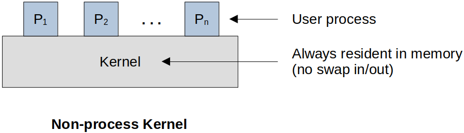
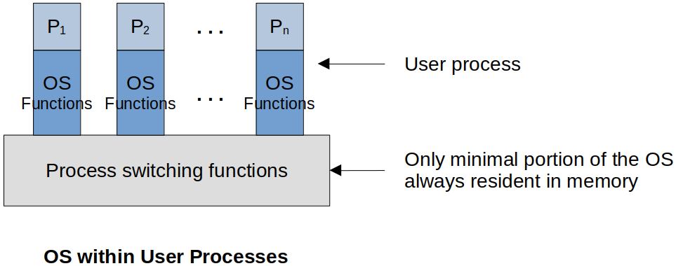
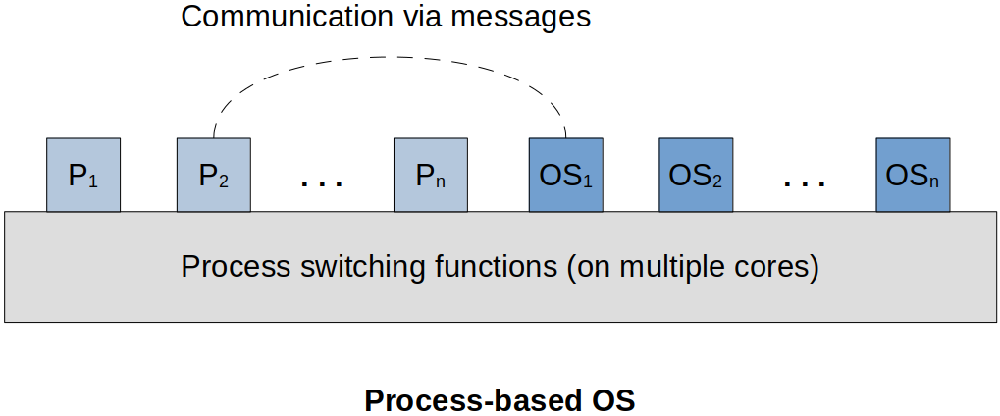
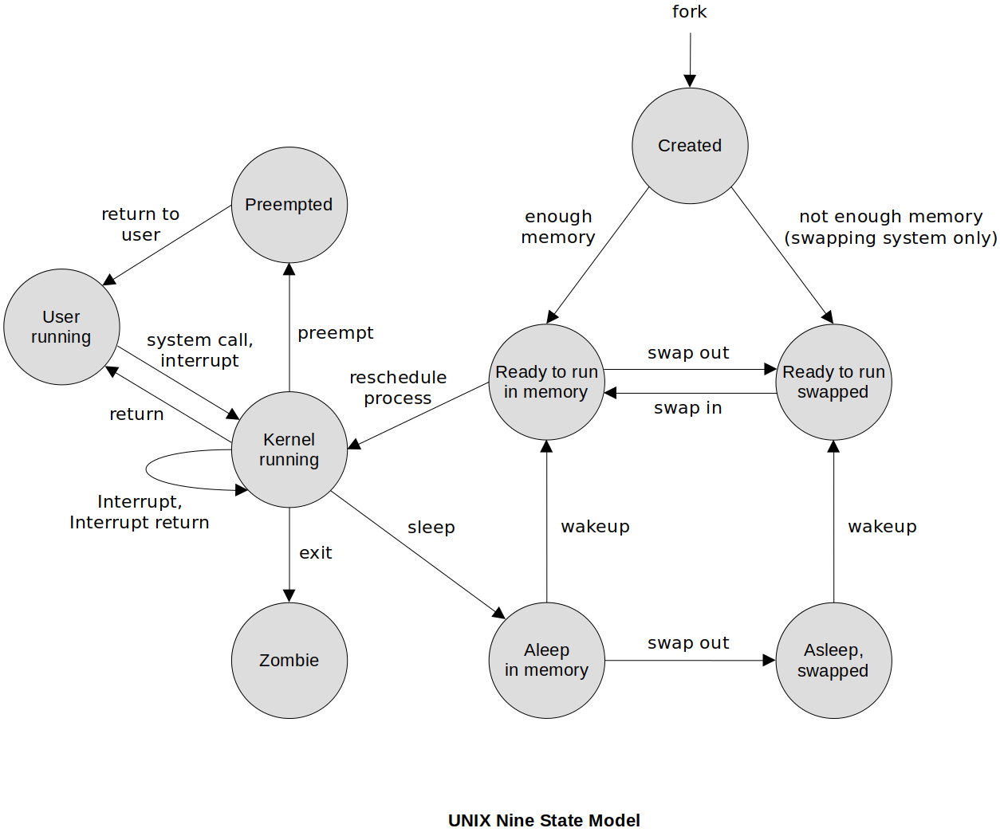

<a href="../">Notebook</a> > <a href="./">Operating Systems</a> > Execution of the OS

# Execution of the OS

## Introduction

* The OS functions in the same way as other software.
* It is code executed by the CPU.
* The OS relinquishes control and depends on the processor to restore control back to it.

## How does the OS Regain Control of the CPU If Needed?

* At the end of the fetch-execute cycle, the hardware checks for interrupts. At this point an interrupt handler can load the next instruction in the OS that needs to take over.
* Because it happens at the end of every instruction, the OS won't get locked out forever.

## Typical Functions of an OS Kernel

* Process Management
  * Process creation and termination
  * Process scheduling and dispatching
  * Process switching
  * Process synchronization and support for interprocess communication (IPC)
  * Management of process control blocks (PCBs)
* Memory Management
  * Allocation of address space to processes
  * Swapping
  * Page and segment management
* I/O Management
  * Buffer management
  * Allocation of I/O channels and devices to processes
* Support Functions
  * Interrupt handling
  * Accounting
  * Monitoring

## Process Creation

1. Assigns a unique process identifier to the new process
2. Allocates space for the process
3. Initializes the process control block (PCB)
4. Sets the appropriate linkages
5. Creates or expands other data structures

## OS Designs

### Non-process Kernel (Older OS Design)

* The kernel is code that executes outside of the context of a process. It has its own
  * Reserved area of memory
  * System stack for function traces
* When the currently running process is interrupted or issues a kernel call, that process' context is  saved.
* Control is transferred to the appropriate instruction within the kernel memory space.
* OS kernel executes desired functionality, then transfers control back to the process or switches in a new one.
* No longer used in modern operating systems

### OS Executes within User Processes

* In this model, almost all portion of the OS software is executed within the context of a user process, and switch execution modes (e.g., user mode $\leftrightarrow$ kernel/privileged mode). Only the core functionalities (i.e., process switching functions) are always resident in memory.

  This is the Linux's way of doing things. The OS creates a process that runs in user mode and it switches its mode to privileged mode by invoking system calls whenever necessary.

* OS becomes a collection of routines (or functions) that the user program calls.

* This requires an enhancement to the process image to provide extra storage for OS stack and sharable library code.

* Some of the modern operating systems use this model.

### Process-Based OS

* Rather than a monolithic kernel, the operating system executes as a collection of processes side-by-side with the user processes. Processes communicate with each other by using the defined methods (e.g., message passing).

* Encourages modular design

* Allows non-critical operations to run as lower priority processes, and allows critical operations to run on dedicated processor(s)

  Crucial part of the OS may run on a dedicated CPU and when it fails, it will move to another CPU so that the service does not stop. (Fault tolerance $\uparrow$)

* Facilitates exploitation of multi-core or multi-processor systems because OS processes can use some of the other processors

* Some of the modern operating systems use this model.

## OS Designs - Selected Example: UNIX SVR4

* Uses the model where most of the OS executes within the environment of a user process
* System processes run in kernel mode.
  * Executes operating system code to perform administrative and housekeeping functions
* User Processes
  * Operate in user mode to execute user programs and utilities
  * Operate in kernel mode to execute instructions that belong to the kernel
  * Enter kernel mode by issuing a system call, when an exception is generated, or when an interrupt occrus

* UNIX Process State Model (uses 9 states instead of 7)
  * **User running** - executing in user mode.
  * **Kernel running** - executing in kernel mode.
  * **Ready to run, in memory** - ready to run as soon as the kernel schedules it.
  * **Asleep in memory** - unable to execute until an event occurs; process is in main memory (a blocked state)
  * **Ready to run, swapped** - process is ready to run, but the swapper must swap the process into main memory before the knernel can schedule it to execute
  * **Asleep, swapped** - the process is awaiting an event and has been swapped to secondary storage (a blocked state)
  * **Preempted** - process is returning from kernel to user mode, but the kernel preempts it and does a process switch to schedule another process
  * **Created** - process is newly created and not yet ready to run
  * **Zombie** - process no longer exists, but it leaves a record for its parent process to collect

## References

Stallings, W. (2018). *Operating Systems: Internals and Design Principles* (9th ed.). Pearson Education, Inc.
